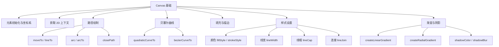

# Canvas 基础面试题图谱

> 难度范围：⭐ 初级 ~ ⭐⭐ 中级 | 题目数量：7 道 | 更新日期：2025-01

本文档覆盖 Canvas API 基础知识，包括元素初始化、坐标系、路径绘制、贝塞尔曲线、填充描边、样式设置、渐变与阴影等核心考察点。

> 📌 **进阶内容请参阅：** [02-canvas-advanced.md — Canvas 进阶](./02-canvas-advanced.md)

---

## 知识点导图



---

## Q1. Canvas 元素初始化与坐标系是怎样的？

**难度：** ⭐ 初级
**高频标签：** 🔥 阿里高频 | 美团高频

### 考察点
- `<canvas>` 元素的 `width`/`height` 属性与 CSS 尺寸的区别
- Canvas 坐标系原点位置及方向
- 设备像素比（devicePixelRatio）对坐标系的影响
- 如何正确初始化一个高清 Canvas

### 参考答案

Canvas 坐标系以左上角为原点 `(0, 0)`，X 轴向右为正，Y 轴向下为正（与数学坐标系 Y 轴方向相反）。

**`width`/`height` 属性 vs CSS 尺寸的区别：**
- `<canvas width="400" height="300">` 定义的是画布的**像素分辨率**（绘图缓冲区大小）
- CSS 的 `width: 400px; height: 300px` 定义的是元素在页面上的**显示尺寸**
- 若两者不一致，浏览器会对画布内容进行缩放，导致模糊

**高清屏适配：** 在 Retina 屏（devicePixelRatio = 2）上，需将画布物理像素扩大 dpr 倍，再通过 CSS 缩回显示尺寸，并对上下文进行 `scale(dpr, dpr)` 变换，才能保证清晰度。

> 📌 **关联进阶：** devicePixelRatio 的深度优化见 [04-performance.md — Q4 高清屏适配](./04-performance.md)

### 代码示例

```js
/**
 * 初始化高清 Canvas
 * @param {HTMLCanvasElement} canvas
 * @param {number} width  - CSS 显示宽度（px）
 * @param {number} height - CSS 显示高度（px）
 * @returns {CanvasRenderingContext2D}
 */
const initHiDPICanvas = (canvas, width, height) => {
  const dpr = window.devicePixelRatio ?? 1;

  // 设置画布物理像素尺寸（绘图缓冲区）
  canvas.width = width * dpr;
  canvas.height = height * dpr;

  // 通过 CSS 控制显示尺寸，保持视觉大小不变
  canvas.style.width = `${width}px`;
  canvas.style.height = `${height}px`;

  const ctx = canvas.getContext('2d');

  // 将坐标系缩放，使 1 个逻辑像素 = dpr 个物理像素
  ctx.scale(dpr, dpr);

  return ctx;
};

// 使用示例
const canvas = document.querySelector('#myCanvas');
const ctx = initHiDPICanvas(canvas, 400, 300);

// 此后所有绘图操作均使用逻辑像素坐标（0~400, 0~300）
ctx.fillRect(10, 10, 100, 50); // 在逻辑坐标 (10,10) 处绘制矩形
```

> 💡 **延伸思考：** 如果动态调整 Canvas 尺寸（如响应窗口 resize），需要重新调用初始化函数，因为修改 `canvas.width` 会自动清空画布并重置上下文状态（包括 `scale`）。如何设计一个响应式 Canvas 组件？

---

## Q2. 如何获取 2D 上下文？有哪些基本配置？

**难度：** ⭐ 初级
**高频标签：** 🔥 字节跳动高频

### 考察点
- `getContext('2d')` 的调用方式与返回值
- `getContext` 的可选配置参数（`alpha`、`desynchronized` 等）
- 上下文对象的核心属性分类
- `getContext` 返回 `null` 的场景及处理

### 参考答案

通过 `canvas.getContext('2d')` 获取 `CanvasRenderingContext2D` 对象，该对象提供所有 2D 绘图方法。

**`getContext` 配置参数：**
- `alpha`（默认 `true`）：是否支持透明通道。设为 `false` 可提升性能，适合不需要透明背景的场景
- `desynchronized`（默认 `false`）：允许浏览器异步合成，可降低延迟，适合实时绘图（如手写板）
- `willReadFrequently`（默认 `false`）：提示浏览器会频繁调用 `getImageData`，可优化内存布局

**返回 `null` 的场景：**
- 浏览器不支持 Canvas（极少见）
- 同一 Canvas 已通过 `getContext('webgl')` 获取了 WebGL 上下文（上下文类型冲突）
- Canvas 尺寸为 0

### 代码示例

```js
const canvas = document.getElementById('canvas');

// 基础获取
const ctx = canvas.getContext('2d');

// 带配置参数的获取（ES2020+ 可选链）
const ctxOptimized = canvas.getContext('2d', {
  alpha: false,           // 不透明背景，提升合成性能
  desynchronized: true,   // 低延迟模式，适合实时交互
  willReadFrequently: false, // 不频繁读取像素
});

// 安全获取：处理 null 情况
const getContext2D = (canvas, options = {}) => {
  const ctx = canvas.getContext('2d', options);
  if (!ctx) {
    throw new Error('无法获取 2D 上下文，请检查浏览器兼容性');
  }
  return ctx;
};

// 上下文核心属性分类示例
const ctx2 = canvas.getContext('2d');

// 填充与描边样式
ctx2.fillStyle = '#3498db';    // 填充颜色
ctx2.strokeStyle = '#e74c3c';  // 描边颜色

// 线条样式
ctx2.lineWidth = 2;            // 线宽（默认 1）
ctx2.lineCap = 'round';        // 线帽样式
ctx2.lineJoin = 'miter';       // 连接样式

// 文字样式
ctx2.font = '16px Arial';      // 字体
ctx2.textAlign = 'center';     // 水平对齐
```

> 💡 **延伸思考：** `alpha: false` 在性能上的提升原理是什么？浏览器在合成图层时，不透明图层可以跳过 Alpha 混合计算，减少 GPU 开销。在绘制大量不透明图形时，这个优化尤为明显。

---

## Q3. 路径绘制：moveTo、lineTo、arc 的用法与原理？

**难度：** ⭐⭐ 中级
**高频标签：** 🔥 阿里高频 | 字节跳动高频

### 考察点
- 路径（Path）的概念：当前路径与子路径
- `beginPath()` 的必要性及不调用的后果
- `moveTo` vs `lineTo` 的区别
- `arc(x, y, radius, startAngle, endAngle, anticlockwise)` 参数含义
- `closePath()` 与手动连接起点的区别

### 参考答案

Canvas 的路径绘制基于**当前路径**（current path）的概念。路径是一系列点和线段的集合，不会直接显示，需要调用 `stroke()` 或 `fill()` 才能渲染。

**关键方法：**
- `beginPath()`：清空当前路径，开始新路径。**每次绘制新图形前必须调用**，否则新路径会追加到旧路径上，导致 `stroke()`/`fill()` 重绘所有历史路径
- `moveTo(x, y)`：移动画笔到指定位置，不绘制线条（相当于"抬笔移动"）
- `lineTo(x, y)`：从当前位置画直线到指定位置（相当于"落笔画线"）
- `arc(x, y, r, startAngle, endAngle, anticlockwise)`：以 `(x, y)` 为圆心、`r` 为半径绘制圆弧，角度以弧度表示（0 = 3 点钟方向），`anticlockwise` 默认 `false`（顺时针）
- `closePath()`：从当前点画直线回到路径起点，形成封闭路径

### 代码示例

```js
const canvas = document.getElementById('canvas');
const ctx = canvas.getContext('2d');

// ❌ 错误示例：不调用 beginPath 导致路径叠加
ctx.moveTo(10, 10);
ctx.lineTo(100, 10);
ctx.strokeStyle = 'red';
ctx.stroke();

ctx.moveTo(10, 50);
ctx.lineTo(100, 50);
ctx.strokeStyle = 'blue';
ctx.stroke(); // 会同时重绘红色线条！

// ✅ 正确示例：每次绘制前调用 beginPath
const drawLine = (ctx, x1, y1, x2, y2, color) => {
  ctx.beginPath();          // 清空旧路径
  ctx.moveTo(x1, y1);       // 移动到起点（不绘制）
  ctx.lineTo(x2, y2);       // 画线到终点
  ctx.strokeStyle = color;
  ctx.stroke();
};

drawLine(ctx, 10, 10, 100, 10, 'red');
drawLine(ctx, 10, 50, 100, 50, 'blue'); // 互不干扰

// 绘制圆弧示例
ctx.beginPath();
// arc(圆心x, 圆心y, 半径, 起始角度, 结束角度, 是否逆时针)
ctx.arc(200, 100, 50, 0, Math.PI * 2); // 完整圆
ctx.strokeStyle = '#2ecc71';
ctx.stroke();

// 绘制扇形（饼图基础）
ctx.beginPath();
ctx.moveTo(350, 100);                          // 移动到圆心
ctx.arc(350, 100, 50, 0, Math.PI / 2);         // 绘制 90° 弧
ctx.closePath();                               // 连回圆心，形成扇形
ctx.fillStyle = 'rgba(52, 152, 219, 0.7)';
ctx.fill();
```

> 💡 **延伸思考：** `arc` 的角度是弧度制（radians），而非角度制（degrees）。转换公式：`radians = degrees * Math.PI / 180`。如何绘制一个精确的饼图？需要计算每个扇形的起始和结束角度，并确保所有扇形角度之和为 `2 * Math.PI`。

---

## Q4. 贝塞尔曲线：quadraticCurveTo 与 bezierCurveTo 的区别？

**难度：** ⭐⭐ 中级
**高频标签：** 🔥 阿里高频

### 考察点
- 二次贝塞尔曲线（Quadratic Bézier）的控制点概念
- 三次贝塞尔曲线（Cubic Bézier）的两个控制点
- 两者的参数差异与适用场景
- 贝塞尔曲线在实际项目中的应用（平滑折线图、圆角图形等）

### 参考答案

贝塞尔曲线通过**控制点**来定义曲线的弯曲程度，是 Canvas 中绘制平滑曲线的核心工具。

**二次贝塞尔曲线 `quadraticCurveTo(cpx, cpy, x, y)`：**
- 1 个控制点 `(cpx, cpy)`，1 个终点 `(x, y)`
- 曲线从当前点出发，被控制点"吸引"，到达终点
- 适合绘制简单的平滑曲线、气泡对话框等

**三次贝塞尔曲线 `bezierCurveTo(cp1x, cp1y, cp2x, cp2y, x, y)`：**
- 2 个控制点 `(cp1x, cp1y)` 和 `(cp2x, cp2y)`，1 个终点
- 更灵活，可以绘制 S 形曲线等复杂形状
- CSS `cubic-bezier()` 动画函数底层即为三次贝塞尔曲线
- 适合绘制折线图平滑连接、心形、花瓣等复杂图形

**选择建议：** 简单曲线用二次，需要精确控制曲线两端切线方向时用三次。

### 代码示例

```js
const canvas = document.getElementById('canvas');
const ctx = canvas.getContext('2d');

// 二次贝塞尔曲线：绘制平滑的波浪线
const drawQuadraticWave = (ctx) => {
  ctx.beginPath();
  ctx.moveTo(50, 150);  // 起点

  // quadraticCurveTo(控制点x, 控制点y, 终点x, 终点y)
  ctx.quadraticCurveTo(150, 50, 250, 150);  // 第一个波峰
  ctx.quadraticCurveTo(350, 250, 450, 150); // 第二个波谷

  ctx.strokeStyle = '#3498db';
  ctx.lineWidth = 2;
  ctx.stroke();
};

// 三次贝塞尔曲线：绘制 S 形曲线
const drawCubicSCurve = (ctx) => {
  ctx.beginPath();
  ctx.moveTo(100, 250); // 起点

  // bezierCurveTo(控制点1x, 控制点1y, 控制点2x, 控制点2y, 终点x, 终点y)
  ctx.bezierCurveTo(
    100, 150,  // 控制点1：靠近起点，向上拉
    300, 350,  // 控制点2：靠近终点，向下拉
    300, 250   // 终点
  );

  ctx.strokeStyle = '#e74c3c';
  ctx.lineWidth = 2;
  ctx.stroke();
};

// 实际应用：绘制平滑折线图
const drawSmoothLineChart = (ctx, points) => {
  if (points.length < 2) return;

  ctx.beginPath();
  ctx.moveTo(points[0].x, points[0].y);

  for (let i = 1; i < points.length; i++) {
    const prev = points[i - 1];
    const curr = points[i];

    // 计算控制点：取相邻两点的中间位置
    const cpX = (prev.x + curr.x) / 2;

    // 使用二次贝塞尔曲线平滑连接相邻点
    ctx.quadraticCurveTo(cpX, prev.y, cpX, (prev.y + curr.y) / 2);
    ctx.quadraticCurveTo(cpX, curr.y, curr.x, curr.y);
  }

  ctx.strokeStyle = '#2ecc71';
  ctx.lineWidth = 2;
  ctx.stroke();
};

drawQuadraticWave(ctx);
drawCubicSCurve(ctx);
```

> 💡 **延伸思考：** 如何用贝塞尔曲线绘制一个心形？心形可以用两段三次贝塞尔曲线拼接而成。另外，SVG 的 `path` 中的 `Q`（二次）和 `C`（三次）命令与 Canvas 的贝塞尔曲线 API 在数学上完全等价，理解一个就能触类旁通。

---

## Q5. fill() 与 stroke() 的区别与使用场景？

**难度：** ⭐ 初级
**高频标签：** 🔥 字节跳动高频 | 美团高频

### 考察点
- `fill()` 与 `stroke()` 的本质区别
- `fillStyle` 与 `strokeStyle` 的设置方式
- `fill()` 的填充规则：`nonzero` vs `evenodd`
- 同时使用 `fill()` 和 `stroke()` 时的顺序问题
- `fillRect`/`strokeRect` 等快捷方法

### 参考答案

**`fill()`：** 填充当前路径围成的区域，使用 `fillStyle` 指定的颜色/渐变/图案。对于未封闭的路径，会自动连接起点和终点形成封闭区域再填充。

**`stroke()`：** 沿当前路径绘制描边（轮廓线），使用 `strokeStyle` 指定颜色，`lineWidth` 指定线宽。

**关键区别：**
- `fill` 填充内部区域，`stroke` 绘制边框线条
- `stroke` 的线宽以路径为中心向两侧延伸（各占 `lineWidth / 2`），因此边缘路径的描边会有一半被裁剪

**同时使用时的顺序：** 应先 `fill()` 再 `stroke()`，否则描边会被填充色覆盖一半。

**填充规则（`fill(fillRule)`）：**
- `nonzero`（默认）：非零环绕规则，适合大多数场景
- `evenodd`：奇偶规则，适合绘制镂空图形（如甜甜圈形状）

### 代码示例

```js
const canvas = document.getElementById('canvas');
const ctx = canvas.getContext('2d');

// 基础用法对比
const drawComparison = (ctx) => {
  // 只填充
  ctx.beginPath();
  ctx.rect(20, 20, 100, 60);
  ctx.fillStyle = '#3498db';
  ctx.fill();

  // 只描边
  ctx.beginPath();
  ctx.rect(140, 20, 100, 60);
  ctx.strokeStyle = '#e74c3c';
  ctx.lineWidth = 3;
  ctx.stroke();

  // 先填充再描边（正确顺序）
  ctx.beginPath();
  ctx.rect(260, 20, 100, 60);
  ctx.fillStyle = '#2ecc71';
  ctx.strokeStyle = '#27ae60';
  ctx.lineWidth = 4;
  ctx.fill();   // 先填充
  ctx.stroke(); // 再描边，描边压在填充色上方
};

// evenodd 填充规则：绘制镂空圆环
const drawDonut = (ctx, cx, cy, outerR, innerR) => {
  ctx.beginPath();
  // 外圆（顺时针）
  ctx.arc(cx, cy, outerR, 0, Math.PI * 2, false);
  // 内圆（逆时针，形成镂空）
  ctx.arc(cx, cy, innerR, 0, Math.PI * 2, true);

  ctx.fillStyle = '#9b59b6';
  // evenodd 规则：内圆区域被"挖空"
  ctx.fill('evenodd');
};

// 快捷方法：fillRect / strokeRect（无需 beginPath）
ctx.fillStyle = '#f39c12';
ctx.fillRect(20, 120, 100, 60);   // 直接填充矩形

ctx.strokeStyle = '#d35400';
ctx.lineWidth = 2;
ctx.strokeRect(140, 120, 100, 60); // 直接描边矩形

drawComparison(ctx);
drawDonut(ctx, 350, 150, 50, 25);
```

> 💡 **延伸思考：** `clearRect(x, y, w, h)` 是第三种操作路径的方式，它清除指定矩形区域的像素（变为透明）。在动画中，通常用 `clearRect(0, 0, canvas.width, canvas.height)` 清空整个画布后重绘，而非用白色矩形覆盖，因为 `clearRect` 会真正恢复透明度。

---

## Q6. 样式设置：颜色、线宽、线帽、线段连接有哪些选项？

**难度：** ⭐⭐ 中级
**高频标签：** 🔥 字节跳动高频

### 考察点
- `fillStyle`/`strokeStyle` 支持的值类型（颜色字符串、渐变对象、图案对象）
- `lineWidth` 的默认值及最小有效值
- `lineCap` 的三种值：`butt`、`round`、`square` 的视觉差异
- `lineJoin` 的三种值：`miter`、`round`、`bevel` 的视觉差异
- `miterLimit` 的作用：防止尖角过长
- `setLineDash` 与 `lineDashOffset` 实现虚线

### 参考答案

**`lineCap`（线帽）：** 控制线条端点的样式
- `butt`（默认）：平直端点，线条在端点处截断
- `round`：圆形端点，在端点处添加半圆，线条实际长度增加 `lineWidth / 2`
- `square`：方形端点，在端点处添加矩形，线条实际长度增加 `lineWidth / 2`

**`lineJoin`（连接）：** 控制两条线段连接处的样式
- `miter`（默认）：尖角连接，当角度很小时尖角会很长，受 `miterLimit` 限制
- `round`：圆角连接，在连接处添加圆弧
- `bevel`：斜切连接，在连接处添加三角形填充

**`miterLimit`（默认 10）：** 当 `lineJoin = 'miter'` 时，若尖角长度超过 `lineWidth * miterLimit`，自动降级为 `bevel`。

### 代码示例

```js
const canvas = document.getElementById('canvas');
const ctx = canvas.getContext('2d');

// 演示三种 lineCap
const drawLineCaps = (ctx) => {
  const caps = ['butt', 'round', 'square'];
  caps.forEach((cap, i) => {
    ctx.beginPath();
    ctx.lineWidth = 20;
    ctx.lineCap = cap; // 设置线帽样式
    ctx.strokeStyle = '#3498db';
    ctx.moveTo(50, 40 + i * 40);
    ctx.lineTo(250, 40 + i * 40);
    ctx.stroke();
  });
};

// 演示三种 lineJoin
const drawLineJoins = (ctx) => {
  const joins = ['miter', 'round', 'bevel'];
  joins.forEach((join, i) => {
    ctx.beginPath();
    ctx.lineWidth = 15;
    ctx.lineJoin = join; // 设置连接样式
    ctx.strokeStyle = '#e74c3c';
    ctx.moveTo(300 + i * 80, 80);
    ctx.lineTo(340 + i * 80, 40);
    ctx.lineTo(380 + i * 80, 80);
    ctx.stroke();
  });
};

// 虚线绘制：setLineDash + lineDashOffset
const drawDashedLine = (ctx) => {
  ctx.beginPath();
  ctx.setLineDash([10, 5]);    // [实线长度, 间隔长度]
  ctx.lineDashOffset = 0;      // 虚线起始偏移量（可用于动画）
  ctx.strokeStyle = '#2ecc71';
  ctx.lineWidth = 2;
  ctx.moveTo(50, 200);
  ctx.lineTo(400, 200);
  ctx.stroke();

  // 重置虚线（恢复实线）
  ctx.setLineDash([]);
};

// 动态虚线动画（蚂蚁线效果）
let offset = 0;
const animateDash = () => {
  ctx.clearRect(0, 220, 450, 30);
  ctx.beginPath();
  ctx.setLineDash([8, 4]);
  ctx.lineDashOffset = -offset; // 负值使虚线向右流动
  ctx.strokeStyle = '#9b59b6';
  ctx.lineWidth = 2;
  ctx.rect(50, 225, 350, 20);
  ctx.stroke();

  offset = (offset + 1) % 12; // 12 = 8 + 4（一个虚线周期）
  requestAnimationFrame(animateDash);
};

drawLineCaps(ctx);
drawLineJoins(ctx);
drawDashedLine(ctx);
```

> 💡 **延伸思考：** `miterLimit` 的计算公式是 `miterLength / lineWidth`，其中 `miterLength` 是尖角顶点到内角的距离。当两条线夹角很小时，`miterLength` 会趋向无穷大，这就是为什么需要 `miterLimit` 来限制。在绘制折线图时，如果数据点变化剧烈，建议使用 `lineJoin = 'round'` 避免尖角问题。

---

## Q7. 渐变（线性渐变/径向渐变）与阴影效果如何实现？

**难度：** ⭐⭐ 中级
**高频标签：** 🔥 美团高频 | 阿里高频

### 考察点
- `createLinearGradient(x0, y0, x1, y1)` 的坐标含义
- `createRadialGradient(x0, y0, r0, x1, y1, r1)` 的两圆参数
- `addColorStop(offset, color)` 的 `offset` 范围（0~1）
- 渐变对象的坐标系是**画布坐标系**，而非图形本身坐标系
- 阴影属性：`shadowColor`、`shadowBlur`、`shadowOffsetX`、`shadowOffsetY`
- 阴影对性能的影响及关闭方式

### 参考答案

**线性渐变 `createLinearGradient(x0, y0, x1, y1)`：**
- `(x0, y0)` 是渐变起点，`(x1, y1)` 是渐变终点
- 渐变方向由两点连线决定，垂直于连线方向颜色相同
- 坐标是**画布绝对坐标**，与绘制图形的位置无关

**径向渐变 `createRadialGradient(x0, y0, r0, x1, y1, r1)`：**
- 定义两个圆：内圆 `(x0, y0, r0)` 和外圆 `(x1, y1, r1)`
- 颜色从内圆向外圆过渡
- 两圆圆心不同时可产生偏心渐变效果（模拟光照）

**阴影属性：**
- `shadowColor`：阴影颜色（必须设置，否则阴影不可见）
- `shadowBlur`：模糊半径（0 = 无模糊，值越大越模糊）
- `shadowOffsetX`/`shadowOffsetY`：阴影偏移量

**性能注意：** 阴影渲染开销较大，绘制完成后应将 `shadowColor` 设为 `'transparent'` 或 `shadowBlur` 设为 `0` 来关闭阴影，避免影响后续绘制性能。

> 📌 **关联进阶：** 渐变与图像处理的结合见 [02-canvas-advanced.md — Q2 图像处理](./02-canvas-advanced.md)

### 代码示例

```js
const canvas = document.getElementById('canvas');
const ctx = canvas.getContext('2d');

// 线性渐变：从左到右，蓝色到红色
const drawLinearGradient = (ctx) => {
  // 创建渐变对象，坐标为画布绝对坐标
  const gradient = ctx.createLinearGradient(
    50, 0,   // 渐变起点 (x0, y0)
    250, 0   // 渐变终点 (x1, y1)
  );

  // 添加颜色节点，offset 范围 0~1
  gradient.addColorStop(0, '#3498db');    // 起点：蓝色
  gradient.addColorStop(0.5, '#9b59b6'); // 中点：紫色
  gradient.addColorStop(1, '#e74c3c');   // 终点：红色

  ctx.fillStyle = gradient; // 将渐变赋给 fillStyle
  ctx.fillRect(50, 20, 200, 60);
};

// 径向渐变：模拟球体光照效果
const drawRadialGradient = (ctx) => {
  // 内圆（高光点）偏离中心，模拟光源
  const gradient = ctx.createRadialGradient(
    280, 130, 5,   // 内圆：圆心(280,130)，半径5（高光点）
    300, 150, 60   // 外圆：圆心(300,150)，半径60（球体边缘）
  );

  gradient.addColorStop(0, '#ffffff');   // 高光：白色
  gradient.addColorStop(0.3, '#3498db'); // 过渡：蓝色
  gradient.addColorStop(1, '#1a252f');   // 边缘：深色（阴影感）

  ctx.beginPath();
  ctx.arc(300, 150, 60, 0, Math.PI * 2);
  ctx.fillStyle = gradient;
  ctx.fill();
};

// 阴影效果
const drawWithShadow = (ctx) => {
  // 设置阴影属性
  ctx.shadowColor = 'rgba(0, 0, 0, 0.5)'; // 半透明黑色阴影
  ctx.shadowBlur = 15;                      // 模糊半径
  ctx.shadowOffsetX = 5;                    // 水平偏移
  ctx.shadowOffsetY = 5;                    // 垂直偏移

  ctx.fillStyle = '#f39c12';
  ctx.fillRect(50, 120, 120, 60);

  // ⚠️ 重要：绘制完成后关闭阴影，避免影响后续绘制性能
  ctx.shadowColor = 'transparent';
  ctx.shadowBlur = 0;
  ctx.shadowOffsetX = 0;
  ctx.shadowOffsetY = 0;
};

drawLinearGradient(ctx);
drawRadialGradient(ctx);
drawWithShadow(ctx);
```

> 💡 **延伸思考：** 渐变对象的坐标是画布绝对坐标，这意味着如果你移动了图形的绘制位置，渐变不会跟着移动。如何实现"跟随图形的渐变"？可以在每次绘制前根据图形位置动态创建渐变对象，或者使用 `ctx.save()`/`ctx.translate()` 配合相对坐标来实现。

---

---

## 延伸阅读

- [MDN — Canvas API 中文文档](https://developer.mozilla.org/zh-CN/docs/Web/API/Canvas_API) — 官方权威参考，涵盖所有 Canvas 2D 上下文方法与属性，含交互式示例
- [MDN — CanvasRenderingContext2D](https://developer.mozilla.org/zh-CN/docs/Web/API/CanvasRenderingContext2D) — 2D 上下文完整 API 列表，包含每个方法的参数说明与浏览器兼容性
- [HTML Living Standard — The canvas element](https://html.spec.whatwg.org/multipage/canvas.html) — W3C/WHATWG 官方规范，了解 Canvas 底层标准与行为定义
- [贝塞尔曲线可视化工具 — cubic-bezier.com](https://cubic-bezier.com/) — 直观理解三次贝塞尔曲线控制点与曲线形状的关系
- [Canvas 性能优化指南 — MDN](https://developer.mozilla.org/zh-CN/docs/Web/API/Canvas_API/Tutorial/Optimizing_canvas) — 官方性能优化建议，与 [04-performance.md](./04-performance.md) 内容互补

---

> 📌 **文档导航：**
> - 上一篇：[index.md — 总索引](./index.md)
> - 下一篇：[02-canvas-advanced.md — Canvas 进阶](./02-canvas-advanced.md)（变换矩阵、图像处理、OffscreenCanvas）
