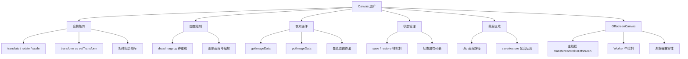

# Canvas 进阶面试题图谱

> 难度范围：⭐⭐ 中级 ~ ⭐⭐⭐ 高级 | 题目数量：7 道 | 更新日期：2025-01

本文档覆盖 Canvas 进阶特性，包括变换矩阵、图像绘制、像素操作、状态管理、裁剪区域与 OffscreenCanvas 等核心考察点。

> 📌 **基础内容请参阅：** [01-canvas-basics.md — Canvas 基础](./01-canvas-basics.md)
> 📌 **表格绘制应用请参阅：** [03-table-rendering.md — 表格绘制专题](./03-table-rendering.md)

---

## 知识点导图



---

## Q1. 变换矩阵：translate、rotate、scale 的原理与组合

**难度：** ⭐⭐ 中级
**高频标签：** 🔥 字节跳动高频 | 阿里高频

### 考察点
- Canvas 变换的本质：对坐标系（而非图形）进行变换
- `translate(x, y)`、`rotate(angle)`、`scale(sx, sy)` 的参数含义
- 变换的叠加顺序对结果的影响（矩阵乘法不满足交换律）
- 如何利用 `save()`/`restore()` 隔离变换作用域
- 绕任意点旋转的实现技巧

### 参考答案

Canvas 的变换操作本质上是对**当前坐标系**进行变换，而非直接移动图形。所有后续绘制操作都在变换后的坐标系中进行。

**三种基础变换：**
- `translate(x, y)`：将坐标系原点平移到 `(x, y)`，后续绘制坐标相对于新原点计算
- `rotate(angle)`：以当前坐标系原点为中心，顺时针旋转 `angle` 弧度
- `scale(sx, sy)`：以当前坐标系原点为基准，在 X/Y 方向分别缩放 `sx`/`sy` 倍

**变换顺序的关键：** 变换是累积的，且顺序影响结果。矩阵乘法不满足交换律，`translate → rotate` 与 `rotate → translate` 的效果完全不同。

**绕任意点旋转的技巧：** 先 `translate` 到旋转中心，再 `rotate`，最后 `translate` 回来（或在旋转后的坐标系中以原点为中心绘制图形）。

> 📌 **关联基础：** 坐标系概念见 [01-canvas-basics.md — Q1 Canvas 初始化与坐标系](./01-canvas-basics.md)

### 代码示例

```js
const canvas = document.getElementById('canvas');
const ctx = canvas.getContext('2d');

// 演示变换顺序的差异
const drawTransformOrder = (ctx) => {
  // 方案 A：先平移再旋转（图形绕平移后的原点旋转）
  ctx.save();
  ctx.translate(100, 100);   // 坐标系原点移到 (100, 100)
  ctx.rotate(Math.PI / 4);   // 绕新原点旋转 45°
  ctx.fillStyle = '#3498db';
  ctx.fillRect(-25, -25, 50, 50); // 以新原点为中心绘制
  ctx.restore();

  // 方案 B：先旋转再平移（坐标轴已旋转，平移方向也旋转了）
  ctx.save();
  ctx.rotate(Math.PI / 4);   // 先旋转坐标系
  ctx.translate(100, 100);   // 沿旋转后的坐标轴平移
  ctx.fillStyle = '#e74c3c';
  ctx.fillRect(-25, -25, 50, 50);
  ctx.restore();
};

// 绕任意点旋转：以图形中心为旋转轴
const rotateAroundCenter = (ctx, cx, cy, angle) => {
  ctx.save();
  ctx.translate(cx, cy);   // 步骤1：将坐标系原点移到旋转中心
  ctx.rotate(angle);        // 步骤2：绕新原点旋转
  ctx.translate(-cx, -cy); // 步骤3：将原点移回（可选，取决于后续绘制需求）
  // 此时绘制的图形将以 (cx, cy) 为中心旋转
  ctx.restore();
};

// 组合变换：绘制旋转缩放的星形
const drawRotatedStar = (ctx, x, y, radius, angle, scale) => {
  ctx.save();
  ctx.translate(x, y);      // 移动到目标位置
  ctx.rotate(angle);         // 旋转
  ctx.scale(scale, scale);   // 缩放

  // 在变换后的坐标系中以原点为中心绘制五角星
  ctx.beginPath();
  for (let i = 0; i < 5; i++) {
    const outerAngle = (i * 4 * Math.PI) / 5 - Math.PI / 2;
    const innerAngle = outerAngle + (2 * Math.PI) / 10;
    const outerX = Math.cos(outerAngle) * radius;
    const outerY = Math.sin(outerAngle) * radius;
    const innerX = Math.cos(innerAngle) * (radius * 0.4);
    const innerY = Math.sin(innerAngle) * (radius * 0.4);
    i === 0 ? ctx.moveTo(outerX, outerY) : ctx.lineTo(outerX, outerY);
    ctx.lineTo(innerX, innerY);
  }
  ctx.closePath();
  ctx.fillStyle = '#f39c12';
  ctx.fill();
  ctx.restore(); // 恢复变换前的状态
};

drawTransformOrder(ctx);
drawRotatedStar(ctx, 300, 150, 40, Math.PI / 6, 1.2);
```

> 💡 **延伸思考：** 如果需要实现一个"公转+自转"的动画（如太阳系模型），应如何组合变换？思路是：先 `translate` 到公转轨道中心，再 `rotate` 公转角度，再 `translate` 到行星位置，最后 `rotate` 自转角度。每一层变换都需要配合 `save()`/`restore()` 隔离。

---

## Q2. transform() 与 setTransform() 的区别

**难度：** ⭐⭐ 中级
**高频标签：** 🔥 阿里高频 | 腾讯高频

### 考察点
- 变换矩阵（CTM，Current Transformation Matrix）的概念
- `transform(a, b, c, d, e, f)` 六个参数的含义
- `transform()` 与 `setTransform()` 的本质区别
- `resetTransform()` 的作用
- 如何用矩阵参数实现 translate、rotate、scale

### 参考答案

Canvas 内部维护一个**当前变换矩阵（CTM）**，所有绘制坐标都会经过 CTM 变换后才映射到画布像素。

**变换矩阵的 6 个参数（仿射变换矩阵）：**

```
| a  c  e |
| b  d  f |
| 0  0  1 |
```

- `a`：X 轴缩放（默认 1）
- `b`：X 轴倾斜（默认 0）
- `c`：Y 轴倾斜（默认 0）
- `d`：Y 轴缩放（默认 1）
- `e`：X 轴平移（默认 0）
- `f`：Y 轴平移（默认 0）

**`transform(a, b, c, d, e, f)`：** 将新矩阵与当前 CTM **相乘**（累积变换），不会重置已有变换。

**`setTransform(a, b, c, d, e, f)`：** **替换**当前 CTM 为指定矩阵，忽略之前所有变换。

**`resetTransform()`：** 等价于 `setTransform(1, 0, 0, 1, 0, 0)`，将 CTM 重置为单位矩阵。

**常用矩阵对应关系：**
- `translate(tx, ty)` ≡ `transform(1, 0, 0, 1, tx, ty)`
- `scale(sx, sy)` ≡ `transform(sx, 0, 0, sy, 0, 0)`
- `rotate(θ)` ≡ `transform(cos θ, sin θ, -sin θ, cos θ, 0, 0)`

### 代码示例

```js
const canvas = document.getElementById('canvas');
const ctx = canvas.getContext('2d');

// transform() 累积变换示例
const demoTransformAccumulate = (ctx) => {
  ctx.save();

  // 第一次变换：平移到 (50, 50)
  ctx.transform(1, 0, 0, 1, 50, 50); // 等价于 translate(50, 50)

  // 第二次变换：在已有变换基础上再平移 (30, 30)
  // 最终效果：原点在 (80, 80)
  ctx.transform(1, 0, 0, 1, 30, 30);

  ctx.fillStyle = '#3498db';
  ctx.fillRect(0, 0, 60, 40); // 实际绘制在 (80, 80)

  ctx.restore();
};

// setTransform() 替换变换示例
const demoSetTransform = (ctx) => {
  ctx.save();

  // 先设置一些变换
  ctx.translate(200, 0);
  ctx.rotate(Math.PI / 6);

  // setTransform 直接替换 CTM，忽略上面的 translate 和 rotate
  // 参数：(a, b, c, d, e, f) = (scaleX, skewY, skewX, scaleY, translateX, translateY)
  ctx.setTransform(
    1, 0,    // a=1(无缩放), b=0(无倾斜)
    0, 1,    // c=0(无倾斜), d=1(无缩放)
    100, 80  // e=100(X平移), f=80(Y平移)
  );

  ctx.fillStyle = '#e74c3c';
  ctx.fillRect(0, 0, 60, 40); // 实际绘制在 (100, 80)，之前的变换被忽略

  ctx.restore();
};

// 使用矩阵实现镜像翻转（水平翻转）
const flipHorizontal = (ctx, canvasWidth) => {
  // 水平翻转：X 轴缩放为 -1，同时平移补偿
  ctx.setTransform(-1, 0, 0, 1, canvasWidth, 0);
  // 此后绘制的内容将水平镜像
};

// 获取当前变换矩阵（ES2020+ DOMMatrix）
const getCurrentMatrix = (ctx) => {
  const matrix = ctx.getTransform(); // 返回 DOMMatrix 对象
  console.log(`a=${matrix.a}, b=${matrix.b}, c=${matrix.c}`);
  console.log(`d=${matrix.d}, e=${matrix.e}, f=${matrix.f}`);
  return matrix;
};

demoTransformAccumulate(ctx);
demoSetTransform(ctx);
```

> 💡 **延伸思考：** `getTransform()` 返回的 `DOMMatrix` 对象支持矩阵运算（`multiply`、`inverse` 等）。如何利用逆矩阵将屏幕坐标（鼠标点击位置）转换回画布逻辑坐标？这在实现 Canvas 缩放平移交互时非常关键。

---

## Q3. 图像绘制：drawImage 的多种重载形式

**难度：** ⭐⭐ 中级
**高频标签：** 🔥 字节跳动高频 | 美团高频

### 考察点
- `drawImage` 的三种重载签名及参数含义
- 图像源（`CanvasImageSource`）支持的类型
- 图像加载时机：必须等待 `onload` 后才能绘制
- 图像裁剪（源矩形）与缩放（目标矩形）的坐标系
- 绘制视频帧、Canvas 自身等特殊场景

### 参考答案

`drawImage` 是 Canvas 中最灵活的绘图方法，支持三种重载形式：

**重载 1：`drawImage(image, dx, dy)`**
- 将图像原始尺寸绘制到目标位置 `(dx, dy)`

**重载 2：`drawImage(image, dx, dy, dw, dh)`**
- 将图像缩放到 `dw × dh` 大小后绘制到 `(dx, dy)`

**重载 3：`drawImage(image, sx, sy, sw, sh, dx, dy, dw, dh)`**
- 从图像的 `(sx, sy)` 处裁剪 `sw × sh` 的区域，缩放到 `dw × dh` 后绘制到 `(dx, dy)`
- `s` 前缀参数为**源矩形**（source），`d` 前缀参数为**目标矩形**（destination）

**支持的图像源类型（`CanvasImageSource`）：**
- `HTMLImageElement`（``）
- `HTMLVideoElement`（`<video>`，绘制当前帧）
- `HTMLCanvasElement`（另一个 Canvas）
- `ImageBitmap`（高性能位图，可在 Worker 中使用）
- `OffscreenCanvas`

### 代码示例

```js
const canvas = document.getElementById('canvas');
const ctx = canvas.getContext('2d');

// 重载1：原始尺寸绘制
const drawOriginalSize = (ctx, src) => {
  const img = new Image();
  img.onload = () => {
    // 必须在 onload 后绘制，否则图像尚未加载完成
    ctx.drawImage(img, 10, 10); // 在 (10, 10) 处以原始尺寸绘制
  };
  img.src = src;
};

// 重载2：指定目标尺寸（缩放）
const drawScaled = (ctx, img, x, y, width, height) => {
  // 将图像缩放到 width × height 后绘制
  ctx.drawImage(img, x, y, width, height);
};

// 重载3：裁剪 + 缩放（精灵图/雪碧图常用）
const drawSprite = (ctx, spriteSheet, spriteX, spriteY, spriteW, spriteH, destX, destY) => {
  ctx.drawImage(
    spriteSheet,          // 精灵图
    spriteX, spriteY,     // 源矩形起点（在精灵图中的位置）
    spriteW, spriteH,     // 源矩形尺寸（要裁剪的区域）
    destX, destY,         // 目标矩形起点（在 Canvas 中的位置）
    spriteW * 2, spriteH * 2 // 目标矩形尺寸（放大 2 倍）
  );
};

// 绘制视频帧（实时截图）
const captureVideoFrame = (ctx, video, x, y, w, h) => {
  // video 元素必须已播放或暂停在某一帧
  ctx.drawImage(video, x, y, w, h);
};

// 使用 Promise 封装图像加载
const loadImage = (src) => new Promise((resolve, reject) => {
  const img = new Image();
  img.onload = () => resolve(img);
  img.onerror = (err) => reject(new Error(`图像加载失败: ${src}`));
  img.src = src;
});

// 异步绘制示例（ES2020+ async/await）
const drawAsync = async (ctx) => {
  try {
    const img = await loadImage('https://example.com/image.png');

    // 重载1：原始尺寸
    ctx.drawImage(img, 0, 0);

    // 重载2：缩放到 200×150
    ctx.drawImage(img, 220, 0, 200, 150);

    // 重载3：裁剪左上角 100×100，放大到 200×200
    ctx.drawImage(img, 0, 0, 100, 100, 440, 0, 200, 200);
  } catch (err) {
    console.error(err.message);
  }
};

// Canvas 自身作为图像源（实现复制/镜像效果）
const mirrorCanvas = (sourceCanvas, targetCtx) => {
  const { width } = sourceCanvas;
  targetCtx.save();
  targetCtx.scale(-1, 1);                    // 水平翻转坐标系
  targetCtx.drawImage(sourceCanvas, -width, 0); // 补偿翻转偏移
  targetCtx.restore();
};
```

> 💡 **延伸思考：** `ImageBitmap` 相比 `HTMLImageElement` 有什么优势？`ImageBitmap` 是已解码的位图，绘制时无需重新解码，性能更高；且可通过 `createImageBitmap()` 在 Worker 线程中创建，避免阻塞主线程。在高频绘制场景（如视频处理）中推荐使用。

---

## Q4. 像素操作：getImageData / putImageData 实现图像滤镜

**难度：** ⭐⭐⭐ 高级
**高频标签：** 🔥 字节跳动高频 | 阿里高频

### 考察点
- `getImageData(x, y, w, h)` 返回的 `ImageData` 结构
- `ImageData.data` 的 RGBA 字节排列方式
- 像素索引计算公式：`index = (y * width + x) * 4`
- 常见滤镜算法：灰度、反色、亮度、模糊
- `putImageData` 的性能特点与使用限制
- `willReadFrequently` 配置对性能的影响

### 参考答案

`getImageData` 返回一个 `ImageData` 对象，其 `data` 属性是一个 `Uint8ClampedArray`，按 **RGBA 顺序**存储每个像素的颜色值（每个通道 0~255）。

**像素数据结构：**
```
data[0] = R（红）  data[1] = G（绿）  data[2] = B（蓝）  data[3] = A（透明度）
data[4] = 下一个像素的 R ...
```

**像素索引公式：** `const idx = (y * imageData.width + x) * 4`

**常见滤镜算法：**
- **灰度**：`gray = 0.299R + 0.587G + 0.114B`（人眼感知权重），将 R/G/B 均设为 gray
- **反色**：`R = 255 - R, G = 255 - G, B = 255 - B`
- **亮度调整**：每个通道加上亮度偏移量（使用 `Uint8ClampedArray` 自动截断到 0~255）
- **高斯模糊**：对每个像素取周围像素的加权平均（卷积运算）

**性能注意：** `getImageData`/`putImageData` 会触发 GPU→CPU 的数据回读，开销较大。频繁调用时应在 `getContext` 时设置 `willReadFrequently: true`，提示浏览器优化内存布局。

> 📌 **关联进阶：** OffscreenCanvas 可将像素处理移至 Worker 线程，见本文档 [Q7 OffscreenCanvas](#q7-offscreencanvas-与-web-worker-结合使用)

### 代码示例

```js
const canvas = document.getElementById('canvas');
// 频繁读取像素时，设置 willReadFrequently 优化性能
const ctx = canvas.getContext('2d', { willReadFrequently: true });

/**
 * 获取指定区域的像素数据并应用滤镜
 * @param {CanvasRenderingContext2D} ctx
 * @param {Function} filterFn - 滤镜函数，接收并修改 ImageData
 */
const applyFilter = (ctx, filterFn) => {
  const { width, height } = ctx.canvas;
  // 获取整个画布的像素数据
  const imageData = ctx.getImageData(0, 0, width, height);
  filterFn(imageData);
  // 将修改后的像素数据写回画布
  ctx.putImageData(imageData, 0, 0);
};

// 灰度滤镜：基于人眼感知权重
const grayscaleFilter = (imageData) => {
  const { data } = imageData;
  for (let i = 0; i < data.length; i += 4) {
    const r = data[i];
    const g = data[i + 1];
    const b = data[i + 2];
    // 加权平均：人眼对绿色最敏感，对蓝色最不敏感
    const gray = Math.round(0.299 * r + 0.587 * g + 0.114 * b);
    data[i] = gray;     // R
    data[i + 1] = gray; // G
    data[i + 2] = gray; // B
    // data[i + 3] 透明度不变
  }
};

// 反色滤镜
const invertFilter = (imageData) => {
  const { data } = imageData;
  for (let i = 0; i < data.length; i += 4) {
    data[i] = 255 - data[i];         // R
    data[i + 1] = 255 - data[i + 1]; // G
    data[i + 2] = 255 - data[i + 2]; // B
    // 透明度不变
  }
};

// 亮度调整滤镜（Uint8ClampedArray 自动截断到 0~255）
const brightnessFilter = (amount) => (imageData) => {
  const { data } = imageData;
  for (let i = 0; i < data.length; i += 4) {
    data[i] += amount;     // R
    data[i + 1] += amount; // G
    data[i + 2] += amount; // B
  }
};

// 3×3 均值模糊（Box Blur）
const boxBlurFilter = (imageData) => {
  const { data, width, height } = imageData;
  const output = new Uint8ClampedArray(data); // 复制原始数据，避免读写互相影响

  for (let y = 1; y < height - 1; y++) {
    for (let x = 1; x < width - 1; x++) {
      for (let c = 0; c < 3; c++) { // 只处理 RGB，跳过 Alpha
        let sum = 0;
        // 遍历 3×3 邻域
        for (let dy = -1; dy <= 1; dy++) {
          for (let dx = -1; dx <= 1; dx++) {
            const idx = ((y + dy) * width + (x + dx)) * 4 + c;
            sum += data[idx];
          }
        }
        // 写入输出缓冲区（9 个像素的平均值）
        output[(y * width + x) * 4 + c] = Math.round(sum / 9);
      }
    }
  }

  // 将模糊结果写回 imageData
  imageData.data.set(output);
};

// 使用示例
const img = new Image();
img.onload = () => {
  ctx.drawImage(img, 0, 0);
  applyFilter(ctx, grayscaleFilter);       // 应用灰度滤镜
  // applyFilter(ctx, invertFilter);       // 应用反色滤镜
  // applyFilter(ctx, brightnessFilter(50)); // 提亮 50
  // applyFilter(ctx, boxBlurFilter);      // 应用模糊
};
img.src = 'photo.jpg';
```

> 💡 **延伸思考：** 像素操作是 CPU 密集型任务，对大尺寸图像（如 4K）处理会阻塞主线程。如何优化？可以将 `ImageData` 通过 `Transferable Objects` 传递给 Web Worker 处理，处理完成后再传回主线程。结合 `OffscreenCanvas`（见 Q7）可以实现完全无阻塞的图像处理管线。

---

## Q5. Canvas 状态管理：save() / restore() 的工作原理

**难度：** ⭐⭐ 中级
**高频标签：** 🔥 字节跳动高频 | 美团高频

### 考察点
- `save()` 保存的状态内容（样式属性 + 变换矩阵 + 裁剪区域）
- `restore()` 的栈弹出机制
- `save()`/`restore()` 不保存的内容（画布像素内容）
- 嵌套 `save()`/`restore()` 的使用场景
- 忘记调用 `restore()` 导致的状态泄漏问题

### 参考答案

Canvas 内部维护一个**状态栈**（drawing state stack）。`save()` 将当前状态压栈，`restore()` 弹出栈顶状态并恢复。

**`save()` 保存的状态包括：**
- 所有样式属性：`fillStyle`、`strokeStyle`、`lineWidth`、`lineCap`、`lineJoin`、`font`、`globalAlpha`、`globalCompositeOperation`、`shadowColor`、`shadowBlur` 等
- 当前变换矩阵（CTM）
- 当前裁剪区域（clip path）

**`save()` 不保存的内容：**
- 画布像素内容（`clearRect`、`fillRect` 等绘制操作不可撤销）
- 当前路径（`beginPath` 开始的路径）

**典型使用场景：**
1. 临时修改样式后恢复：绘制特殊样式的图形，不影响后续绘制
2. 隔离变换作用域：在局部坐标系中绘制，不影响全局坐标系
3. 临时设置裁剪区域：绘制完成后恢复完整绘制区域

> 📌 **关联进阶：** 裁剪区域的保存与恢复见本文档 [Q6 clip() 裁剪区域](#q6-裁剪区域clip-的使用与注意事项)

### 代码示例

```js
const canvas = document.getElementById('canvas');
const ctx = canvas.getContext('2d');

// 基础用法：临时修改样式后恢复
const drawWithTempStyle = (ctx) => {
  // 当前状态：默认黑色
  ctx.fillStyle = '#000000';

  ctx.save(); // 保存当前状态（黑色）

  // 临时修改样式
  ctx.fillStyle = '#e74c3c';
  ctx.globalAlpha = 0.5;
  ctx.fillRect(20, 20, 100, 60); // 用红色半透明绘制

  ctx.restore(); // 恢复到 save() 时的状态（黑色，不透明）

  ctx.fillRect(140, 20, 100, 60); // 用黑色不透明绘制
};

// 嵌套 save/restore：多层状态隔离
const drawNestedStates = (ctx) => {
  ctx.fillStyle = 'blue';    // 外层状态

  ctx.save();                // 保存外层状态（蓝色）
  ctx.fillStyle = 'red';     // 中层状态

  ctx.save();                // 保存中层状态（红色）
  ctx.fillStyle = 'green';   // 内层状态
  ctx.fillRect(20, 100, 60, 40); // 绿色

  ctx.restore();             // 恢复到中层（红色）
  ctx.fillRect(100, 100, 60, 40); // 红色

  ctx.restore();             // 恢复到外层（蓝色）
  ctx.fillRect(180, 100, 60, 40); // 蓝色
};

// 实际应用：绘制复杂图形时隔离变换
const drawComplexScene = (ctx) => {
  // 绘制背景（全局坐标系）
  ctx.fillStyle = '#ecf0f1';
  ctx.fillRect(0, 0, 400, 300);

  // 绘制旋转的子图形（局部坐标系）
  ctx.save();
  ctx.translate(200, 150);   // 移动到画布中心
  ctx.rotate(Math.PI / 4);   // 旋转 45°
  ctx.fillStyle = '#3498db';
  ctx.fillRect(-40, -40, 80, 80); // 以新原点为中心绘制
  ctx.restore(); // 恢复全局坐标系，后续绘制不受旋转影响

  // 继续在全局坐标系中绘制
  ctx.fillStyle = '#e74c3c';
  ctx.fillRect(10, 10, 50, 30); // 不受上面旋转的影响
};

drawWithTempStyle(ctx);
drawNestedStates(ctx);
drawComplexScene(ctx);
```

> 💡 **延伸思考：** 如果 `save()` 和 `restore()` 调用次数不匹配（如在循环中只 `save()` 不 `restore()`），会导致状态栈溢出或状态泄漏。在封装绘图函数时，应确保每个 `save()` 都有对应的 `restore()`，可以用 try/finally 保证即使绘制过程中抛出异常也能正确恢复状态。

---

## Q6. 裁剪区域：clip() 的使用与注意事项

**难度：** ⭐⭐ 中级
**高频标签：** 🔥 阿里高频 | 腾讯高频

### 考察点
- `clip()` 的工作原理：将当前路径设为裁剪区域
- 裁剪区域的累积性：多次 `clip()` 取交集
- 如何用 `save()`/`restore()` 重置裁剪区域
- `clip(fillRule)` 的填充规则（`nonzero` vs `evenodd`）
- 圆形头像、不规则遮罩等实际应用场景

### 参考答案

`clip()` 将当前路径设置为**裁剪区域**，此后所有绘制操作只在裁剪区域内可见，超出区域的部分被裁剪掉。

**关键特性：**
1. **累积性**：多次调用 `clip()` 会取多个裁剪区域的**交集**，裁剪区域只会越来越小，无法通过再次调用 `clip()` 扩大
2. **重置方式**：唯一重置裁剪区域的方法是 `restore()`（配合之前的 `save()`）
3. **不影响已绘制内容**：`clip()` 只影响调用之后的绘制操作
4. **填充规则**：`clip('evenodd')` 可实现镂空裁剪（如圆环形裁剪区域）

**常见应用：**
- 圆形头像（圆形裁剪区域 + `drawImage`）
- 不规则形状遮罩
- 图表中的数据区域限制（防止绘制超出坐标轴范围）

> 📌 **关联基础：** 填充规则（nonzero/evenodd）见 [01-canvas-basics.md — Q5 fill 与 stroke](./01-canvas-basics.md)

### 代码示例

```js
const canvas = document.getElementById('canvas');
const ctx = canvas.getContext('2d');

// 经典应用：圆形头像裁剪
const drawCircularAvatar = async (ctx, src, cx, cy, radius) => {
  const img = await new Promise((resolve) => {
    const image = new Image();
    image.onload = () => resolve(image);
    image.src = src;
  });

  ctx.save(); // 保存当前状态（包括裁剪区域）

  // 定义圆形裁剪路径
  ctx.beginPath();
  ctx.arc(cx, cy, radius, 0, Math.PI * 2);
  ctx.clip(); // 设置圆形裁剪区域

  // 在裁剪区域内绘制图像（超出圆形的部分被裁剪）
  ctx.drawImage(img, cx - radius, cy - radius, radius * 2, radius * 2);

  ctx.restore(); // 恢复裁剪区域（移除圆形裁剪）

  // 绘制圆形边框（不受裁剪影响，因为已 restore）
  ctx.beginPath();
  ctx.arc(cx, cy, radius, 0, Math.PI * 2);
  ctx.strokeStyle = '#ffffff';
  ctx.lineWidth = 3;
  ctx.stroke();
};

// 演示裁剪区域的累积性（取交集）
const demoClipIntersection = (ctx) => {
  ctx.save();

  // 第一个裁剪区域：左侧矩形
  ctx.beginPath();
  ctx.rect(50, 50, 200, 150);
  ctx.clip();

  // 第二个裁剪区域：右侧矩形（与第一个取交集）
  ctx.beginPath();
  ctx.rect(100, 80, 200, 150);
  ctx.clip(); // 实际裁剪区域 = 两个矩形的交集

  // 只有交集区域内的绘制可见
  ctx.fillStyle = '#3498db';
  ctx.fillRect(0, 0, 400, 300); // 只有交集部分显示蓝色

  ctx.restore(); // 恢复到 save() 前的裁剪区域
};

// evenodd 规则：圆环形裁剪（镂空效果）
const drawDonutClip = (ctx, cx, cy, outerR, innerR) => {
  ctx.save();

  ctx.beginPath();
  ctx.arc(cx, cy, outerR, 0, Math.PI * 2, false); // 外圆（顺时针）
  ctx.arc(cx, cy, innerR, 0, Math.PI * 2, true);  // 内圆（逆时针）
  ctx.clip('evenodd'); // 使用 evenodd 规则，内圆区域被排除

  // 绘制渐变背景，只有圆环区域可见
  const gradient = ctx.createLinearGradient(cx - outerR, cy, cx + outerR, cy);
  gradient.addColorStop(0, '#e74c3c');
  gradient.addColorStop(1, '#3498db');
  ctx.fillStyle = gradient;
  ctx.fillRect(cx - outerR, cy - outerR, outerR * 2, outerR * 2);

  ctx.restore();
};

drawCircularAvatar(ctx, 'avatar.jpg', 80, 80, 60);
demoClipIntersection(ctx);
drawDonutClip(ctx, 300, 150, 70, 35);
```

> 💡 **延伸思考：** 在绘制图表时，如何防止折线图的数据点超出坐标轴范围？可以在绘制数据前用 `clip()` 设置坐标轴区域为裁剪区域，绘制完成后 `restore()`。这样即使数据超出范围，也不会显示在坐标轴外部，比手动计算边界更简洁。

---

## Q7. OffscreenCanvas 与 Web Worker 结合使用

**难度：** ⭐⭐⭐ 高级
**高频标签：** 🔥 字节跳动高频 | 阿里高频

### 考察点
- `OffscreenCanvas` 的设计目的：将渲染工作移出主线程
- `transferControlToOffscreen()` 的使用方式
- Worker 中使用 `OffscreenCanvas` 的完整流程
- `Transferable Objects` 机制：零拷贝传递所有权
- 浏览器兼容性与 Polyfill 方案
- 适用场景：复杂动画、图像处理、大数据渲染

### 参考答案

`OffscreenCanvas` 是一个可以在 **Worker 线程**中使用的 Canvas，将渲染计算从主线程卸载，避免阻塞 UI 交互和页面响应。

**两种使用模式：**

**模式 1：`transferControlToOffscreen()`（推荐）**
- 主线程将 `<canvas>` 的控制权转移给 `OffscreenCanvas`
- Worker 通过 `OffscreenCanvas` 直接渲染到屏幕，无需回传数据
- 适合持续渲染的动画场景

**模式 2：独立 `OffscreenCanvas`**
- 在 Worker 中创建 `new OffscreenCanvas(width, height)`
- 渲染完成后通过 `transferToImageBitmap()` 将结果传回主线程
- 适合一次性图像处理任务

**`Transferable Objects` 机制：**
- `postMessage(data, [transferable])` 中的第二个参数指定可转移对象
- 转移后原线程的引用失效（所有权转移，非拷贝），实现零拷贝传递
- `OffscreenCanvas`、`ArrayBuffer`、`ImageBitmap` 等均支持转移

**浏览器兼容性（数据截至 2025-01，请以 [MDN](https://developer.mozilla.org/en-US/docs/Web/API/OffscreenCanvas) 为准）：**

| 浏览器 | 支持版本 | 备注 |
|--------|----------|------|
| Chrome | 69+ | 完整支持 |
| Firefox | 105+ | 完整支持（早期版本需 flag 开启） |
| Safari | 16.4+ | 2023 年 3 月正式支持 |
| Edge | 79+ | 基于 Chromium，同 Chrome |
| iOS Safari | 16.4+ | 同 Safari |

**Polyfill 方案：**
对于不支持 `OffscreenCanvas` 的环境，可采用以下降级策略：
1. **特性检测降级**：检测 `typeof OffscreenCanvas !== 'undefined'`，不支持时回退到主线程渲染
2. **`canvas-offscreen-polyfill`**：社区 Polyfill，模拟 `OffscreenCanvas` API（性能无提升，仅保证 API 兼容）
3. **`ImageBitmap` 降级**：Worker 中用普通 Canvas 渲染，通过 `createImageBitmap()` 传回主线程绘制

> 📌 **关联进阶：** 像素操作与 Worker 结合见本文档 [Q4 像素操作](#q4-像素操作getimagedata--putimagedata-实现图像滤镜)
> 📌 **关联性能：** OffscreenCanvas 在大数据表格渲染中的应用见 [04-performance.md](./04-performance.md)

### 代码示例

```js
// ===== 主线程代码（main.js）=====

const initOffscreenRendering = () => {
  const canvas = document.getElementById('canvas');

  // 特性检测：不支持时降级到主线程渲染
  if (!canvas.transferControlToOffscreen) {
    console.warn('OffscreenCanvas 不支持，降级到主线程渲染');
    startMainThreadRendering(canvas);
    return;
  }

  // 将 canvas 控制权转移给 OffscreenCanvas
  const offscreen = canvas.transferControlToOffscreen();

  // 创建 Worker
  const worker = new Worker('./render-worker.js', { type: 'module' });

  // 通过 Transferable Objects 零拷贝传递 OffscreenCanvas
  // 注意：转移后主线程无法再操作 canvas
  worker.postMessage(
    { type: 'init', canvas: offscreen, width: 800, height: 600 },
    [offscreen] // 第二个参数：指定要转移所有权的对象列表
  );

  // 监听 Worker 消息
  worker.onmessage = ({ data }) => {
    if (data.type === 'ready') {
      console.log('Worker 渲染器已就绪');
      // 发送渲染指令
      worker.postMessage({ type: 'startAnimation' });
    }
  };

  // 清理：页面卸载时终止 Worker
  window.addEventListener('unload', () => worker.terminate());
};

// 降级方案：主线程渲染
const startMainThreadRendering = (canvas) => {
  const ctx = canvas.getContext('2d');
  const animate = () => {
    ctx.clearRect(0, 0, canvas.width, canvas.height);
    // ... 主线程渲染逻辑
    requestAnimationFrame(animate);
  };
  animate();
};

initOffscreenRendering();
```

```js
// ===== Worker 线程代码（render-worker.js）=====

let ctx = null;
let animationId = null;

// 接收主线程消息
self.onmessage = ({ data }) => {
  switch (data.type) {
    case 'init':
      // 在 Worker 中获取 OffscreenCanvas 的 2D 上下文
      ctx = data.canvas.getContext('2d');
      self.postMessage({ type: 'ready' });
      break;

    case 'startAnimation':
      startAnimation();
      break;

    case 'stopAnimation':
      if (animationId) {
        cancelAnimationFrame(animationId);
        animationId = null;
      }
      break;
  }
};

// Worker 中的动画循环（不阻塞主线程）
const startAnimation = () => {
  let angle = 0;

  const render = () => {
    const { width, height } = ctx.canvas;

    // 清空画布
    ctx.clearRect(0, 0, width, height);

    // 绘制旋转矩形（CPU 密集型操作在 Worker 中执行）
    ctx.save();
    ctx.translate(width / 2, height / 2);
    ctx.rotate(angle);
    ctx.fillStyle = `hsl(${(angle * 180) / Math.PI % 360}, 70%, 50%)`;
    ctx.fillRect(-50, -50, 100, 100);
    ctx.restore();

    angle += 0.02; // 每帧旋转约 1.15°

    // Worker 中使用 requestAnimationFrame（需要浏览器支持）
    animationId = requestAnimationFrame(render);
  };

  render();
};
```

```js
// ===== 模式2：独立 OffscreenCanvas + ImageBitmap 传回主线程 =====

// Worker 中处理图像并传回结果
const processImageInWorker = async (imageData) => {
  // 创建独立的 OffscreenCanvas
  const offscreen = new OffscreenCanvas(imageData.width, imageData.height);
  const ctx = offscreen.getContext('2d');

  // 将 ImageData 绘制到 OffscreenCanvas
  ctx.putImageData(imageData, 0, 0);

  // 执行像素处理（如灰度滤镜）
  const pixelData = ctx.getImageData(0, 0, offscreen.width, offscreen.height);
  for (let i = 0; i < pixelData.data.length; i += 4) {
    const gray = Math.round(
      0.299 * pixelData.data[i] +
      0.587 * pixelData.data[i + 1] +
      0.114 * pixelData.data[i + 2]
    );
    pixelData.data[i] = pixelData.data[i + 1] = pixelData.data[i + 2] = gray;
  }
  ctx.putImageData(pixelData, 0, 0);

  // 转换为 ImageBitmap 并传回主线程（零拷贝）
  const bitmap = offscreen.transferToImageBitmap();
  self.postMessage({ type: 'result', bitmap }, [bitmap]);
};
```

> 💡 **延伸思考：** `OffscreenCanvas` 在 Worker 中使用 `requestAnimationFrame` 时，帧率与主线程的 `requestAnimationFrame` 是否同步？在 Worker 中，`requestAnimationFrame` 的回调频率由浏览器决定，通常与显示器刷新率一致，但不保证与主线程帧同步。如果需要精确同步（如主线程 UI 与 Worker 渲染协调），可以通过 `postMessage` 传递时间戳来手动同步。

---

---

## 延伸阅读

- [MDN — OffscreenCanvas](https://developer.mozilla.org/en-US/docs/Web/API/OffscreenCanvas) — 官方文档，包含完整 API 说明、浏览器兼容性表格与使用示例
- [MDN — Canvas API 变换](https://developer.mozilla.org/zh-CN/docs/Web/API/Canvas_API/Tutorial/Transformations) — 官方变换教程，涵盖 translate、rotate、scale 与矩阵变换的详细说明
- [MDN — 像素操作](https://developer.mozilla.org/zh-CN/docs/Web/API/Canvas_API/Tutorial/Pixel_manipulation_with_canvas) — 官方像素操作教程，包含 getImageData/putImageData 的完整示例与性能建议
- [HTML Living Standard — ImageBitmap](https://html.spec.whatwg.org/multipage/imagebitmap-and-animations.html) — W3C 规范，了解 ImageBitmap 与 OffscreenCanvas 的底层标准
- [Web Workers API — MDN](https://developer.mozilla.org/zh-CN/docs/Web/API/Web_Workers_API) — Web Worker 完整指南，包含 Transferable Objects 机制说明

---

> 📌 **文档导航：**
> - 上一篇：[01-canvas-basics.md — Canvas 基础](./01-canvas-basics.md)（路径绘制、样式设置、渐变阴影）
> - 下一篇：[03-table-rendering.md — 表格绘制专题](./03-table-rendering.md)（虚拟滚动、冻结列、单元格合并）
