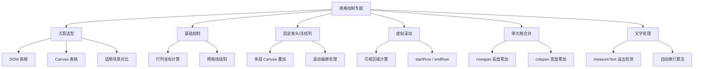

# 表格绘制专题面试题图谱

> 难度范围：⭐⭐ 中级 ~ ⭐⭐⭐ 高级 | 题目数量：7 道 | 更新日期：2025-01

本文档覆盖 Canvas 表格绘制的核心技术，包括方案选型、坐标计算、虚拟滚动、冻结列、单元格合并、文字处理等高频考察点。

> 📌 **进阶特性请参阅：** [02-canvas-advanced.md — Canvas 进阶](./02-canvas-advanced.md)
> 📌 **性能优化请参阅：** [04-performance.md — 性能优化专题](./04-performance.md)

---

## 知识点导图



---

## Q1. DOM 表格 vs Canvas 表格：如何选型？

**难度：** ⭐⭐ 中级
**高频标签：** 🔥 字节跳动高频 | 美团高频

### 考察点
- DOM 表格与 Canvas 表格各自的渲染原理
- 两种方案在性能、交互、可访问性上的差异
- 数据量级对选型的影响
- 主流开源表格库的底层方案（如 AG Grid、Luckysheet）

### 参考答案

**DOM 表格方案：**
- 基于 `<table>`/`<div>` 等 HTML 元素渲染，浏览器负责布局计算
- 优点：天然支持无障碍访问（屏幕阅读器）、文本选中、浏览器内置滚动、CSS 样式灵活
- 缺点：大数据量（万行以上）时 DOM 节点数量庞大，布局重排（reflow）开销极高，滚动卡顿明显

**Canvas 表格方案：**
- 所有单元格通过 Canvas 2D API 手动绘制，无 DOM 节点
- 优点：渲染性能与数据量解耦，10 万行数据与 100 行数据渲染开销相近；支持像素级自定义样式
- 缺点：需手动实现文字选中、键盘导航、无障碍访问；调试困难；代码复杂度高

**选型建议：**

| 场景 | 推荐方案 |
|------|---------|
| 数据量 < 1000 行，需要无障碍/SEO | DOM 表格 |
| 数据量 1000~10000 行，需要虚拟滚动 | DOM 表格 + 虚拟滚动（如 TanStack Virtual） |
| 数据量 > 10000 行，复杂样式/冻结列 | Canvas 表格 |
| 类 Excel 电子表格（Luckysheet、x-spreadsheet） | Canvas 表格 |
| 数据可视化大屏表格 | Canvas 表格 |

### 代码示例

```js
// 特性检测：根据数据量动态选择渲染方案
const createTable = (container, data, options = {}) => {
  const ROW_THRESHOLD = 10000; // 超过此行数切换到 Canvas 方案

  if (data.length > ROW_THRESHOLD || options.forceCanvas) {
    // Canvas 方案：适合大数据量
    return new CanvasTable(container, data, options);
  } else {
    // DOM 方案：适合小数据量，保留无障碍支持
    return new DOMTable(container, data, options);
  }
};

// DOM 表格简单实现
class DOMTable {
  constructor(container, data, options) {
    this.container = container;
    this.data = data;
    this.render();
  }

  render() {
    const table = document.createElement('table');
    table.setAttribute('role', 'grid'); // 无障碍角色

    this.data.forEach((row, rowIdx) => {
      const tr = document.createElement('tr');
      row.forEach((cell, colIdx) => {
        const td = document.createElement('td');
        td.textContent = cell;
        td.setAttribute('aria-rowindex', rowIdx + 1); // 无障碍行索引
        tr.appendChild(td);
      });
      table.appendChild(tr);
    });

    this.container.appendChild(table);
  }
}
```

> 💡 **延伸思考：** AG Grid 在数据量超过阈值时会自动切换到"无限行模式"（Infinite Row Model），底层仍使用 DOM 但配合虚拟滚动。而 Luckysheet 则完全基于 Canvas。两种思路各有取舍，你在实际项目中会如何权衡？

---

## Q2. 使用 Canvas 绘制基础表格：行列坐标如何计算？

**难度：** ⭐⭐ 中级
**高频标签：** 🔥 阿里高频 | 字节跳动高频

### 考察点
- 行列坐标的基本计算公式
- 等宽列与变宽列的坐标计算差异
- 网格线的绘制优化（批量路径 vs 逐条绘制）
- 表格边框的像素对齐问题（避免模糊）

### 参考答案

Canvas 表格的核心是将行列索引映射到画布坐标。

**等宽列坐标公式：**
- 第 `col` 列的 X 起点：`x = col * colWidth`
- 第 `row` 行的 Y 起点：`y = row * rowHeight`
- 单元格宽度：`colWidth`，单元格高度：`rowHeight`

**变宽列坐标（需预计算累积宽度）：**
- `colOffsets[col] = sum(colWidths[0..col-1])`
- 第 `col` 列 X 起点：`x = colOffsets[col]`

**像素对齐：** Canvas 的线条以路径为中心向两侧延伸，`lineWidth=1` 时路径在整数坐标上会导致模糊（各占 0.5px）。解决方案：将坐标偏移 0.5px（`x + 0.5`）使线条落在像素中心。

### 代码示例

```js
/**
 * 绘制基础 Canvas 表格
 * @param {CanvasRenderingContext2D} ctx
 * @param {object} options
 */
const drawTable = (ctx, options) => {
  const {
    data,           // 二维数组：data[row][col]
    colWidths,      // 每列宽度数组，如 [100, 150, 120]
    rowHeight = 32, // 行高（等高）
    offsetX = 0,    // 表格左上角 X 坐标
    offsetY = 0,    // 表格左上角 Y 坐标
  } = options;

  const rowCount = data.length;
  const colCount = colWidths.length;

  // 预计算每列的 X 起点（累积宽度）
  const colOffsets = colWidths.reduce((acc, w, i) => {
    acc.push(i === 0 ? offsetX : acc[i - 1] + colWidths[i - 1]);
    return acc;
  }, []);

  const totalWidth = colWidths.reduce((sum, w) => sum + w, 0);
  const totalHeight = rowCount * rowHeight;

  // ── 绘制单元格背景 ──
  data.forEach((row, rowIdx) => {
    // 第 rowIdx 行的 Y 起点
    const y = offsetY + rowIdx * rowHeight; // y = row * rowHeight

    row.forEach((cell, colIdx) => {
      // 第 colIdx 列的 X 起点
      const x = colOffsets[colIdx]; // x = col * colWidth（等宽时）

      // 交替行背景色
      ctx.fillStyle = rowIdx % 2 === 0 ? '#ffffff' : '#f8f9fa';
      ctx.fillRect(x, y, colWidths[colIdx], rowHeight);

      // 绘制单元格文字（左对齐，垂直居中）
      ctx.fillStyle = '#333333';
      ctx.font = '14px Arial';
      ctx.textBaseline = 'middle';
      ctx.fillText(
        String(cell),
        x + 8,                    // 左内边距 8px
        y + rowHeight / 2,        // 垂直居中
        colWidths[colIdx] - 16    // 最大宽度（防溢出）
      );
    });
  });

  // ── 批量绘制网格线（性能优化：合并为一条路径）──
  ctx.beginPath();
  ctx.strokeStyle = '#e0e0e0';
  ctx.lineWidth = 1;

  // 水平线：每行底部
  for (let row = 0; row <= rowCount; row++) {
    const y = offsetY + row * rowHeight + 0.5; // +0.5 像素对齐，避免模糊
    ctx.moveTo(offsetX, y);
    ctx.lineTo(offsetX + totalWidth, y);
  }

  // 垂直线：每列右侧
  for (let col = 0; col <= colCount; col++) {
    const x = (col < colCount ? colOffsets[col] : offsetX + totalWidth) + 0.5;
    ctx.moveTo(x, offsetY);
    ctx.lineTo(x, offsetY + totalHeight);
  }

  ctx.stroke(); // 一次性绘制所有网格线
};

// 使用示例
const canvas = document.getElementById('canvas');
const ctx = canvas.getContext('2d');

drawTable(ctx, {
  data: [
    ['姓名', '部门', '薪资'],
    ['张三', '工程', '25000'],
    ['李四', '产品', '22000'],
  ],
  colWidths: [120, 150, 100],
  rowHeight: 36,
  offsetX: 0,
  offsetY: 0,
});
```

> 💡 **延伸思考：** 当列宽支持用户拖拽调整时，`colOffsets` 需要在每次列宽变化后重新计算。如何设计一个高效的列宽管理器，使得拖拽时只重绘受影响的列而非整个表格？这涉及到脏矩形优化，详见 [04-performance.md](./04-performance.md)。

---

## Q3. 固定表头与冻结列如何实现？

**难度：** ⭐⭐⭐ 高级
**高频标签：** 🔥 字节跳动高频 | 腾讯高频

### 考察点
- 多层 Canvas 叠加的分层渲染思路
- 滚动偏移（scrollX/scrollY）对坐标的影响
- 固定区域与滚动区域的坐标系隔离
- 交叉单元格（左上角固定区域）的处理

### 参考答案

固定表头与冻结列的核心思路是**分层渲染**：将表格拆分为 4 个区域，分别绘制在不同的 Canvas 层上。

**四区域划分：**
```
┌─────────────┬──────────────────────┐
│  固定区域    │   表头（水平滚动）    │  ← 不随垂直滚动移动
│ (左上角)    │                      │
├─────────────┼──────────────────────┤
│  冻结列      │   数据区域           │  ← 随垂直滚动移动
│ (垂直滚动)  │   (双向滚动)         │
└─────────────┴──────────────────────┘
```

**实现方案：**
1. 创建多个 Canvas 元素，通过 CSS `position: absolute` 叠加
2. 数据区域 Canvas 响应滚动事件，更新 `scrollX`/`scrollY`
3. 表头 Canvas 只响应水平滚动（`scrollX`），冻结列只响应垂直滚动（`scrollY`）
4. 固定区域（左上角）不响应任何滚动

### 代码示例

```js
class FrozenTable {
  constructor(container, data, options) {
    this.data = data;
    this.colWidths = options.colWidths;
    this.rowHeight = options.rowHeight ?? 32;
    this.frozenCols = options.frozenCols ?? 1; // 冻结列数
    this.frozenRows = options.frozenRows ?? 1; // 冻结行数（表头）
    this.scrollX = 0;
    this.scrollY = 0;

    this._initCanvases(container);
    this._bindScroll();
    this.render();
  }

  _initCanvases(container) {
    // 计算冻结区域尺寸
    this.frozenWidth = this.colWidths
      .slice(0, this.frozenCols)
      .reduce((s, w) => s + w, 0);
    this.frozenHeight = this.frozenRows * this.rowHeight;

    // 创建 4 个 Canvas 层（CSS 绝对定位叠加）
    const makeCanvas = (left, top, width, height, zIndex) => {
      const c = document.createElement('canvas');
      Object.assign(c.style, {
        position: 'absolute', left: `${left}px`, top: `${top}px`, zIndex,
      });
      c.width = width;
      c.height = height;
      container.style.position = 'relative';
      container.appendChild(c);
      return c.getContext('2d');
    };

    const W = container.clientWidth;
    const H = container.clientHeight;

    // 数据区域（右下，双向滚动）
    this.ctxData = makeCanvas(this.frozenWidth, this.frozenHeight,
      W - this.frozenWidth, H - this.frozenHeight, 1);

    // 表头（右上，只随水平滚动）
    this.ctxHeader = makeCanvas(this.frozenWidth, 0,
      W - this.frozenWidth, this.frozenHeight, 2);

    // 冻结列（左下，只随垂直滚动）
    this.ctxFrozenCol = makeCanvas(0, this.frozenHeight,
      this.frozenWidth, H - this.frozenHeight, 2);

    // 固定区域（左上角，不滚动）
    this.ctxCorner = makeCanvas(0, 0,
      this.frozenWidth, this.frozenHeight, 3);
  }

  _bindScroll() {
    // 监听鼠标滚轮，更新滚动偏移并重绘
    this.ctxData.canvas.addEventListener('wheel', (e) => {
      e.preventDefault();
      this.scrollX = Math.max(0, this.scrollX + e.deltaX);
      this.scrollY = Math.max(0, this.scrollY + e.deltaY);
      this.render();
    });
  }

  render() {
    this._drawDataArea();
    this._drawHeader();
    this._drawFrozenCol();
    this._drawCorner();
  }

  _drawDataArea() {
    const ctx = this.ctxData;
    const { width, height } = ctx.canvas;
    ctx.clearRect(0, 0, width, height);

    // 计算可视行范围（虚拟滚动）
    const startRow = this.frozenRows + Math.floor(this.scrollY / this.rowHeight);
    const endRow = Math.min(this.data.length,
      startRow + Math.ceil(height / this.rowHeight) + 1);

    // 计算可视列范围（跳过冻结列）
    const scrollCols = this._getScrollCols(this.scrollX);

    scrollCols.forEach(({ colIdx, x }) => {
      for (let row = startRow; row < endRow; row++) {
        // 数据区域坐标：减去滚动偏移
        const cellX = x - this.scrollX;                          // x = col * colWidth - scrollX
        const cellY = (row - this.frozenRows) * this.rowHeight   // y = row * rowHeight
          - this.scrollY + (this.frozenRows * this.rowHeight);   // 减去垂直滚动偏移

        ctx.fillStyle = row % 2 === 0 ? '#fff' : '#f8f9fa';
        ctx.fillRect(cellX, cellY - this.frozenHeight,
          this.colWidths[colIdx], this.rowHeight);

        ctx.fillStyle = '#333';
        ctx.font = '13px Arial';
        ctx.textBaseline = 'middle';
        ctx.fillText(
          String(this.data[row]?.[colIdx] ?? ''),
          cellX + 8,
          cellY - this.frozenHeight + this.rowHeight / 2,
          this.colWidths[colIdx] - 16
        );
      }
    });
  }

  _getScrollCols(scrollX) {
    // 计算水平滚动后可见的列（跳过冻结列）
    const result = [];
    let x = this.frozenWidth;
    for (let col = this.frozenCols; col < this.colWidths.length; col++) {
      if (x - scrollX + this.colWidths[col] > 0 &&
          x - scrollX < this.ctxData.canvas.width) {
        result.push({ colIdx: col, x });
      }
      x += this.colWidths[col];
    }
    return result;
  }

  _drawHeader() {
    // 表头只随水平滚动，不随垂直滚动
    const ctx = this.ctxHeader;
    ctx.clearRect(0, 0, ctx.canvas.width, ctx.canvas.height);
    ctx.fillStyle = '#f0f0f0';
    ctx.fillRect(0, 0, ctx.canvas.width, this.frozenHeight);

    this._getScrollCols(this.scrollX).forEach(({ colIdx, x }) => {
      const cellX = x - this.scrollX - this.frozenWidth; // 减去水平滚动偏移
      ctx.fillStyle = '#333';
      ctx.font = 'bold 13px Arial';
      ctx.textBaseline = 'middle';
      ctx.fillText(
        String(this.data[0]?.[colIdx] ?? ''),
        cellX + 8,
        this.frozenHeight / 2,
        this.colWidths[colIdx] - 16
      );
    });
  }

  _drawFrozenCol() {
    // 冻结列只随垂直滚动
    const ctx = this.ctxFrozenCol;
    ctx.clearRect(0, 0, ctx.canvas.width, ctx.canvas.height);

    const startRow = this.frozenRows + Math.floor(this.scrollY / this.rowHeight);
    const endRow = Math.min(this.data.length,
      startRow + Math.ceil(ctx.canvas.height / this.rowHeight) + 1);

    for (let row = startRow; row < endRow; row++) {
      const y = (row - this.frozenRows) * this.rowHeight - this.scrollY; // y = row * rowHeight - scrollY
      let x = 0;
      for (let col = 0; col < this.frozenCols; col++) {
        ctx.fillStyle = row % 2 === 0 ? '#fafafa' : '#f0f0f0';
        ctx.fillRect(x, y, this.colWidths[col], this.rowHeight);
        ctx.fillStyle = '#333';
        ctx.font = '13px Arial';
        ctx.textBaseline = 'middle';
        ctx.fillText(String(this.data[row]?.[col] ?? ''),
          x + 8, y + this.rowHeight / 2, this.colWidths[col] - 16);
        x += this.colWidths[col]; // x = col * colWidth（累加）
      }
    }
  }

  _drawCorner() {
    // 左上角固定区域：不随任何方向滚动
    const ctx = this.ctxCorner;
    ctx.clearRect(0, 0, ctx.canvas.width, ctx.canvas.height);
    ctx.fillStyle = '#e8e8e8';
    ctx.fillRect(0, 0, this.frozenWidth, this.frozenHeight);
    let x = 0;
    for (let col = 0; col < this.frozenCols; col++) {
      ctx.fillStyle = '#333';
      ctx.font = 'bold 13px Arial';
      ctx.textBaseline = 'middle';
      ctx.fillText(String(this.data[0]?.[col] ?? ''),
        x + 8, this.frozenHeight / 2, this.colWidths[col] - 16);
      x += this.colWidths[col];
    }
  }
}
```

> 💡 **延伸思考：** 多层 Canvas 叠加时，如何处理鼠标事件的穿透？可以将最顶层 Canvas 设为透明（`pointer-events: none`），只在数据区域 Canvas 上监听事件，再根据坐标计算命中的是哪个区域（固定区/冻结列/数据区）。

---

## Q4. 虚拟滚动在 Canvas 表格中的实现原理？

**难度：** ⭐⭐⭐ 高级
**高频标签：** 🔥 字节跳动高频 | 阿里高频

### 考察点
- 虚拟滚动的核心思想：只渲染可视区域内的行
- `startRow` / `endRow` 的计算公式
- 滚动偏移（scrollTop）与行索引的映射关系
- 等高行与变高行的计算差异
- Canvas 表格虚拟滚动与 DOM 虚拟滚动的实现差异

### 参考答案

虚拟滚动的核心思想：无论数据有多少行，**只绘制当前可视区域内的行**，通过滚动偏移计算出应该渲染哪些行。

**等高行的关键公式：**
- 可视区域起始行：`startRow = Math.floor(scrollY / rowHeight)`
- 可视区域结束行：`endRow = startRow + Math.ceil(viewportHeight / rowHeight) + 1`（+1 防止底部出现空白）
- 第 `row` 行在画布上的 Y 坐标：`y = row * rowHeight - scrollY`

**Canvas 虚拟滚动 vs DOM 虚拟滚动：**
- DOM 方案需要维护占位元素（撑开滚动容器高度），Canvas 方案通过绘制滚动条或监听外部滚动容器实现
- Canvas 方案每帧重绘整个可视区域，DOM 方案可以只更新变化的行

### 代码示例

```js
class VirtualScrollTable {
  constructor(canvas, data, options = {}) {
    this.canvas = canvas;
    this.ctx = canvas.getContext('2d');
    this.data = data;
    this.colWidths = options.colWidths ?? [100, 150, 120];
    this.rowHeight = options.rowHeight ?? 32;
    this.scrollY = 0;

    // 总高度 = 所有行高之和（等高情况）
    this.totalHeight = data.length * this.rowHeight;

    this._bindEvents();
    this.render();
  }

  get viewportHeight() {
    return this.canvas.height;
  }

  // 核心：根据滚动偏移计算可视行范围
  _getVisibleRange() {
    // 可视区域起始行索引
    const startRow = Math.floor(this.scrollY / this.rowHeight);

    // 可视区域结束行索引（多渲染 1 行防止底部空白）
    const endRow = Math.min(
      this.data.length,
      startRow + Math.ceil(this.viewportHeight / this.rowHeight) + 1
    );

    return { startRow, endRow };
  }

  render() {
    const { ctx } = this;
    ctx.clearRect(0, 0, this.canvas.width, this.canvas.height);

    const { startRow, endRow } = this._getVisibleRange();

    // 只绘制可视范围内的行
    for (let row = startRow; row < endRow; row++) {
      // 第 row 行在画布上的实际 Y 坐标
      const y = row * this.rowHeight - this.scrollY; // y = row * rowHeight - scrollY

      // 交替行背景
      ctx.fillStyle = row % 2 === 0 ? '#ffffff' : '#f5f5f5';
      ctx.fillRect(0, y, this.canvas.width, this.rowHeight);

      // 绘制各列数据
      let x = 0;
      this.colWidths.forEach((colWidth, colIdx) => {
        const cellValue = this.data[row]?.[colIdx] ?? '';
        ctx.fillStyle = '#333333';
        ctx.font = '13px Arial';
        ctx.textBaseline = 'middle';
        ctx.fillText(String(cellValue), x + 8, y + this.rowHeight / 2, colWidth - 16);
        x += colWidth; // x = col * colWidth（累加）
      });
    }

    // 绘制网格线
    this._drawGridLines(startRow, endRow);

    // 绘制滚动条
    this._drawScrollbar();
  }

  _drawGridLines(startRow, endRow) {
    const { ctx } = this;
    const totalWidth = this.colWidths.reduce((s, w) => s + w, 0);

    ctx.beginPath();
    ctx.strokeStyle = '#e0e0e0';
    ctx.lineWidth = 1;

    // 水平线
    for (let row = startRow; row <= endRow; row++) {
      const y = row * this.rowHeight - this.scrollY + 0.5;
      ctx.moveTo(0, y);
      ctx.lineTo(totalWidth, y);
    }

    // 垂直线
    let x = 0;
    this.colWidths.forEach((w) => {
      x += w;
      ctx.moveTo(x + 0.5, 0);
      ctx.lineTo(x + 0.5, this.viewportHeight);
    });

    ctx.stroke();
  }

  _drawScrollbar() {
    const { ctx } = this;
    const barWidth = 8;
    const barX = this.canvas.width - barWidth - 2;
    const ratio = this.viewportHeight / this.totalHeight;

    if (ratio >= 1) return; // 内容未超出视口，不显示滚动条

    const barHeight = Math.max(30, this.viewportHeight * ratio);
    const barY = (this.scrollY / this.totalHeight) * this.viewportHeight;

    ctx.fillStyle = 'rgba(0,0,0,0.3)';
    ctx.beginPath();
    ctx.roundRect(barX, barY, barWidth, barHeight, 4);
    ctx.fill();
  }

  _bindEvents() {
    this.canvas.addEventListener('wheel', (e) => {
      e.preventDefault();
      const maxScroll = this.totalHeight - this.viewportHeight;
      this.scrollY = Math.max(0, Math.min(maxScroll, this.scrollY + e.deltaY));
      this.render();
    });
  }
}

// 使用示例：10 万行数据
const data = Array.from({ length: 100000 }, (_, i) =>
  [`行 ${i + 1}`, `数据 ${i}`, Math.random().toFixed(2)]
);

const canvas = document.getElementById('canvas');
canvas.width = 400;
canvas.height = 500;
new VirtualScrollTable(canvas, data, {
  colWidths: [120, 160, 100],
  rowHeight: 32,
});
```

> 💡 **延伸思考：** 变高行（每行高度不同）的虚拟滚动如何实现？需要预计算每行的累积高度数组 `rowOffsets`，然后用二分查找定位 `startRow`（时间复杂度 O(log n)），而非直接除法。这在行高由内容决定（如自动换行）的场景中非常重要。

---

## Q5. 单元格合并（rowspan/colspan）的坐标计算方法？

**难度：** ⭐⭐⭐ 高级
**高频标签：** 🔥 阿里高频 | 字节跳动高频

### 考察点
- 合并单元格的数据结构设计
- rowspan 对单元格高度的影响：`height = rowspan * rowHeight`
- colspan 对单元格宽度的影响：`width = sum(colWidths[col..col+colspan-1])`
- 被合并单元格的跳过逻辑
- 合并单元格与虚拟滚动的兼容处理

### 参考答案

合并单元格的核心是：**主单元格**（左上角）负责绘制，**被合并单元格**跳过绘制。

**数据结构设计：**
```js
// 合并信息映射：key = "row,col"，value = 合并配置
const mergeMap = {
  '0,0': { rowspan: 2, colspan: 2 }, // (0,0) 合并 2 行 2 列
  '2,1': { rowspan: 1, colspan: 3 }, // (2,1) 合并 1 行 3 列
};
```

**坐标计算：**
- 合并单元格宽度：`width = colWidths[col] + colWidths[col+1] + ... + colWidths[col+colspan-1]`
- 合并单元格高度：`height = rowspan * rowHeight`
- 被合并单元格判断：检查其左上方是否有覆盖它的主单元格

### 代码示例

```js
/**
 * 绘制支持单元格合并的 Canvas 表格
 */
const drawMergedTable = (ctx, data, colWidths, rowHeight, mergeMap) => {
  // 预计算列偏移
  const colOffsets = colWidths.reduce((acc, w, i) => {
    acc.push(i === 0 ? 0 : acc[i - 1] + colWidths[i - 1]);
    return acc;
  }, []);

  // 构建"被合并单元格"集合，用于跳过绘制
  const skippedCells = new Set();

  Object.entries(mergeMap).forEach(([key, { rowspan, colspan }]) => {
    const [startRow, startCol] = key.split(',').map(Number);
    // 标记所有被合并的子单元格（排除主单元格自身）
    for (let r = startRow; r < startRow + rowspan; r++) {
      for (let c = startCol; c < startCol + colspan; c++) {
        if (r !== startRow || c !== startCol) {
          skippedCells.add(`${r},${c}`);
        }
      }
    }
  });

  data.forEach((row, rowIdx) => {
    row.forEach((cell, colIdx) => {
      const cellKey = `${rowIdx},${colIdx}`;

      // 跳过被合并的子单元格
      if (skippedCells.has(cellKey)) return;

      const merge = mergeMap[cellKey] ?? { rowspan: 1, colspan: 1 };

      // 计算合并后的单元格尺寸
      const x = colOffsets[colIdx];                                    // x = col * colWidth（累积）
      const y = rowIdx * rowHeight;                                     // y = row * rowHeight

      // colspan 宽度：累加跨越的列宽
      const cellWidth = colWidths
        .slice(colIdx, colIdx + merge.colspan)
        .reduce((s, w) => s + w, 0);

      // rowspan 高度：行高 × 跨越行数
      const cellHeight = merge.rowspan * rowHeight;                    // height = rowspan * rowHeight

      // 绘制单元格背景
      ctx.fillStyle = mergeMap[cellKey] ? '#fff3cd' : '#ffffff'; // 合并单元格用黄色背景区分
      ctx.fillRect(x, y, cellWidth, cellHeight);

      // 绘制单元格文字（垂直水平居中）
      ctx.fillStyle = '#333333';
      ctx.font = '13px Arial';
      ctx.textAlign = 'center';
      ctx.textBaseline = 'middle';
      ctx.fillText(
        String(cell),
        x + cellWidth / 2,   // 水平居中
        y + cellHeight / 2,  // 垂直居中
        cellWidth - 8
      );
      ctx.textAlign = 'left'; // 重置对齐方式
    });
  });

  // 绘制网格线（跳过被合并区域内部的线）
  ctx.beginPath();
  ctx.strokeStyle = '#cccccc';
  ctx.lineWidth = 1;

  data.forEach((row, rowIdx) => {
    row.forEach((_, colIdx) => {
      if (skippedCells.has(`${rowIdx},${colIdx}`)) return;
      const merge = mergeMap[`${rowIdx},${colIdx}`] ?? { rowspan: 1, colspan: 1 };
      const x = colOffsets[colIdx] + 0.5;
      const y = rowIdx * rowHeight + 0.5;
      const w = colWidths.slice(colIdx, colIdx + merge.colspan).reduce((s, v) => s + v, 0);
      const h = merge.rowspan * rowHeight;
      ctx.strokeRect(x, y, w, h);
    });
  });

  ctx.stroke();
};
```

> 💡 **延伸思考：** 合并单元格与虚拟滚动结合时，如何处理跨越可视区域边界的合并单元格？例如一个 rowspan=5 的单元格，其主单元格在可视区域外（已滚动过去），但部分区域仍在可视区域内。需要在计算 `startRow` 时，向上扩展搜索范围，找到所有可能覆盖当前可视区域的主单元格。

---

## Q6. 文字溢出省略（ellipsis）在 Canvas 单元格中如何处理？

**难度：** ⭐⭐ 中级
**高频标签：** 🔥 美团高频 | 阿里高频

### 考察点
- `measureText(text).width` 检测文字宽度
- 二分查找优化截断位置的查找效率
- 省略号宽度需要预先计算并从可用宽度中扣除
- `fillText` 的第四个参数 `maxWidth` 与手动截断的区别

### 参考答案

Canvas 没有 CSS 的 `text-overflow: ellipsis`，需要手动实现：

1. 用 `ctx.measureText(text).width` 测量文字宽度
2. 若宽度超出单元格可用宽度，逐字符截断并加上省略号 `...`
3. 优化：用二分查找代替逐字符遍历，将时间复杂度从 O(n) 降至 O(log n)

**注意：** `fillText` 的第四个参数 `maxWidth` 会压缩文字而非截断，视觉效果是文字变窄，不是省略号效果，不能用于实现 ellipsis。

### 代码示例

```js
/**
 * 在 Canvas 中绘制带省略号的文字
 * @param {CanvasRenderingContext2D} ctx
 * @param {string} text - 原始文字
 * @param {number} x - 绘制起点 X
 * @param {number} y - 绘制起点 Y
 * @param {number} maxWidth - 单元格可用宽度
 * @returns {string} 实际绘制的文字（含省略号）
 */
const fillTextEllipsis = (ctx, text, x, y, maxWidth) => {
  const ELLIPSIS = '...';
  const ellipsisWidth = ctx.measureText(ELLIPSIS).width;

  // 文字宽度未超出，直接绘制
  if (ctx.measureText(text).width <= maxWidth) {
    ctx.fillText(text, x, y);
    return text;
  }

  // 可用于文字的宽度（扣除省略号宽度）
  const availableWidth = maxWidth - ellipsisWidth;

  // 二分查找最大可容纳的字符数
  let lo = 0;
  let hi = text.length;

  while (lo < hi) {
    const mid = Math.ceil((lo + hi) / 2);
    const w = ctx.measureText(text.slice(0, mid)).width;
    if (w <= availableWidth) {
      lo = mid;
    } else {
      hi = mid - 1;
    }
  }

  const truncated = text.slice(0, lo) + ELLIPSIS;
  ctx.fillText(truncated, x, y);
  return truncated;
};

// 在表格单元格中使用
const drawCellWithEllipsis = (ctx, text, x, y, colWidth, rowHeight) => {
  const PADDING = 8; // 左右内边距
  const availableWidth = colWidth - PADDING * 2;

  ctx.font = '13px Arial';
  ctx.textBaseline = 'middle';
  ctx.fillStyle = '#333333';

  fillTextEllipsis(ctx, text, x + PADDING, y + rowHeight / 2, availableWidth);
};

// 使用示例
const canvas = document.getElementById('canvas');
const ctx = canvas.getContext('2d');

drawCellWithEllipsis(ctx, '这是一段很长的文字内容，超出单元格宽度后会显示省略号', 0, 0, 150, 32);
drawCellWithEllipsis(ctx, '短文字', 0, 32, 150, 32); // 不超出，正常显示
```

> 💡 **延伸思考：** 如果需要支持 Tooltip（鼠标悬停时显示完整文字），需要在鼠标移动事件中检测鼠标位置对应的单元格，判断该单元格是否发生了截断（可以缓存截断结果），若截断则显示原生 `title` 属性或自定义 Tooltip。

---

## Q7. Canvas 表格中的文字自动换行如何实现？

**难度：** ⭐⭐⭐ 高级
**高频标签：** 🔥 字节跳动高频 | 阿里高频

### 考察点
- Canvas 不支持自动换行，需手动实现分词逻辑
- 中文与英文的分词策略差异
- 换行后行高的动态计算
- 自动换行与虚拟滚动的兼容（变高行）

### 参考答案

Canvas 的 `fillText` 不支持自动换行，需要手动将文字按宽度分割成多行。

**实现思路：**
1. 按空格（英文）或逐字符（中文）分词
2. 逐词/字累加宽度，超出时换行
3. 返回分行结果数组，按行绘制

**中英文混合处理：** 英文按单词分割（空格），中文每个字符都可以换行。可以用正则将文字分割为"词元"（英文单词 + 中文字符）。

### 代码示例

```js
/**
 * 将文字按宽度自动分行
 * @param {CanvasRenderingContext2D} ctx
 * @param {string} text
 * @param {number} maxWidth - 单元格可用宽度
 * @returns {string[]} 分行后的文字数组
 */
const wrapText = (ctx, text, maxWidth) => {
  if (!text) return [''];

  // 将文字分割为词元：英文单词 + 中文字符 + 标点
  // 正则：匹配英文单词、数字序列、或单个非空白字符
  const tokens = text.match(/[a-zA-Z0-9]+|[^\s]/g) ?? [];

  const lines = [];
  let currentLine = '';

  tokens.forEach((token) => {
    const testLine = currentLine ? `${currentLine}${token}` : token;
    const testWidth = ctx.measureText(testLine).width;

    if (testWidth > maxWidth && currentLine) {
      // 当前行已满，换行
      lines.push(currentLine);
      currentLine = token;
    } else {
      // 英文单词间加空格
      currentLine = currentLine && /^[a-zA-Z0-9]/.test(token) && /[a-zA-Z0-9]$/.test(currentLine)
        ? `${currentLine} ${token}`
        : testLine;
    }
  });

  if (currentLine) lines.push(currentLine);
  return lines.length > 0 ? lines : [''];
};

/**
 * 在单元格中绘制自动换行文字
 * @returns {number} 实际占用的行数
 */
const drawWrappedCell = (ctx, text, x, y, colWidth, lineHeight, maxLines = Infinity) => {
  const PADDING = 8;
  const availableWidth = colWidth - PADDING * 2;

  ctx.font = '13px Arial';
  ctx.textBaseline = 'top';
  ctx.fillStyle = '#333333';

  const lines = wrapText(ctx, text, availableWidth);
  const visibleLines = lines.slice(0, maxLines);

  visibleLines.forEach((line, i) => {
    // 若是最后一行且有更多内容，加省略号
    if (i === maxLines - 1 && lines.length > maxLines) {
      const ellipsis = '...';
      const ellipsisWidth = ctx.measureText(ellipsis).width;
      let truncated = line;
      while (ctx.measureText(truncated + ellipsis).width > availableWidth && truncated.length > 0) {
        truncated = truncated.slice(0, -1);
      }
      ctx.fillText(truncated + ellipsis, x + PADDING, y + i * lineHeight);
    } else {
      ctx.fillText(line, x + PADDING, y + i * lineHeight);
    }
  });

  return visibleLines.length;
};

// 动态行高表格：根据内容计算每行高度
const calcRowHeight = (ctx, rowData, colWidths, baseLineHeight = 20, padding = 8) => {
  return rowData.reduce((maxLines, cell, colIdx) => {
    const lines = wrapText(ctx, String(cell), colWidths[colIdx] - padding * 2);
    return Math.max(maxLines, lines.length);
  }, 1) * baseLineHeight + padding * 2;
};

// 使用示例
const canvas = document.getElementById('canvas');
const ctx = canvas.getContext('2d');
ctx.font = '13px Arial';

const text = 'This is a long English sentence that needs to wrap. 这是一段需要自动换行的中文文字内容。';
drawWrappedCell(ctx, text, 0, 0, 200, 20, 3); // 最多显示 3 行
```

> 💡 **延伸思考：** 自动换行会导致行高不固定，与虚拟滚动结合时需要预计算所有行的高度并存储在 `rowHeights` 数组中，再用前缀和数组 `rowOffsets` 快速定位任意行的 Y 坐标。这个预计算过程本身也可能很耗时（需要对每个单元格调用 `measureText`），可以考虑懒计算（只计算可视区域附近的行高）或 Web Worker 异步计算。

---

## 延伸阅读

- [MDN — CanvasRenderingContext2D.measureText()](https://developer.mozilla.org/zh-CN/docs/Web/API/CanvasRenderingContext2D/measureText) — 文字宽度测量 API，含 TextMetrics 对象的完整属性说明
- [MDN — Canvas API 教程：绘制文本](https://developer.mozilla.org/zh-CN/docs/Web/API/Canvas_API/Tutorial/Drawing_text) — 官方文字绘制教程，包含字体、对齐、基线等详细说明
- [Luckysheet 源码 — GitHub](https://github.com/dream-num/Luckysheet) — 基于 Canvas 的开源电子表格，可参考其表格绘制、冻结列、合并单元格的实现
- [x-spreadsheet — GitHub](https://github.com/myliang/x-spreadsheet) — 轻量级 Canvas 表格库，代码量适中，适合学习 Canvas 表格核心实现
- [TanStack Virtual — 虚拟滚动](https://tanstack.com/virtual/latest) — 主流虚拟滚动库，可对比 DOM 虚拟滚动与 Canvas 虚拟滚动的实现思路

---

> 📌 **文档导航：**
> - 上一篇：[02-canvas-advanced.md — Canvas 进阶](./02-canvas-advanced.md)（变换矩阵、图像处理、OffscreenCanvas）
> - 下一篇：[04-performance.md — 性能优化专题](./04-performance.md)（分层渲染、脏矩形、高清屏适配）
