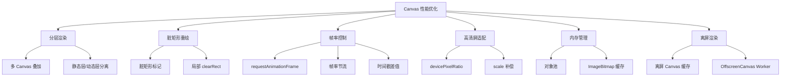

# 性能优化专题面试题图谱

> 难度范围：⭐⭐ 中级 ~ ⭐⭐⭐ 高级 | 题目数量：7 道 | 更新日期：2025-01

本文档覆盖 Canvas 渲染性能优化的核心策略，包括分层渲染、脏矩形局部重绘、帧率控制、高清屏适配、内存管理等高频考察点。

> 📌 **表格绘制优化请参阅：** [03-table-rendering.md — 表格绘制专题](./03-table-rendering.md)
> 📌 **实战应用请参阅：** [05-practical-cases.md — 实战应用专题](./05-practical-cases.md)

---

## 知识点导图



---

## Q1. 分层渲染（多 Canvas 叠加）策略是什么？

**难度：** ⭐⭐⭐ 高级
**高频标签：** 🔥 阿里高频 | 字节跳动高频

### 考察点
- 分层渲染的核心思想：静态内容与动态内容分离
- 多 Canvas 叠加的 CSS 实现方式
- 哪些内容适合放在静态层，哪些放在动态层
- 分层渲染在图表库（ECharts）中的实际应用

### 参考答案

分层渲染的核心思想：将**变化频率不同**的内容绘制在不同的 Canvas 层上，每帧只重绘发生变化的层，避免重绘静态内容。

**典型分层方案（以图表为例）：**
- 底层（静态）：坐标轴、网格线、背景 — 只在初始化或窗口 resize 时重绘
- 中层（半静态）：数据折线、柱状图 — 数据更新时重绘
- 顶层（动态）：鼠标悬停高亮、Tooltip、十字准线 — 每次鼠标移动时重绘

**性能收益：** 假设顶层只占总绘制量的 10%，鼠标移动时只重绘顶层，性能提升约 10 倍。

**ECharts 的分层实现：** ECharts 内部维护一个 `ZRender` 渲染器，根据图层（layer）的 `z` 值将不同图形分配到不同 Canvas，实现分层渲染。

### 代码示例

```js
// ❌ 优化前：所有内容在同一 Canvas，每帧全量重绘
const badExample = (canvas, data) => {
  const ctx = canvas.getContext('2d');

  const render = () => {
    ctx.clearRect(0, 0, canvas.width, canvas.height);

    // 每帧都重绘静态坐标轴（浪费！）
    drawAxes(ctx);
    drawGridLines(ctx);

    // 每帧重绘数据（必要）
    drawData(ctx, data);

    // 每帧重绘鼠标交互层（必要）
    drawTooltip(ctx);

    requestAnimationFrame(render);
  };
  render();
};

// ✅ 优化后：分层渲染，只重绘变化的层
class LayeredRenderer {
  constructor(container, width, height) {
    this.width = width;
    this.height = height;

    // 创建三层 Canvas（CSS 绝对定位叠加）
    this.staticCtx = this._createLayer(container, 1);   // 底层：静态内容
    this.dataCtx = this._createLayer(container, 2);     // 中层：数据内容
    this.interactCtx = this._createLayer(container, 3); // 顶层：交互内容

    // 标记各层是否需要重绘
    this._staticDirty = true;
    this._dataDirty = true;
  }

  _createLayer(container, zIndex) {
    const canvas = document.createElement('canvas');
    canvas.width = this.width;
    canvas.height = this.height;
    Object.assign(canvas.style, {
      position: 'absolute', top: 0, left: 0, zIndex,
    });
    container.style.position = 'relative';
    container.appendChild(canvas);
    return canvas.getContext('2d');
  }

  // 标记静态层需要重绘（如窗口 resize）
  markStaticDirty() { this._staticDirty = true; }

  // 标记数据层需要重绘（如数据更新）
  markDataDirty() { this._dataDirty = true; }

  render(data, mousePos) {
    // 静态层：只在标记为脏时重绘
    if (this._staticDirty) {
      const ctx = this.staticCtx;
      ctx.clearRect(0, 0, this.width, this.height);
      drawAxes(ctx);       // 坐标轴（静态）
      drawGridLines(ctx);  // 网格线（静态）
      this._staticDirty = false;
    }

    // 数据层：数据变化时重绘
    if (this._dataDirty) {
      const ctx = this.dataCtx;
      ctx.clearRect(0, 0, this.width, this.height);
      drawData(ctx, data); // 数据折线（半静态）
      this._dataDirty = false;
    }

    // 交互层：每帧重绘（鼠标位置变化）
    const ctx = this.interactCtx;
    ctx.clearRect(0, 0, this.width, this.height);
    if (mousePos) {
      drawCrosshair(ctx, mousePos); // 十字准线（动态）
      drawTooltip(ctx, mousePos, data); // Tooltip（动态）
    }
  }
}
```

> 💡 **延伸思考：** 分层数量并非越多越好。每个 Canvas 层都会占用独立的 GPU 纹理内存，层数过多反而增加 GPU 合成开销。通常 2~4 层是合理范围。如何判断是否需要分层？可以用 Chrome DevTools 的 Rendering 面板开启"Paint flashing"，观察每帧的重绘区域。

---

## Q2. 脏矩形（Dirty Rectangle）局部重绘优化原理？

**难度：** ⭐⭐⭐ 高级
**高频标签：** 🔥 字节跳动高频 | 腾讯高频

### 考察点
- 脏矩形的定义：发生变化的最小包围矩形
- 局部 `clearRect` + 局部重绘 vs 全量重绘的性能差异
- 多个脏矩形的合并策略
- 脏矩形在 Canvas 表格中的应用（单元格编辑）

### 参考答案

脏矩形优化的核心：**只清除和重绘发生变化的区域**，而非每帧清空整个画布。

**实现步骤：**
1. 记录每个可绘制对象的包围矩形（bounding box）
2. 当对象状态变化时，将其旧包围矩形和新包围矩形都标记为"脏"
3. 每帧只清除脏矩形区域，只重绘与脏矩形相交的对象
4. 多个脏矩形可以合并为一个大矩形（减少 `clearRect` 调用次数）

**适用场景：** 画布中大部分内容静止，只有少数对象在移动（如拖拽、动画精灵）。

**不适用场景：** 全屏动画（每帧大部分区域都变化），此时脏矩形计算开销反而得不偿失。

### 代码示例

```js
// 脏矩形管理器
class DirtyRectManager {
  constructor() {
    this._dirtyRects = []; // 待重绘的矩形列表
  }

  // 标记一个矩形区域为脏
  markDirty(x, y, width, height) {
    this._dirtyRects.push({ x, y, width, height });
  }

  // 合并所有脏矩形为一个最小包围矩形
  getMergedRect() {
    if (this._dirtyRects.length === 0) return null;

    let minX = Infinity, minY = Infinity, maxX = -Infinity, maxY = -Infinity;

    this._dirtyRects.forEach(({ x, y, width, height }) => {
      minX = Math.min(minX, x);
      minY = Math.min(minY, y);
      maxX = Math.max(maxX, x + width);
      maxY = Math.max(maxY, y + height);
    });

    return { x: minX, y: minY, width: maxX - minX, height: maxY - minY };
  }

  clear() {
    this._dirtyRects = [];
  }
}

// 使用脏矩形优化的渲染循环
class DirtyRectRenderer {
  constructor(canvas) {
    this.canvas = canvas;
    this.ctx = canvas.getContext('2d');
    this.objects = []; // 所有可绘制对象
    this.dirtyManager = new DirtyRectManager();
  }

  // 移动对象时标记脏矩形
  moveObject(obj, newX, newY) {
    // 标记旧位置为脏（需要清除）
    this.dirtyManager.markDirty(obj.x - 1, obj.y - 1, obj.width + 2, obj.height + 2);

    // 更新位置
    obj.x = newX;
    obj.y = newY;

    // 标记新位置为脏（需要重绘）
    this.dirtyManager.markDirty(obj.x - 1, obj.y - 1, obj.width + 2, obj.height + 2);
  }

  render() {
    const mergedRect = this.dirtyManager.getMergedRect();

    if (!mergedRect) return; // 没有脏区域，跳过本帧

    const { x, y, width, height } = mergedRect;

    // ✅ 只清除脏矩形区域（而非整个画布）
    this.ctx.clearRect(x, y, width, height);

    // 只重绘与脏矩形相交的对象
    this.ctx.save();
    this.ctx.beginPath();
    this.ctx.rect(x, y, width, height);
    this.ctx.clip(); // 裁剪到脏矩形区域，防止重绘溢出

    this.objects.forEach((obj) => {
      // 检查对象是否与脏矩形相交
      if (this._intersects(obj, mergedRect)) {
        this._drawObject(obj);
      }
    });

    this.ctx.restore();
    this.dirtyManager.clear(); // 清空脏矩形列表
  }

  _intersects(obj, rect) {
    return !(obj.x + obj.width < rect.x ||
             obj.x > rect.x + rect.width ||
             obj.y + obj.height < rect.y ||
             obj.y > rect.y + rect.height);
  }

  _drawObject(obj) {
    this.ctx.fillStyle = obj.color;
    this.ctx.fillRect(obj.x, obj.y, obj.width, obj.height);
  }
}
```

> 💡 **延伸思考：** 在 Canvas 表格中，当用户编辑某个单元格时，只需要重绘该单元格所在的矩形区域（`x = colOffset, y = row * rowHeight, width = colWidth, height = rowHeight`），而非整个表格。这可以将单元格编辑的重绘开销从 O(总单元格数) 降至 O(1)。

---

## Q3. requestAnimationFrame 与 Canvas 动画帧率控制

**难度：** ⭐⭐ 中级
**高频标签：** 🔥 字节跳动高频 | 美团高频

### 考察点
- `requestAnimationFrame` vs `setInterval` 的本质区别
- rAF 回调参数 `timestamp` 的含义与用途
- 帧率节流：限制动画在指定 FPS 运行
- 页面不可见时 rAF 自动暂停的机制
- `cancelAnimationFrame` 的使用时机

### 参考答案

**`requestAnimationFrame` vs `setInterval`：**
- `setInterval(fn, 16)` 不与显示器刷新率同步，可能导致丢帧或撕裂
- `requestAnimationFrame` 在浏览器下一次重绘前调用，与显示器刷新率（通常 60Hz/120Hz）同步
- 页面不可见时（切换标签页），rAF 自动暂停，节省 CPU/GPU 资源；`setInterval` 仍会继续执行

**帧率节流：** 当动画不需要 60FPS（如数据每秒更新一次），可以通过时间戳差值控制实际渲染频率。

**`timestamp` 参数：** rAF 回调接收一个高精度时间戳（`DOMHighResTimeStamp`），单位毫秒，精度可达微秒级，用于计算帧间隔。

### 代码示例

```js
// ❌ 优化前：使用 setInterval，不与刷新率同步
const badAnimation = (canvas) => {
  const ctx = canvas.getContext('2d');
  let x = 0;

  // setInterval 不与显示器刷新率同步，可能丢帧
  setInterval(() => {
    ctx.clearRect(0, 0, canvas.width, canvas.height);
    ctx.fillRect(x, 50, 50, 50);
    x = (x + 2) % canvas.width;
  }, 16); // 约 60FPS，但不精确
};

// ✅ 优化后：使用 requestAnimationFrame
const goodAnimation = (canvas) => {
  const ctx = canvas.getContext('2d');
  let x = 0;
  let animId = null;

  const render = (timestamp) => {
    ctx.clearRect(0, 0, canvas.width, canvas.height);
    ctx.fillStyle = '#3498db';
    ctx.fillRect(x, 50, 50, 50);
    x = (x + 2) % canvas.width;

    // 返回 animId 以便后续取消
    animId = requestAnimationFrame(render);
  };

  animId = requestAnimationFrame(render);

  // 清理：组件卸载时取消动画
  return () => cancelAnimationFrame(animId);
};

// ✅ 帧率节流：限制动画在指定 FPS 运行
const createThrottledAnimation = (canvas, targetFPS = 30) => {
  const ctx = canvas.getContext('2d');
  const frameInterval = 1000 / targetFPS; // 每帧最小间隔（ms）
  let lastFrameTime = 0;
  let animId = null;

  const render = (timestamp) => {
    // 计算距上一帧的时间差
    const elapsed = timestamp - lastFrameTime;

    if (elapsed >= frameInterval) {
      // 修正 lastFrameTime，避免累积误差
      lastFrameTime = timestamp - (elapsed % frameInterval);

      // 执行实际绘制
      ctx.clearRect(0, 0, canvas.width, canvas.height);
      ctx.fillStyle = `hsl(${timestamp / 10 % 360}, 70%, 50%)`;
      ctx.fillRect(50, 50, 100, 100);
    }

    animId = requestAnimationFrame(render);
  };

  animId = requestAnimationFrame(render);
  return () => cancelAnimationFrame(animId);
};

// ✅ 基于时间的动画（与帧率无关）
const timeBasedAnimation = (canvas) => {
  const ctx = canvas.getContext('2d');
  const SPEED = 100; // 像素/秒（与帧率无关）
  let x = 0;
  let lastTime = null;

  const render = (timestamp) => {
    if (lastTime !== null) {
      const deltaTime = (timestamp - lastTime) / 1000; // 转换为秒
      x = (x + SPEED * deltaTime) % canvas.width; // 基于时间计算位移
    }
    lastTime = timestamp;

    ctx.clearRect(0, 0, canvas.width, canvas.height);
    ctx.fillRect(x, 50, 50, 50);
    requestAnimationFrame(render);
  };

  requestAnimationFrame(render);
};
```

> 💡 **延伸思考：** 在 120Hz 显示器上，rAF 回调频率会提升到 120 次/秒。如果动画逻辑基于"每帧移动固定像素"（而非基于时间），在 120Hz 屏幕上动画速度会是 60Hz 屏幕的 2 倍。这就是为什么推荐使用"基于时间的动画"（`deltaTime * speed`）而非"基于帧的动画"。

---

## Q4. devicePixelRatio 与高清屏适配原理？

**难度：** ⭐⭐ 中级
**高频标签：** 🔥 字节跳动高频 | 阿里高频

### 考察点
- `devicePixelRatio`（DPR）的定义：物理像素与 CSS 像素的比值
- Canvas 模糊的根本原因
- 高清适配的标准实现步骤
- DPR 变化时（如拖动窗口到不同屏幕）的动态响应
- 高清适配对内存的影响

### 参考答案

**DPR（devicePixelRatio）：** 设备物理像素与 CSS 逻辑像素的比值。Retina 屏 DPR=2，意味着 1 个 CSS 像素对应 2×2=4 个物理像素。

**Canvas 模糊的原因：** 默认情况下，`<canvas width="400" height="300">` 创建的是 400×300 的绘图缓冲区，但在 DPR=2 的屏幕上，浏览器需要将其拉伸到 800×600 物理像素显示，导致模糊。

**高清适配步骤：**
1. 将 Canvas 的 `width`/`height` 属性乘以 DPR（扩大物理像素）
2. 通过 CSS 将 Canvas 显示尺寸设回逻辑像素大小
3. 对 Canvas 上下文调用 `scale(dpr, dpr)`，使绘图坐标仍使用逻辑像素

**内存影响：** DPR=2 时，Canvas 内存占用是普通屏的 4 倍（宽×2，高×2）。在移动端需注意内存限制。

### 代码示例

```js
// ❌ 优化前：未处理 DPR，Retina 屏显示模糊
const blurryCanvas = () => {
  const canvas = document.getElementById('canvas');
  canvas.width = 400;   // 绘图缓冲区 400px
  canvas.height = 300;
  canvas.style.width = '400px';  // CSS 显示 400px
  canvas.style.height = '300px';
  // 在 DPR=2 的屏幕上，400px 缓冲区被拉伸到 800 物理像素 → 模糊
};

// ✅ 优化后：高清屏适配
const createHiDPICanvas = (container, logicalWidth, logicalHeight) => {
  const canvas = document.createElement('canvas');
  const dpr = window.devicePixelRatio ?? 1;

  // 步骤1：物理像素尺寸 = 逻辑尺寸 × DPR
  canvas.width = logicalWidth * dpr;
  canvas.height = logicalHeight * dpr;

  // 步骤2：CSS 显示尺寸保持逻辑像素大小
  canvas.style.width = `${logicalWidth}px`;
  canvas.style.height = `${logicalHeight}px`;

  container.appendChild(canvas);

  const ctx = canvas.getContext('2d');

  // 步骤3：缩放上下文，使绘图坐标使用逻辑像素
  ctx.scale(dpr, dpr);

  // 返回上下文和逻辑尺寸（绘图时使用逻辑坐标）
  return { ctx, width: logicalWidth, height: logicalHeight, dpr };
};

// 响应 DPR 变化（如拖动窗口到不同屏幕）
const watchDPRChange = (canvas, onDPRChange) => {
  let currentDPR = window.devicePixelRatio;

  // 使用 matchMedia 监听 DPR 变化
  const updateDPR = () => {
    const newDPR = window.devicePixelRatio;
    if (newDPR !== currentDPR) {
      currentDPR = newDPR;
      onDPRChange(newDPR);
    }
    // 重新注册监听（matchMedia 只触发一次）
    window.matchMedia(`(resolution: ${newDPR}dppx)`)
      .addEventListener('change', updateDPR, { once: true });
  };

  window.matchMedia(`(resolution: ${currentDPR}dppx)`)
    .addEventListener('change', updateDPR, { once: true });
};

// 使用示例
const { ctx, width, height } = createHiDPICanvas(document.body, 400, 300);

// 使用逻辑坐标绘制（DPR 已通过 scale 处理）
ctx.fillStyle = '#3498db';
ctx.fillRect(10, 10, 100, 50); // 逻辑坐标，在 Retina 屏上自动映射到物理像素

// 监听 DPR 变化并重新初始化
watchDPRChange(ctx.canvas, (newDPR) => {
  console.log(`DPR 变化为 ${newDPR}，重新初始化 Canvas`);
  // 重新设置 canvas.width/height 和 ctx.scale
});
```

> 💡 **延伸思考：** 在移动端，DPR 可能高达 3（如 iPhone Pro 系列）。一个 375×812 的逻辑尺寸 Canvas，在 DPR=3 时物理像素为 1125×2436，内存占用约 10MB（RGBA 4字节/像素）。如果页面有多个 Canvas，内存压力会很大。可以考虑对非关键 Canvas 使用 `Math.min(dpr, 2)` 限制最大 DPR。

---

## Q5. 离屏 Canvas 缓存静态内容的优化思路？

**难度：** ⭐⭐⭐ 高级
**高频标签：** 🔥 阿里高频 | 腾讯高频

### 考察点
- 离屏 Canvas（Offscreen Canvas）作为缓存的使用方式
- `drawImage(offscreenCanvas, ...)` 的性能优势
- 适合缓存的内容类型（复杂静态图形）
- `ImageBitmap` 与离屏 Canvas 缓存的对比

### 参考答案

离屏 Canvas 缓存的核心思想：将**复杂但不常变化**的图形预先绘制到一个不显示的 Canvas 上，每帧通过 `drawImage` 将缓存内容贴到主 Canvas，避免重复执行复杂绘制逻辑。

**适合缓存的内容：**
- 复杂的背景图案（如网格、渐变背景）
- 精灵图（Sprite）中的单个精灵
- 复杂路径图形（如地图轮廓）

**`ImageBitmap` vs 离屏 Canvas：**
- 离屏 Canvas 可以继续在上面绘制（适合需要更新的缓存）
- `ImageBitmap` 是只读位图，绘制性能更高（GPU 纹理），适合完全静态的缓存

### 代码示例

```js
// ❌ 优化前：每帧重复绘制复杂背景
const badRender = (ctx, width, height) => {
  const render = () => {
    ctx.clearRect(0, 0, width, height);

    // 每帧都重新绘制复杂网格背景（浪费！）
    for (let x = 0; x < width; x += 20) {
      for (let y = 0; y < height; y += 20) {
        ctx.strokeStyle = '#e0e0e0';
        ctx.strokeRect(x, y, 20, 20);
      }
    }

    // 绘制动态内容
    drawDynamicContent(ctx);
    requestAnimationFrame(render);
  };
  render();
};

// ✅ 优化后：离屏 Canvas 缓存静态背景
const createCachedBackground = (width, height) => {
  // 创建离屏 Canvas（不插入 DOM）
  const offscreen = document.createElement('canvas');
  offscreen.width = width;
  offscreen.height = height;
  const offCtx = offscreen.getContext('2d');

  // 一次性绘制复杂背景到离屏 Canvas
  for (let x = 0; x < width; x += 20) {
    for (let y = 0; y < height; y += 20) {
      offCtx.strokeStyle = '#e0e0e0';
      offCtx.strokeRect(x + 0.5, y + 0.5, 20, 20);
    }
  }

  return offscreen; // 返回缓存的离屏 Canvas
};

const optimizedRender = (mainCanvas) => {
  const ctx = mainCanvas.getContext('2d');
  const { width, height } = mainCanvas;

  // 初始化时创建缓存（只执行一次）
  const bgCache = createCachedBackground(width, height);

  const render = () => {
    ctx.clearRect(0, 0, width, height);

    // 每帧只需一次 drawImage 贴背景（极快）
    ctx.drawImage(bgCache, 0, 0);

    // 绘制动态内容
    drawDynamicContent(ctx);

    requestAnimationFrame(render);
  };

  render();
};

// 使用 ImageBitmap 进一步优化（GPU 纹理，更快）
const createImageBitmapCache = async (width, height) => {
  const offscreen = document.createElement('canvas');
  offscreen.width = width;
  offscreen.height = height;
  const offCtx = offscreen.getContext('2d');

  // 绘制复杂内容
  drawComplexBackground(offCtx, width, height);

  // 转换为 ImageBitmap（GPU 纹理，drawImage 性能最优）
  const bitmap = await createImageBitmap(offscreen);
  return bitmap;
};
```

> 💡 **延伸思考：** 离屏 Canvas 缓存在什么情况下需要失效（invalidate）？当缓存内容依赖的数据发生变化时（如主题色切换、窗口 resize），需要重新生成缓存。可以设计一个缓存版本号机制：每次数据变化时递增版本号，渲染时检查版本号是否匹配，不匹配则重新生成缓存。

---

## Q6. 大数据量表格渲染的内存管理与 GC 压力控制

**难度：** ⭐⭐⭐ 高级
**高频标签：** 🔥 字节跳动高频 | 阿里高频

### 考察点
- Canvas 渲染中常见的内存泄漏场景
- 对象池（Object Pool）模式减少 GC 压力
- 避免在渲染循环中创建临时对象
- `ImageBitmap` 的手动释放（`close()` 方法）
- Canvas 本身的内存占用与释放

### 参考答案

**常见内存问题：**
1. **渲染循环中创建临时对象：** 每帧 `new Object()`、数组字面量 `[]`、字符串拼接等都会产生大量短生命周期对象，触发频繁 GC
2. **ImageBitmap 未释放：** `ImageBitmap` 持有 GPU 纹理内存，不再使用时必须调用 `bitmap.close()` 手动释放
3. **Canvas 元素未清理：** 动态创建的离屏 Canvas 如果不移除引用，会持续占用内存
4. **事件监听器泄漏：** Canvas 上的事件监听器未在组件销毁时移除

**对象池模式：** 预先创建一批对象，使用时从池中取出，用完归还，避免频繁 `new`/GC。

### 代码示例

```js
// ❌ 优化前：渲染循环中频繁创建临时对象
const badRenderLoop = (ctx, rows) => {
  const render = () => {
    rows.forEach((row) => {
      // 每帧创建新数组和字符串（GC 压力大）
      const cells = row.data.map((v) => String(v)); // 创建新数组
      const text = cells.join(' | ');               // 创建新字符串
      ctx.fillText(text, row.x, row.y);
    });
    requestAnimationFrame(render);
  };
  render();
};

// ✅ 优化后：对象池 + 预计算，减少 GC 压力
class RenderObjectPool {
  constructor(factory, initialSize = 100) {
    this._pool = Array.from({ length: initialSize }, factory);
    this._factory = factory;
  }

  // 从池中取出对象
  acquire() {
    return this._pool.pop() ?? this._factory();
  }

  // 归还对象到池中（重置状态后归还）
  release(obj) {
    // 重置对象状态，避免脏数据
    if (typeof obj.reset === 'function') obj.reset();
    this._pool.push(obj);
  }
}

// 预计算并缓存渲染数据，避免在渲染循环中计算
class TableRenderer {
  constructor(canvas, data, colWidths, rowHeight) {
    this.ctx = canvas.getContext('2d');
    this.rowHeight = rowHeight;

    // 预计算列偏移（只在数据变化时重新计算）
    this.colOffsets = colWidths.reduce((acc, w, i) => {
      acc.push(i === 0 ? 0 : acc[i - 1] + colWidths[i - 1]);
      return acc;
    }, []);

    // 预格式化所有单元格文字（避免渲染循环中的 String() 转换）
    this.formattedData = data.map((row) =>
      row.map((cell) => String(cell))
    );

    this._bitmapCache = new Map(); // ImageBitmap 缓存
  }

  render(scrollY) {
    const { ctx, rowHeight } = this;
    const startRow = Math.floor(scrollY / rowHeight);
    const endRow = Math.min(
      this.formattedData.length,
      startRow + Math.ceil(ctx.canvas.height / rowHeight) + 1
    );

    ctx.clearRect(0, 0, ctx.canvas.width, ctx.canvas.height);

    // 使用预计算数据，渲染循环中无临时对象创建
    for (let row = startRow; row < endRow; row++) {
      const y = row * rowHeight - scrollY; // y = row * rowHeight - scrollY

      this.formattedData[row].forEach((text, col) => {
        const x = this.colOffsets[col]; // x = col * colWidth（预计算）
        ctx.fillText(text, x + 8, y + rowHeight / 2);
      });
    }
  }

  // 清理资源：释放所有 ImageBitmap
  destroy() {
    this._bitmapCache.forEach((bitmap) => bitmap.close()); // 手动释放 GPU 纹理
    this._bitmapCache.clear();
  }
}

// Canvas 元素的内存释放
const releaseCanvas = (canvas) => {
  // 将 Canvas 尺寸设为 0，释放绘图缓冲区内存
  canvas.width = 0;
  canvas.height = 0;
  // 移除 DOM 引用
  canvas.remove();
};
```

> 💡 **延伸思考：** 如何检测 Canvas 应用的内存泄漏？可以使用 Chrome DevTools 的 Memory 面板，拍摄堆快照（Heap Snapshot），对比操作前后的内存增长。重点关注 `HTMLCanvasElement`、`ImageBitmap`、`ImageData` 等对象的数量是否持续增长。

---

## Q7. 离屏渲染与 Web Worker 结合的完整优化方案

**难度：** ⭐⭐⭐ 高级
**高频标签：** 🔥 字节跳动高频 | 阿里高频

### 考察点
- 将渲染计算完全移至 Worker 的完整架构
- 主线程与 Worker 的职责划分
- 渲染结果回传的两种方式（`transferControlToOffscreen` vs `ImageBitmap`）
- 该方案的适用场景与局限性

### 参考答案

**完整优化架构：**
- 主线程：负责用户交互（鼠标/键盘事件）、数据管理、向 Worker 发送渲染指令
- Worker 线程：负责所有 Canvas 绘制计算，通过 `OffscreenCanvas` 直接渲染或返回 `ImageBitmap`

**两种渲染结果传递方式：**
1. `transferControlToOffscreen`：Worker 直接控制屏幕 Canvas，零延迟，但主线程失去对该 Canvas 的控制权
2. Worker 返回 `ImageBitmap`：主线程保留控制权，可以在主线程叠加绘制（如 Tooltip），但有一帧延迟

**适用场景：** 复杂数据可视化、大数据表格、实时图像处理。

**局限性：** Worker 中无法访问 DOM，无法使用 `window.devicePixelRatio`（需主线程传入），调试相对困难。

### 代码示例

```js
// 主线程：协调器
class CanvasWorkerCoordinator {
  constructor(canvas) {
    this.worker = new Worker('./canvas-worker.js', { type: 'module' });
    this.pendingCallbacks = new Map();
    this.msgId = 0;

    // 将 Canvas 控制权转移给 Worker
    const offscreen = canvas.transferControlToOffscreen();
    this.worker.postMessage(
      {
        type: 'init',
        canvas: offscreen,
        dpr: window.devicePixelRatio ?? 1, // 传入 DPR（Worker 无法访问）
        width: canvas.clientWidth,
        height: canvas.clientHeight,
      },
      [offscreen] // Transferable：零拷贝转移所有权
    );

    this.worker.onmessage = ({ data }) => {
      if (data.type === 'renderComplete') {
        const cb = this.pendingCallbacks.get(data.id);
        cb?.();
        this.pendingCallbacks.delete(data.id);
      }
    };
  }

  // 发送渲染指令给 Worker
  render(renderData, onComplete) {
    const id = ++this.msgId;
    if (onComplete) this.pendingCallbacks.set(id, onComplete);

    this.worker.postMessage({ type: 'render', id, data: renderData });
  }

  destroy() {
    this.worker.terminate();
  }
}

// Worker 线程（canvas-worker.js）
let ctx = null;
let dpr = 1;

self.onmessage = ({ data }) => {
  switch (data.type) {
    case 'init':
      // 在 Worker 中获取 OffscreenCanvas 上下文
      ctx = data.canvas.getContext('2d');
      dpr = data.dpr;
      ctx.scale(dpr, dpr); // 应用 DPR 缩放
      break;

    case 'render':
      if (!ctx) break;
      // 执行实际渲染（不阻塞主线程）
      renderTable(ctx, data.data);
      // 通知主线程渲染完成
      self.postMessage({ type: 'renderComplete', id: data.id });
      break;
  }
};

const renderTable = (ctx, { rows, colWidths, rowHeight, scrollY }) => {
  const { width, height } = ctx.canvas;
  ctx.clearRect(0, 0, width / dpr, height / dpr);

  const startRow = Math.floor(scrollY / rowHeight);
  const endRow = Math.min(rows.length, startRow + Math.ceil(height / dpr / rowHeight) + 1);

  // 预计算列偏移
  const colOffsets = colWidths.reduce((acc, w, i) => {
    acc.push(i === 0 ? 0 : acc[i - 1] + colWidths[i - 1]);
    return acc;
  }, []);

  for (let row = startRow; row < endRow; row++) {
    const y = row * rowHeight - scrollY; // y = row * rowHeight - scrollY
    ctx.fillStyle = row % 2 === 0 ? '#fff' : '#f5f5f5';
    ctx.fillRect(0, y, width / dpr, rowHeight);

    rows[row]?.forEach((cell, col) => {
      const x = colOffsets[col]; // x = col * colWidth（预计算）
      ctx.fillStyle = '#333';
      ctx.font = '13px Arial';
      ctx.textBaseline = 'middle';
      ctx.fillText(String(cell), x + 8, y + rowHeight / 2, colWidths[col] - 16);
    });
  }
};
```

> 💡 **延伸思考：** 当 Worker 渲染速度跟不上主线程的数据更新频率时（如高频实时数据），如何处理渲染队列积压？可以采用"丢帧"策略：Worker 正在渲染时，新的渲染请求不入队，而是替换掉待处理的请求（只保留最新状态），确保渲染的始终是最新数据，而非历史积压数据。

---

## 延伸阅读

- [MDN — Canvas 性能优化指南](https://developer.mozilla.org/zh-CN/docs/Web/API/Canvas_API/Tutorial/Optimizing_canvas) — 官方性能优化建议，涵盖离屏渲染、避免浮点坐标、批量操作等策略
- [MDN — requestAnimationFrame](https://developer.mozilla.org/zh-CN/docs/Web/API/window/requestAnimationFrame) — rAF 官方文档，含时间戳参数说明与最佳实践
- [MDN — devicePixelRatio](https://developer.mozilla.org/zh-CN/docs/Web/API/Window/devicePixelRatio) — DPR 官方文档，含监听 DPR 变化的示例代码
- [Chrome DevTools — 渲染性能分析](https://developer.chrome.com/docs/devtools/performance/) — 使用 Performance 面板分析 Canvas 渲染瓶颈的官方指南
- [OffscreenCanvas — MDN](https://developer.mozilla.org/en-US/docs/Web/API/OffscreenCanvas) — OffscreenCanvas 完整文档，含 Worker 使用示例与兼容性数据

---

> 📌 **文档导航：**
> - 上一篇：[03-table-rendering.md — 表格绘制专题](./03-table-rendering.md)（虚拟滚动、冻结列、单元格合并）
> - 下一篇：[05-practical-cases.md — 实战应用专题](./05-practical-cases.md)（拖拽调列宽、事件系统、低代码平台）
