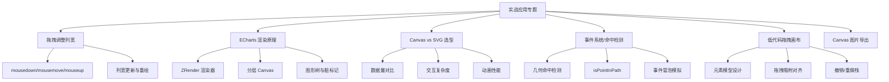

# 实战应用专题面试题图谱

> 难度范围：⭐⭐⭐ 高级 | 题目数量：6 道 | 更新日期：2025-01

本文档覆盖 Canvas 在真实业务场景中的实战应用，每道题采用「分析 → 方案设计 → 关键代码」三段式结构，帮助你将理论知识与项目经验结合。

> 📌 **性能优化基础请参阅：** [04-performance.md — 性能优化专题](./04-performance.md)
> 📌 **Canvas 基础请参阅：** [01-canvas-basics.md — Canvas 基础](./01-canvas-basics.md)

---

## 知识点导图



---

## Q1. 实现支持拖拽调整列宽的 Canvas 表格

**难度：** ⭐⭐⭐ 高级
**高频标签：** 🔥 美团高频 | 字节跳动高频

### 分析

拖拽调整列宽是 Canvas 表格中最常见的交互需求。难点在于：
1. Canvas 没有原生事件系统，需要手动将鼠标坐标映射到列分隔线
2. 拖拽过程中需要实时更新列宽并重绘
3. 需要处理鼠标样式（`cursor: col-resize`）的切换

### 方案设计

1. **命中检测**：在 `mousemove` 中检测鼠标是否在某列分隔线附近（±4px 容差）
2. **拖拽状态机**：维护 `isDragging`、`draggingCol`、`dragStartX`、`dragStartWidth` 状态
3. **实时重绘**：`mousemove` 时更新 `colWidths[draggingCol]` 并调用 `render()`
4. **最小列宽限制**：防止列宽被拖到 0 或负值

### 关键代码

```js
class ResizableTable {
  constructor(canvas, data, colWidths, rowHeight = 32) {
    this.canvas = canvas;
    this.ctx = canvas.getContext('2d');
    this.data = data;
    this.colWidths = [...colWidths]; // 拷贝，避免修改原数组
    this.rowHeight = rowHeight;
    this.MIN_COL_WIDTH = 40; // 最小列宽

    // 拖拽状态
    this._isDragging = false;
    this._draggingCol = -1;   // 正在拖拽的列索引
    this._dragStartX = 0;     // 拖拽起始鼠标 X
    this._dragStartWidth = 0; // 拖拽起始列宽
    this._hoverCol = -1;      // 鼠标悬停的分隔线列索引

    this._bindEvents();
    this.render();
  }

  // 计算每列右边界的 X 坐标
  get _colRightEdges() {
    return this.colWidths.reduce((acc, w) => {
      acc.push((acc.at(-1) ?? 0) + w);
      return acc;
    }, []);
  }

  // 检测鼠标 X 坐标是否命中某列分隔线（±4px 容差）
  _hitTestDivider(mouseX) {
    const TOLERANCE = 4;
    const edges = this._colRightEdges;
    for (let i = 0; i < edges.length - 1; i++) { // 最后一列右边界不可拖拽
      if (Math.abs(mouseX - edges[i]) <= TOLERANCE) {
        return i; // 返回命中的列索引
      }
    }
    return -1;
  }

  _bindEvents() {
    this.canvas.addEventListener('mousemove', (e) => {
      const rect = this.canvas.getBoundingClientRect();
      const mouseX = e.clientX - rect.left;
      const mouseY = e.clientY - rect.top;

      if (this._isDragging) {
        // 拖拽中：更新列宽
        const delta = mouseX - this._dragStartX;
        const newWidth = Math.max(
          this.MIN_COL_WIDTH,
          this._dragStartWidth + delta
        );
        this.colWidths[this._draggingCol] = newWidth;
        this.render(); // 实时重绘
      } else {
        // 非拖拽：检测是否悬停在分隔线上
        const hitCol = this._hitTestDivider(mouseX);
        this._hoverCol = hitCol;
        // 切换鼠标样式
        this.canvas.style.cursor = hitCol >= 0 ? 'col-resize' : 'default';
      }
    });

    this.canvas.addEventListener('mousedown', (e) => {
      if (this._hoverCol >= 0) {
        const rect = this.canvas.getBoundingClientRect();
        this._isDragging = true;
        this._draggingCol = this._hoverCol;
        this._dragStartX = e.clientX - rect.left;
        this._dragStartWidth = this.colWidths[this._hoverCol];
        e.preventDefault(); // 防止文字选中
      }
    });

    // mouseup 在 document 上监听，防止鼠标移出 Canvas 后松开
    document.addEventListener('mouseup', () => {
      if (this._isDragging) {
        this._isDragging = false;
        this._draggingCol = -1;
        // 触发列宽变化回调（通知外部更新）
        this.onColWidthChange?.(this.colWidths);
      }
    });
  }

  render() {
    const { ctx, data, colWidths, rowHeight } = this;
    const { width, height } = this.canvas;
    ctx.clearRect(0, 0, width, height);

    // 预计算列偏移
    const colOffsets = colWidths.reduce((acc, w, i) => {
      acc.push(i === 0 ? 0 : acc[i - 1] + colWidths[i - 1]);
      return acc;
    }, []);

    // 绘制单元格
    data.forEach((row, rowIdx) => {
      const y = rowIdx * rowHeight; // y = row * rowHeight
      row.forEach((cell, colIdx) => {
        const x = colOffsets[colIdx]; // x = col * colWidth（累积）
        ctx.fillStyle = rowIdx % 2 === 0 ? '#fff' : '#f8f9fa';
        ctx.fillRect(x, y, colWidths[colIdx], rowHeight);
        ctx.fillStyle = '#333';
        ctx.font = '13px Arial';
        ctx.textBaseline = 'middle';
        ctx.fillText(String(cell), x + 8, y + rowHeight / 2, colWidths[colIdx] - 16);
      });
    });

    // 绘制网格线
    ctx.beginPath();
    ctx.strokeStyle = '#e0e0e0';
    ctx.lineWidth = 1;
    const totalWidth = colOffsets.at(-1) + colWidths.at(-1);
    const totalHeight = data.length * rowHeight;
    for (let r = 0; r <= data.length; r++) {
      const y = r * rowHeight + 0.5;
      ctx.moveTo(0, y); ctx.lineTo(totalWidth, y);
    }
    colOffsets.forEach((x) => {
      ctx.moveTo(x + 0.5, 0); ctx.lineTo(x + 0.5, totalHeight);
    });
    ctx.moveTo(totalWidth + 0.5, 0); ctx.lineTo(totalWidth + 0.5, totalHeight);
    ctx.stroke();

    // 高亮正在拖拽的分隔线
    if (this._isDragging || this._hoverCol >= 0) {
      const col = this._isDragging ? this._draggingCol : this._hoverCol;
      const x = colOffsets[col] + colWidths[col] + 0.5;
      ctx.beginPath();
      ctx.strokeStyle = '#3498db';
      ctx.lineWidth = 2;
      ctx.moveTo(x, 0);
      ctx.lineTo(x, totalHeight);
      ctx.stroke();
    }
  }
}
```

> 💡 **延伸思考：** 如何实现双击列分隔线自动适应内容宽度（Auto Fit）？需要遍历该列所有单元格，用 `measureText` 测量每个单元格的文字宽度，取最大值加上内边距作为新列宽，然后重绘。

---

## Q2. ECharts 底层渲染原理是什么？

**难度：** ⭐⭐⭐ 高级
**高频标签：** 🔥 阿里高频 | 腾讯高频

### 分析

ECharts 是国内最流行的数据可视化库，面试中常被问到其底层实现原理。核心问题是：ECharts 如何管理复杂的图形树、如何实现高效渲染、如何处理事件？

### 方案设计

ECharts 底层依赖 **ZRender**（轻量级 Canvas/SVG 渲染引擎），其架构分为三层：

1. **图形树（Display List）**：维护所有图形元素（`Circle`、`Rect`、`Path` 等）的树形结构，类似 DOM 树
2. **渲染器（Renderer）**：ZRender 支持 Canvas 和 SVG 两种渲染后端，默认使用 Canvas
3. **分层 Canvas（Layer）**：根据图形的 `zlevel` 属性分配到不同 Canvas 层，实现分层渲染

**渲染流程：**
1. 用户调用 `chart.setOption(option)` 更新数据
2. ECharts 将 option 转换为图形元素，更新图形树
3. ZRender 标记变化的图形为"脏"（dirty）
4. 下一帧（rAF）只重绘脏图形所在的 Canvas 层

### 关键代码

```js
// 模拟 ZRender 核心架构（简化版）

// 图形基类
class Shape {
  constructor(props) {
    this.x = props.x ?? 0;
    this.y = props.y ?? 0;
    this.zlevel = props.zlevel ?? 0; // 决定所在 Canvas 层
    this._dirty = true;              // 初始标记为脏
  }

  // 标记为脏，触发重绘
  markDirty() {
    this._dirty = true;
    this._zrender?.refresh(); // 通知渲染器刷新
  }

  // 子类实现具体绘制逻辑
  draw(ctx) { /* 抽象方法 */ }

  // 命中检测（子类实现）
  contain(x, y) { return false; }
}

class RectShape extends Shape {
  constructor(props) {
    super(props);
    this.width = props.width;
    this.height = props.height;
    this.style = props.style ?? {};
  }

  draw(ctx) {
    ctx.fillStyle = this.style.fill ?? '#000';
    ctx.fillRect(this.x, this.y, this.width, this.height);
  }

  contain(x, y) {
    // 矩形命中检测：点是否在矩形内
    return x >= this.x && x <= this.x + this.width &&
           y >= this.y && y <= this.y + this.height;
  }
}

// ZRender 核心渲染器（简化版）
class ZRender {
  constructor(container, width, height) {
    this._layers = new Map();  // zlevel → Canvas 层
    this._shapes = [];         // 所有图形元素
    this._container = container;
    this._width = width;
    this._height = height;
    this._rafId = null;
  }

  // 添加图形到渲染树
  add(shape) {
    shape._zrender = this;
    this._shapes.push(shape);
    this._getOrCreateLayer(shape.zlevel); // 确保对应层存在
    this.refresh();
  }

  // 获取或创建 Canvas 层
  _getOrCreateLayer(zlevel) {
    if (!this._layers.has(zlevel)) {
      const canvas = document.createElement('canvas');
      canvas.width = this._width;
      canvas.height = this._height;
      Object.assign(canvas.style, {
        position: 'absolute', top: 0, left: 0, zIndex: zlevel,
      });
      this._container.appendChild(canvas);
      this._layers.set(zlevel, canvas.getContext('2d'));
    }
    return this._layers.get(zlevel);
  }

  // 触发刷新（节流：同一帧内多次调用只执行一次）
  refresh() {
    if (this._rafId) return;
    this._rafId = requestAnimationFrame(() => {
      this._rafId = null;
      this._render();
    });
  }

  _render() {
    // 按 zlevel 分组图形
    const layerShapes = new Map();
    this._shapes.forEach((shape) => {
      if (!shape._dirty) return; // 跳过未变化的图形
      const list = layerShapes.get(shape.zlevel) ?? [];
      list.push(shape);
      layerShapes.set(shape.zlevel, list);
    });

    // 只重绘有脏图形的层
    layerShapes.forEach((shapes, zlevel) => {
      const ctx = this._layers.get(zlevel);
      ctx.clearRect(0, 0, this._width, this._height);

      // 重绘该层所有图形（包括未变化的，因为 clearRect 清空了整层）
      this._shapes
        .filter((s) => s.zlevel === zlevel)
        .forEach((s) => {
          s.draw(ctx);
          s._dirty = false; // 清除脏标记
        });
    });
  }

  // 事件分发：遍历图形树找到命中的图形
  dispatchEvent(type, x, y) {
    // 从顶层（高 zlevel）向底层遍历，找到第一个命中的图形
    const sorted = [...this._shapes].sort((a, b) => b.zlevel - a.zlevel);
    for (const shape of sorted) {
      if (shape.contain(x, y)) {
        shape.trigger?.(type, { x, y, target: shape });
        return; // 命中后停止冒泡（简化版）
      }
    }
  }
}
```

> 💡 **延伸思考：** ECharts 5.x 引入了"渐进渲染"（Progressive Rendering）特性：对于大数据量图表（如散点图 10 万点），不在一帧内绘制所有数据，而是分批次渐进绘制，避免长时间阻塞主线程。这与虚拟滚动的思路类似，都是"按需渲染"的体现。

---

## Q3. Canvas vs SVG：数据可视化场景下如何选型？

**难度：** ⭐⭐⭐ 高级
**高频标签：** 🔥 阿里高频 | 字节跳动高频

### 分析

Canvas 和 SVG 都可以用于数据可视化，但各有适用场景。面试中考察的是候选人对两种技术底层差异的理解，以及在实际项目中的选型判断力。

### 方案设计

**核心差异对比：**

| 维度 | Canvas | SVG |
|------|--------|-----|
| 渲染模式 | 即时模式（Immediate Mode）：绘制后无图形对象 | 保留模式（Retained Mode）：维护 DOM 图形树 |
| 数据量 | 适合大数据量（万级以上），渲染开销与数据量无关 | 适合小数据量（千级以下），DOM 节点过多性能下降 |
| 交互 | 需手动实现命中检测，复杂 | 原生支持 DOM 事件，简单 |
| 动画 | 需手动实现，灵活但复杂 | CSS 动画/SMIL 原生支持，简单 |
| 缩放清晰度 | 位图，放大后模糊（需 DPR 适配） | 矢量，任意缩放不失真 |
| 无障碍访问 | 需额外处理 | 原生支持（`<title>`、`<desc>`、ARIA） |
| 导出 | 可导出为 PNG/JPEG | 可导出为 SVG 文件（矢量） |
| 调试 | 困难（无法在 DevTools 中查看图形树） | 方便（DevTools Elements 面板可见） |

**选型建议：**
- 数据量 > 5000 个图形元素 → Canvas
- 需要复杂交互（拖拽、悬停、点击）且数据量小 → SVG
- 需要矢量导出或打印 → SVG
- 实时动画（60FPS）且图形复杂 → Canvas
- 地图、流程图等需要缩放的场景 → SVG（或 Canvas + 手动缩放）

### 关键代码

```js
// 性能对比测试：渲染 10000 个圆形

// Canvas 方案：O(1) 内存，渲染时间固定
const renderWithCanvas = (canvas, points) => {
  const ctx = canvas.getContext('2d');
  const start = performance.now();

  ctx.clearRect(0, 0, canvas.width, canvas.height);

  // 批量绘制：合并路径，一次 fill（性能关键）
  ctx.beginPath();
  points.forEach(({ x, y, r }) => {
    ctx.moveTo(x + r, y);
    ctx.arc(x, y, r, 0, Math.PI * 2);
  });
  ctx.fillStyle = 'rgba(52, 152, 219, 0.6)';
  ctx.fill();

  console.log(`Canvas 渲染 ${points.length} 个圆：${(performance.now() - start).toFixed(2)}ms`);
};

// SVG 方案：O(n) DOM 节点，大数据量性能差
const renderWithSVG = (container, points) => {
  const start = performance.now();

  const svg = document.createElementNS('http://www.w3.org/2000/svg', 'svg');
  svg.setAttribute('width', container.clientWidth);
  svg.setAttribute('height', container.clientHeight);

  // 每个数据点创建一个 DOM 节点（10000 个节点！）
  const fragment = document.createDocumentFragment();
  points.forEach(({ x, y, r }) => {
    const circle = document.createElementNS('http://www.w3.org/2000/svg', 'circle');
    circle.setAttribute('cx', x);
    circle.setAttribute('cy', y);
    circle.setAttribute('r', r);
    circle.setAttribute('fill', 'rgba(52, 152, 219, 0.6)');
    fragment.appendChild(circle);
  });

  svg.appendChild(fragment);
  container.appendChild(svg);

  console.log(`SVG 渲染 ${points.length} 个圆：${(performance.now() - start).toFixed(2)}ms`);
  // 典型结果：Canvas ~5ms，SVG ~200ms（10000 个点）
};

// 混合方案：SVG 负责交互层，Canvas 负责数据层
const hybridApproach = (container, points) => {
  // Canvas 层：绘制大量数据点（高性能）
  const canvas = document.createElement('canvas');
  canvas.style.position = 'absolute';
  container.appendChild(canvas);
  renderWithCanvas(canvas, points);

  // SVG 层：只绘制交互元素（Tooltip 锚点、选中高亮）
  const svg = document.createElementNS('http://www.w3.org/2000/svg', 'svg');
  svg.style.cssText = 'position:absolute;top:0;left:0;pointer-events:none';
  container.appendChild(svg);
  // SVG 层只有少量元素，性能无问题
};
```

> 💡 **延伸思考：** D3.js 默认使用 SVG，但也支持 Canvas 渲染。当数据量超过阈值时，D3 社区推荐切换到 Canvas 渲染模式（`d3-canvas-transition`）。ECharts 则默认 Canvas，但支持通过 `renderer: 'svg'` 切换到 SVG 模式（适合需要矢量导出的场景）。

---

## Q4. Canvas 事件系统（鼠标命中检测）实现原理

**难度：** ⭐⭐⭐ 高级
**高频标签：** 🔥 字节跳动高频 | 阿里高频

### 分析

Canvas 是一个单一的 DOM 元素，所有图形都是"像素"，没有独立的事件目标。实现图形级别的事件（点击某个圆、悬停某个矩形）需要手动实现命中检测系统。

### 方案设计

**三种命中检测方案：**

1. **几何计算法**：根据图形类型（矩形、圆形、多边形）用数学公式判断点是否在图形内。性能最好，但需要为每种图形实现独立的检测逻辑。

2. **`isPointInPath` API**：重新绘制图形路径（不实际渲染），用 Canvas 原生 API 判断点是否在路径内。支持任意复杂路径，但需要重新构建路径。

3. **颜色拾取法（Color Picking）**：为每个图形分配唯一颜色 ID，在离屏 Canvas 上用该颜色绘制图形，命中检测时读取鼠标位置的像素颜色，反查图形 ID。支持任意形状，性能稳定，是 ECharts 等库的实际方案。

### 关键代码

```js
// 方案1：几何计算法（矩形 + 圆形）
class GeometryHitTest {
  static rect(mouseX, mouseY, x, y, width, height) {
    return mouseX >= x && mouseX <= x + width &&
           mouseY >= y && mouseY <= y + height;
  }

  static circle(mouseX, mouseY, cx, cy, radius) {
    const dx = mouseX - cx;
    const dy = mouseY - cy;
    return dx * dx + dy * dy <= radius * radius; // 避免 Math.sqrt，用平方比较
  }

  static polygon(mouseX, mouseY, points) {
    // 射线法：从点向右发射射线，统计与多边形边的交叉次数
    let inside = false;
    for (let i = 0, j = points.length - 1; i < points.length; j = i++) {
      const xi = points[i].x, yi = points[i].y;
      const xj = points[j].x, yj = points[j].y;
      const intersect = ((yi > mouseY) !== (yj > mouseY)) &&
        (mouseX < (xj - xi) * (mouseY - yi) / (yj - yi) + xi);
      if (intersect) inside = !inside;
    }
    return inside;
  }
}

// 方案2：isPointInPath API
class PathHitTest {
  constructor(canvas) {
    this.ctx = canvas.getContext('2d');
  }

  // 检测点是否在路径内（不实际绘制）
  hitTest(buildPathFn, x, y) {
    this.ctx.beginPath();
    buildPathFn(this.ctx); // 重新构建路径（不调用 fill/stroke）
    return this.ctx.isPointInPath(x, y);
  }
}

// 方案3：颜色拾取法（Color Picking）— ECharts 实际使用的方案
class ColorPickingHitTest {
  constructor(width, height) {
    // 创建离屏 Canvas 用于颜色拾取
    this._offscreen = document.createElement('canvas');
    this._offscreen.width = width;
    this._offscreen.height = height;
    this._ctx = this._offscreen.getContext('2d', { willReadFrequently: true });
    this._idToShape = new Map(); // 颜色 ID → 图形对象
    this._nextId = 1;
  }

  // 为图形分配唯一颜色 ID
  _idToColor(id) {
    // 将整数 ID 编码为 RGB 颜色（最多支持 16M 个图形）
    const r = (id >> 16) & 0xff;
    const g = (id >> 8) & 0xff;
    const b = id & 0xff;
    return `rgb(${r},${g},${b})`;
  }

  _colorToId(r, g, b) {
    return (r << 16) | (g << 8) | b;
  }

  // 注册图形：在离屏 Canvas 上用唯一颜色绘制
  register(shape, drawFn) {
    const id = this._nextId++;
    this._idToShape.set(id, shape);

    // 在离屏 Canvas 上用唯一颜色绘制图形
    this._ctx.fillStyle = this._idToColor(id);
    this._ctx.strokeStyle = this._idToColor(id);
    drawFn(this._ctx);

    return id;
  }

  // 命中检测：读取鼠标位置的像素颜色，反查图形
  hitTest(mouseX, mouseY) {
    const pixel = this._ctx.getImageData(
      Math.round(mouseX), Math.round(mouseY), 1, 1
    ).data;

    const id = this._colorToId(pixel[0], pixel[1], pixel[2]);
    return this._idToShape.get(id) ?? null; // 返回命中的图形，或 null
  }

  // 清空并重新注册所有图形（数据更新时调用）
  clear() {
    this._ctx.clearRect(0, 0, this._offscreen.width, this._offscreen.height);
    this._idToShape.clear();
    this._nextId = 1;
  }
}

// 完整事件系统示例
class CanvasEventSystem {
  constructor(canvas, shapes) {
    this.canvas = canvas;
    this.shapes = shapes;
    this.hitTest = new ColorPickingHitTest(canvas.width, canvas.height);

    // 注册所有图形到颜色拾取系统
    shapes.forEach((shape) => {
      this.hitTest.register(shape, (ctx) => shape.draw(ctx));
    });

    this._bindEvents();
  }

  _bindEvents() {
    let lastHovered = null;

    this.canvas.addEventListener('mousemove', (e) => {
      const rect = this.canvas.getBoundingClientRect();
      const x = e.clientX - rect.left;
      const y = e.clientY - rect.top;

      const hit = this.hitTest.hitTest(x, y);

      // 模拟 mouseenter/mouseleave
      if (hit !== lastHovered) {
        lastHovered?.trigger?.('mouseleave');
        hit?.trigger?.('mouseenter');
        lastHovered = hit;
        this.canvas.style.cursor = hit ? 'pointer' : 'default';
      }

      hit?.trigger?.('mousemove', { x, y });
    });

    this.canvas.addEventListener('click', (e) => {
      const rect = this.canvas.getBoundingClientRect();
      const hit = this.hitTest.hitTest(e.clientX - rect.left, e.clientY - rect.top);
      hit?.trigger?.('click', { originalEvent: e });
    });
  }
}
```

> 💡 **延伸思考：** 颜色拾取法的局限性：当图形有透明度（`globalAlpha < 1`）时，离屏 Canvas 上的颜色会与背景混合，导致颜色 ID 失真。解决方案是在离屏 Canvas 上绘制时强制使用不透明颜色（`globalAlpha = 1`），只用颜色 ID 做命中检测，实际渲染时再应用透明度。

---

## Q5. Canvas 在低代码平台（拖拽画布）中的应用要点

**难度：** ⭐⭐⭐ 高级
**高频标签：** 🔥 阿里高频 | 字节跳动高频

### 分析

低代码平台的拖拽画布是 Canvas 最复杂的应用场景之一，涉及元素模型设计、拖拽交互、对齐吸附、撤销/重做等多个子系统。面试中考察的是候选人对复杂系统的架构设计能力。

### 方案设计

**核心子系统：**

1. **元素模型（Element Model）**：每个画布元素是一个数据对象，包含位置、尺寸、样式、类型等属性
2. **渲染引擎**：遍历元素列表，按 z-index 顺序绘制到 Canvas
3. **选中与变换**：点击选中元素，显示控制手柄（8个方向），支持拖拽移动和缩放
4. **对齐吸附**：拖拽时检测与其他元素的对齐关系，显示辅助线
5. **撤销/重做**：命令模式（Command Pattern）+ 历史栈

### 关键代码

```js
// 元素数据模型
class CanvasElement {
  constructor(props) {
    this.id = props.id ?? crypto.randomUUID();
    this.type = props.type;   // 'rect' | 'text' | 'image' | ...
    this.x = props.x ?? 0;
    this.y = props.y ?? 0;
    this.width = props.width ?? 100;
    this.height = props.height ?? 100;
    this.zIndex = props.zIndex ?? 0;
    this.style = props.style ?? {};
    this.selected = false;
  }

  // 命中检测
  contains(px, py) {
    return px >= this.x && px <= this.x + this.width &&
           py >= this.y && py <= this.y + this.height;
  }

  // 获取 8 个控制手柄的位置
  getHandles() {
    const { x, y, width, height } = this;
    const hw = 6; // 手柄半尺寸
    return [
      { id: 'nw', x: x - hw,           y: y - hw,            cursor: 'nw-resize' },
      { id: 'n',  x: x + width/2 - hw, y: y - hw,            cursor: 'n-resize'  },
      { id: 'ne', x: x + width - hw,   y: y - hw,            cursor: 'ne-resize' },
      { id: 'e',  x: x + width - hw,   y: y + height/2 - hw, cursor: 'e-resize'  },
      { id: 'se', x: x + width - hw,   y: y + height - hw,   cursor: 'se-resize' },
      { id: 's',  x: x + width/2 - hw, y: y + height - hw,   cursor: 's-resize'  },
      { id: 'sw', x: x - hw,           y: y + height - hw,   cursor: 'sw-resize' },
      { id: 'w',  x: x - hw,           y: y + height/2 - hw, cursor: 'w-resize'  },
    ];
  }
}

// 撤销/重做：命令模式
class CommandHistory {
  constructor() {
    this._undoStack = [];
    this._redoStack = [];
  }

  execute(command) {
    command.execute();
    this._undoStack.push(command);
    this._redoStack = []; // 执行新命令后清空重做栈
  }

  undo() {
    const command = this._undoStack.pop();
    if (command) {
      command.undo();
      this._redoStack.push(command);
    }
  }

  redo() {
    const command = this._redoStack.pop();
    if (command) {
      command.execute();
      this._undoStack.push(command);
    }
  }
}

// 移动命令
class MoveCommand {
  constructor(element, fromX, fromY, toX, toY) {
    this.element = element;
    this.fromX = fromX; this.fromY = fromY;
    this.toX = toX;     this.toY = toY;
  }

  execute() {
    this.element.x = this.toX;
    this.element.y = this.toY;
  }

  undo() {
    this.element.x = this.fromX;
    this.element.y = this.fromY;
  }
}

// 对齐吸附：检测与其他元素的对齐关系
class AlignmentGuide {
  constructor(threshold = 5) {
    this.threshold = threshold; // 吸附阈值（px）
  }

  // 检测拖拽元素与其他元素的对齐线
  detect(dragging, others) {
    const guides = [];
    const { x, y, width, height } = dragging;

    others.forEach((other) => {
      if (other.id === dragging.id) return;

      // 左边对齐
      if (Math.abs(x - other.x) < this.threshold) {
        guides.push({ type: 'vertical', x: other.x, snapX: other.x });
      }
      // 右边对齐
      if (Math.abs(x + width - (other.x + other.width)) < this.threshold) {
        guides.push({ type: 'vertical', x: other.x + other.width,
          snapX: other.x + other.width - width });
      }
      // 顶部对齐
      if (Math.abs(y - other.y) < this.threshold) {
        guides.push({ type: 'horizontal', y: other.y, snapY: other.y });
      }
      // 底部对齐
      if (Math.abs(y + height - (other.y + other.height)) < this.threshold) {
        guides.push({ type: 'horizontal', y: other.y + other.height,
          snapY: other.y + other.height - height });
      }
    });

    return guides;
  }

  // 绘制对齐辅助线
  drawGuides(ctx, guides, canvasWidth, canvasHeight) {
    ctx.save();
    ctx.strokeStyle = '#3498db';
    ctx.lineWidth = 1;
    ctx.setLineDash([4, 4]);

    guides.forEach(({ type, x, y }) => {
      ctx.beginPath();
      if (type === 'vertical') {
        ctx.moveTo(x + 0.5, 0);
        ctx.lineTo(x + 0.5, canvasHeight);
      } else {
        ctx.moveTo(0, y + 0.5);
        ctx.lineTo(canvasWidth, y + 0.5);
      }
      ctx.stroke();
    });

    ctx.restore();
  }
}

// 键盘快捷键绑定
const bindKeyboardShortcuts = (history, canvas) => {
  document.addEventListener('keydown', (e) => {
    if ((e.ctrlKey || e.metaKey) && e.key === 'z') {
      e.preventDefault();
      if (e.shiftKey) {
        history.redo(); // Ctrl+Shift+Z 重做
      } else {
        history.undo(); // Ctrl+Z 撤销
      }
    }
  });
};
```

> 💡 **延伸思考：** 低代码画布中的"多选"如何实现？可以用框选（rubber band selection）：`mousedown` 记录起点，`mousemove` 绘制选框矩形，`mouseup` 时检测所有与选框相交的元素并标记为选中。多选后的批量移动需要记录所有选中元素的初始位置，统一偏移。

---

## Q6. Canvas 内容导出为图片的实现方案

**难度：** ⭐⭐ 中级
**高频标签：** 🔥 美团高频 | 腾讯高频

### 分析

将 Canvas 内容导出为图片是常见需求（如图表截图、海报生成）。看似简单，但涉及跨域图片污染、高清导出、背景透明等细节问题。

### 方案设计

1. **基础导出**：`canvas.toDataURL()` 或 `canvas.toBlob()`
2. **跨域图片问题**：Canvas 中绘制了跨域图片后，`toDataURL` 会抛出安全错误（Canvas 被"污染"）
3. **高清导出**：导出时需考虑 DPR，确保导出图片的物理像素与屏幕一致
4. **背景透明**：`toDataURL('image/png')` 支持透明背景，`image/jpeg` 不支持

### 关键代码

```js
// 基础导出：toDataURL
const exportAsDataURL = (canvas, format = 'image/png', quality = 0.92) => {
  // format: 'image/png' | 'image/jpeg' | 'image/webp'
  // quality: 0~1，仅对 jpeg/webp 有效
  return canvas.toDataURL(format, quality);
};

// 触发下载
const downloadCanvas = (canvas, filename = 'export.png') => {
  const dataURL = canvas.toDataURL('image/png');
  const link = document.createElement('a');
  link.download = filename;
  link.href = dataURL;
  link.click();
};

// 使用 toBlob（内存效率更高，适合大图）
const exportAsBlob = (canvas, format = 'image/png') =>
  new Promise((resolve) => {
    canvas.toBlob(resolve, format, 0.92);
  });

// 处理跨域图片：设置 crossOrigin 属性
const loadCrossOriginImage = (src) => new Promise((resolve, reject) => {
  const img = new Image();
  img.crossOrigin = 'anonymous'; // 必须在设置 src 前设置
  img.onload = () => resolve(img);
  img.onerror = reject;
  img.src = src;
  // 注意：服务器必须返回 Access-Control-Allow-Origin 响应头
});

// 高清导出：创建临时高分辨率 Canvas
const exportHiDPI = async (sourceCanvas, scale = 2) => {
  const { width, height } = sourceCanvas;

  // 创建临时 Canvas，尺寸为原始的 scale 倍
  const exportCanvas = document.createElement('canvas');
  exportCanvas.width = width * scale;
  exportCanvas.height = height * scale;

  const ctx = exportCanvas.getContext('2d');
  ctx.scale(scale, scale); // 缩放坐标系

  // 将原始 Canvas 内容绘制到导出 Canvas
  ctx.drawImage(sourceCanvas, 0, 0);

  // 导出为 Blob
  const blob = await exportAsBlob(exportCanvas, 'image/png');

  // 释放临时 Canvas 内存
  exportCanvas.width = 0;
  exportCanvas.height = 0;

  return blob;
};

// 添加白色背景后导出（解决 JPEG 透明背景变黑问题）
const exportWithBackground = (canvas, bgColor = '#ffffff', format = 'image/jpeg') => {
  const exportCanvas = document.createElement('canvas');
  exportCanvas.width = canvas.width;
  exportCanvas.height = canvas.height;

  const ctx = exportCanvas.getContext('2d');

  // 先绘制背景色
  ctx.fillStyle = bgColor;
  ctx.fillRect(0, 0, canvas.width, canvas.height);

  // 再绘制原始 Canvas 内容
  ctx.drawImage(canvas, 0, 0);

  return exportCanvas.toDataURL(format, 0.92);
};
```

> 💡 **延伸思考：** 如果需要导出包含 DOM 元素（如 HTML 文字、CSS 样式）的内容为图片，`canvas.toDataURL` 无法直接实现。可以使用 `html2canvas` 库（将 DOM 渲染到 Canvas）或 `dom-to-image` 库（基于 SVG foreignObject）。但这两种方案都有局限性，对复杂 CSS（如 `backdrop-filter`）支持不完整。

---

## 延伸阅读

- [ZRender — ECharts 底层渲染引擎](https://github.com/ecomfe/zrender) — ECharts 的底层 Canvas/SVG 渲染引擎源码，可深入理解图形树、分层渲染、事件系统的实现
- [Konva.js — Canvas 2D 图形库](https://konvajs.org/) — 功能完整的 Canvas 图形库，内置拖拽、变换、事件系统，适合学习低代码画布的实现思路
- [Fabric.js — Canvas 对象模型](http://fabricjs.com/) — 另一个主流 Canvas 图形库，特别适合图片编辑、海报生成等场景
- [MDN — canvas.toBlob()](https://developer.mozilla.org/zh-CN/docs/Web/API/HTMLCanvasElement/toBlob) — Canvas 导出 API 官方文档，含格式、质量参数说明
- [html2canvas — DOM 转 Canvas](https://html2canvas.hertzen.com/) — 将 HTML/CSS 渲染到 Canvas 的库，适合需要截图 DOM 内容的场景

---

> 📌 **文档导航：**
> - 上一篇：[04-performance.md — 性能优化专题](./04-performance.md)（分层渲染、脏矩形、高清屏适配）
> - 返回：[index.md — 总索引](./index.md)
