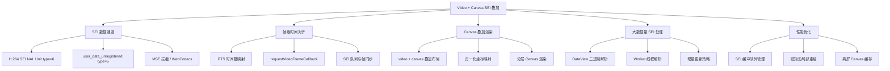

# Video + Canvas SEI 数据叠加渲染面试题图谱

> 难度范围：⭐⭐⭐ 高级 | 题目数量：6 道 | 更新日期：2025-01

本文档聚焦于**视频流 + Canvas 叠加信息**的工程场景：通过 H.264/H.265 SEI（Supplemental Enhancement Information）通道随帧携带业务数据（目标框、轨迹、热力图等），在 Canvas 上与视频帧精确对齐渲染。这是安防监控、自动驾驶标注、直播互动等领域的高频面试考点。

> 📌 **性能优化基础：** [04-performance.md](./04-performance.md) | **实战应用：** [05-practical-cases.md](./05-practical-cases.md)

---

## 知识点导图



---

## Q1. 什么是视频 SEI？如何在 Web 端提取 SEI 数据？

**难度：** ⭐⭐⭐ 高级
**高频标签：** 🔥 字节跳动高频 | 安防/自动驾驶方向

### 考察点

- H.264 SEI NAL Unit 的结构与 `user_data_unregistered` 类型（type=5）
- Web 端提取 SEI 的两种路径：MSE 拦截 vs WebCodecs API
- SEI payload 的二进制解析（`DataView` / `Uint8Array`）
- SEI 数据与视频帧的 PTS 时间戳绑定关系

### 参考答案

**SEI（Supplemental Enhancement Information）** 是 H.264/H.265 标准中的附加信息单元，以 NAL Unit 形式嵌入码流，不影响解码画面，但可携带任意业务数据。

**H.264 码流结构回顾：**

H.264 码流由一系列 NAL Unit（Network Abstraction Layer Unit）组成，每个 NALU 前有 start code（`00 00 00 01`）。NALU 的第一个字节是 NAL header，低 5 位是 `nal_unit_type`：

| nal_unit_type | 含义 |
|---|---|
| 1 | 非 IDR 图像的 slice |
| 5 | IDR 图像（关键帧） |
| 6 | **SEI（Supplemental Enhancement Information）** |
| 7 | SPS（序列参数集） |
| 8 | PPS（图像参数集） |

**SEI 内部结构：**

一个 SEI NALU 可以包含多条 SEI message，每条格式为：

```
[sei_type: 1字节] [payload_size: 1~N字节] [payload: payload_size字节]
```

`payload_size` 采用变长编码：若字节值为 `0xFF` 则累加并继续读下一字节，直到读到非 `0xFF` 字节为止。

**SEI 类型 5 — `user_data_unregistered`：**

- 最常用的自定义数据通道，payload 结构为：`[UUID 16字节][自定义二进制数据]`
- UUID 由业务方自定义，用于区分不同厂商/业务的 SEI 数据，防止冲突
- 自定义数据部分完全由业务方定义，通常用 `DataView` 按约定的二进制协议解析

**PTS 时间戳绑定：**

SEI NALU 与其所在的视频帧共享同一个 PTS（Presentation Timestamp）。在 MSE 场景下，`appendBuffer` 送入的 segment 中，SEI 和对应的图像 slice 在同一个 GOP 内，解码器会将它们关联到同一帧。这是实现帧级精确对齐的物理基础。

**Web 端提取路径对比：**

| 方案 | 原理 | 优点 | 缺点 |
|------|------|------|------|
| MSE + 拦截 appendBuffer | 在送入 SourceBuffer 前扫描 NALU | 兼容性好（Chrome 34+），无需额外服务端 | 需手动实现 NALU 解析器，主线程压力大 |
| WebCodecs EncodedVideoChunk | 解码前拦截编码帧解析 SEI | API 简洁，可在 Worker 中使用 | Chrome 94+，Safari 16.4+，兼容性较差 |
| 服务端提取 + WebSocket 推送 | 服务端解析后与视频流并行推送 | 前端零解析成本，支持任意格式 | 需服务端支持，引入额外网络延迟，需自行做时间同步 |

**三种方案的选型建议：**

- 纯前端、兼容性优先 → MSE 拦截 + Worker 解析
- 新项目、Chrome 环境 → WebCodecs（更干净，无需 monkey-patch）
- 服务端有能力、多端复用 → 服务端提取 + WebSocket，前端只做渲染

### 代码示例

```js
/**
 * 从 H.264 Annex B 码流中提取 SEI NAL Unit
 * start code: 00 00 00 01
 */
const extractSEINALUs = (buffer) => {
  const data = new Uint8Array(buffer);
  const seiUnits = [];
  let i = 0;

  while (i < data.length - 4) {
    // 查找 Annex B start code
    if (data[i] === 0 && data[i+1] === 0 && data[i+2] === 0 && data[i+3] === 1) {
      const naluStart = i + 4;
      const naluType = data[naluStart] & 0x1F; // H.264 NAL unit type

      if (naluType === 6) { // type 6 = SEI
        // 找下一个 start code 确定 NALU 边界
        let naluEnd = data.length;
        for (let j = naluStart + 1; j < data.length - 3; j++) {
          if (data[j] === 0 && data[j+1] === 0 && data[j+2] === 0 && data[j+3] === 1) {
            naluEnd = j; break;
          }
        }
        seiUnits.push(data.slice(naluStart, naluEnd));
      }
      i = naluStart;
    } else {
      i++;
    }
  }
  return seiUnits;
};

/**
 * 解析 SEI NALU，提取 user_data_unregistered (type=5) payload
 */
const parseSEIUserData = (naluBytes) => {
  let offset = 1; // 跳过 NAL header

  while (offset < naluBytes.length) {
    const seiType = naluBytes[offset++];

    // payload size 可能跨多字节（0xFF 表示继续累加）
    let payloadSize = 0;
    while (naluBytes[offset] === 0xFF) payloadSize += naluBytes[offset++];
    payloadSize += naluBytes[offset++];

    if (seiType === 5 && payloadSize >= 16) {
      // 前 16 字节是 UUID
      const uuid = Array.from(naluBytes.slice(offset, offset + 16))
        .map(b => b.toString(16).padStart(2, '0')).join('');
      // UUID 之后是自定义 payload
      const payload = naluBytes.slice(offset + 16, offset + payloadSize);
      return { uuid, payload };
    }
    offset += payloadSize;
  }
  return null;
};

// 拦截 MSE appendBuffer，在送入解码前提取 SEI
// 实际项目中应在 Worker 中执行解析，避免阻塞主线程
const interceptMSEForSEI = (onSEI) => {
  const original = SourceBuffer.prototype.appendBuffer;
  SourceBuffer.prototype.appendBuffer = function(data) {
    const buf = data instanceof ArrayBuffer ? data : data.buffer;
    // 拷贝一份送 Worker 解析，原始 buf 仍送入 MSE
    seiWorker.postMessage({ buffer: buf.slice(0) }, [buf.slice(0)]);
    return original.call(this, data);
  };
};
```

> 💡 **延伸思考：** SEI 解析是 CPU 密集型操作（需要逐字节扫描码流），对于高码率视频（如 4K 60fps）应放在 Web Worker 中执行。解析结果通过 `postMessage` 传回主线程，存入以 PTS 为 key 的有序 Map，等待视频帧回调时查询。

---

## Q2. 如何实现 SEI 数据与视频帧的精确时间对齐？

**难度：** ⭐⭐⭐ 高级
**高频标签：** 🔥 字节跳动高频 | 腾讯高频

### 考察点

- `requestVideoFrameCallback`（rVFC）API 的作用与参数
- rVFC 与 `requestAnimationFrame` 的本质区别
- SEI 队列的设计：以 PTS 为 key 的有序缓冲
- 帧丢失/跳帧场景下的容错处理
- `video.currentTime` 的精度问题

### 参考答案

**核心问题：** `requestAnimationFrame` 触发时机是显示器刷新（约 16ms），而视频帧的实际呈现时机由解码器决定，两者不同步。直接用 rAF + `video.currentTime` 查询 SEI 会有 ±1 帧的误差。

**`video.currentTime` 的精度问题：**

`video.currentTime` 是一个近似值，精度约为 ±1 帧（16ms@60fps）。原因是浏览器出于安全考虑（防止时序攻击）对时间精度做了限制，且 `currentTime` 的更新时机与帧呈现时机并不严格对齐。在 30fps 视频中，一帧时长约 33ms，误差可能导致查询到相邻帧的 SEI 数据。

**`requestVideoFrameCallback`（rVFC）的工作原理：**

rVFC 是浏览器在将视频帧**合成到屏幕之前**触发的回调，由视频解码器驱动，而非显示器刷新驱动。回调参数 `metadata` 包含：

| 字段 | 类型 | 说明 |
|------|------|------|
| `mediaTime` | number | 该帧的精确 PTS（秒），与 SEI 的 PTS 直接对应 |
| `presentedFrames` | number | 累计呈现帧数，相邻两次差值 > 1 说明发生了跳帧 |
| `expectedDisplayTime` | DOMHighResTimeStamp | 该帧预期显示到屏幕的时间 |
| `width` / `height` | number | 视频帧的实际分辨率 |
| `processingDuration` | number | 解码耗时（秒） |

**rVFC vs rAF 对比：**

| 维度 | requestAnimationFrame | requestVideoFrameCallback |
|------|----------------------|--------------------------|
| 触发时机 | 显示器刷新（~16ms），与视频帧无关 | 视频帧实际呈现前，由解码器驱动 |
| 时间精度 | `performance.now()`，与视频帧无关 | `metadata.mediaTime`，精确到帧级 PTS |
| 跳帧检测 | 不支持 | `metadata.presentedFrames` 差值 |
| 暂停时触发 | 继续触发（每帧都触发） | 不触发（视频不前进则无回调） |
| 慢速播放 | 仍以显示器频率触发 | 随视频帧率触发（如 0.5x 速度则 ~30fps） |
| 兼容性 | 全浏览器 | Chrome 83+，Safari 15.4+ |

**SEI 队列设计原则：**

- 以 PTS（秒，浮点数）为 key 存储，`Map` 保持插入顺序（近似有序）
- 精确匹配优先：`seiBuffer.has(pts)`
- 容差匹配兜底：遍历找 `|key - pts| < tolerance`，容差建议取半帧时长（`1 / fps / 2`）
- 定期清理：早于 `currentTime - 2s` 的条目删除，防止内存无限增长
- seek 后立即清空：避免旧位置的 SEI 数据污染新位置

### 代码示例

```js
class SEIVideoSyncRenderer {
  constructor(videoEl, canvasEl) {
    this.video = videoEl;
    this.canvas = canvasEl;
    this.ctx = canvasEl.getContext('2d');
    // SEI 缓冲：Map<pts(秒), seiData>，按 PTS 有序插入
    this.seiBuffer = new Map();
    this._rVFCId = null;
    this._rafId = null;
    this._lastPresentedFrames = 0;
  }

  feedSEI(pts, data) {
    this.seiBuffer.set(pts, data);
    // 清理 2 秒前的过期数据
    const expire = this.video.currentTime - 2;
    for (const [key] of this.seiBuffer) {
      if (key < expire) this.seiBuffer.delete(key);
      else break;
    }
  }

  _findSEI(pts, tolerance = 0.016) {
    if (this.seiBuffer.has(pts)) return this.seiBuffer.get(pts);
    // 近似匹配：找 PTS 差值最小的条目
    let bestKey = null, bestDiff = Infinity;
    for (const [key] of this.seiBuffer) {
      const diff = Math.abs(key - pts);
      if (diff < bestDiff) { bestDiff = diff; bestKey = key; }
      if (key > pts + tolerance) break;
    }
    return bestDiff <= tolerance ? this.seiBuffer.get(bestKey) : null;
  }

  start() {
    if ('requestVideoFrameCallback' in HTMLVideoElement.prototype) {
      // ✅ 精确模式：每帧视频呈现时触发，metadata.mediaTime 是精确 PTS
      const onFrame = (now, metadata) => {
        const seiData = this._findSEI(metadata.mediaTime);

        // 检测跳帧（快进、网络卡顿恢复等场景）
        const skipped = metadata.presentedFrames - this._lastPresentedFrames - 1;
        if (skipped > 0) {
          console.warn(`跳帧 ${skipped} 帧 @ PTS=${metadata.mediaTime.toFixed(3)}s`);
        }
        this._lastPresentedFrames = metadata.presentedFrames;

        this._renderOverlay(seiData, metadata.mediaTime);
        this._rVFCId = this.video.requestVideoFrameCallback(onFrame);
      };
      this._rVFCId = this.video.requestVideoFrameCallback(onFrame);
    } else {
      // ⚠️ 降级：rAF + currentTime，精度约 ±1 帧
      console.warn('rVFC 不支持，降级到 rAF 模式');
      const fallback = () => {
        const seiData = this._findSEI(this.video.currentTime, 0.05);
        this._renderOverlay(seiData, this.video.currentTime);
        this._rafId = requestAnimationFrame(fallback);
      };
      this._rafId = requestAnimationFrame(fallback);
    }
  }

  stop() {
    if (this._rVFCId) this.video.cancelVideoFrameCallback(this._rVFCId);
    if (this._rafId) cancelAnimationFrame(this._rafId);
  }

  _renderOverlay(seiData, pts) {
    const { width, height } = this.canvas;
    this.ctx.clearRect(0, 0, width, height);
    if (!seiData) return;
    seiData.objects?.forEach(obj => this._drawBox(obj));
  }

  _drawBox({ x, y, w, h, label, classId, confidence }) {
    const { width, height } = this.canvas;
    // SEI 坐标为归一化坐标（0~1），映射到 Canvas 像素坐标
    const px = x * width, py = y * height, pw = w * width, ph = h * height;
    const color = `hsl(${classId * 47 % 360}, 80%, 55%)`;
    this.ctx.strokeStyle = color; this.ctx.lineWidth = 2;
    this.ctx.strokeRect(px, py, pw, ph);
    this.ctx.fillStyle = color + 'cc';
    this.ctx.fillRect(px, py - 20, pw, 20);
    this.ctx.fillStyle = '#fff'; this.ctx.font = '11px monospace';
    this.ctx.textBaseline = 'middle';
    this.ctx.fillText(`${label} ${(confidence * 100).toFixed(0)}%`, px + 4, py - 10);
  }
}
```

> 💡 **延伸思考：** `requestVideoFrameCallback` 在视频暂停时不触发。需要监听 `video.onseeked` 事件，在用户拖动进度条后手动触发一次 Canvas 重绘，确保暂停帧的 SEI 数据也能正确显示。

---

## Q3. SEI 数据量很大且实时更新，如何设计高性能解析与渲染管线？

**难度：** ⭐⭐⭐ 高级
**高频标签：** 🔥 字节跳动高频 | 阿里高频

### 考察点

- Worker 线程解析 SEI 的完整架构
- `Transferable Objects`（ArrayBuffer 所有权转移）避免内存拷贝
- 增量更新策略：只更新变化的目标，而非全量重绘
- 大 SEI payload 的 DataView 二进制解析
- 内存管理：避免 SEI 缓冲无限增长

### 参考答案

**高性能三线程管线架构：**

```
视频码流（MSE appendBuffer）
  ↓ 拦截，buf.slice(0) 拷贝后 transfer 给 Worker
SEI Worker：NALU 扫描 → DataView 解析 → postMessage(result)
  ↓ 主线程 seiBuffer.set(pts, data)
requestVideoFrameCallback 触发
  ↓ seiBuffer.query(pts) 查询
Canvas 增量绘制（只重绘变化目标）
  ↓（热力图/掩码场景）
Render Worker：OffscreenCanvas 渲染 → transferToImageBitmap()
  ↓ 主线程 drawImage(bitmap) 一次贴图
```

**为什么 SEI 数据量大是个问题：**

以自动驾驶场景为例，每帧 SEI 可能包含：
- 100+ 个目标框（每个约 20 字节）= 2KB
- 64×64 语义分割掩码（每像素 1 字节）= 4KB
- 轨迹历史点（每目标 30 帧 × 8 字节）= 24KB
- 总计约 **30KB/帧**，30fps 下约 **900KB/s**

如果在主线程同步解析，每帧解析耗时可能超过 5ms，严重影响页面响应。

**关键优化点详解：**

**① 零拷贝 ArrayBuffer 传输**

`postMessage(data, [transferable])` 第二个参数指定可转移对象列表。转移后原线程的引用变为 `detached`（`byteLength === 0`），接收方获得完整所有权，整个过程无内存拷贝，时间复杂度 O(1)。

注意：MSE 的 `appendBuffer` 仍需要原始 buffer，所以必须先 `buf.slice(0)` 拷贝一份再 transfer，不能直接 transfer 原始 buffer。

**② DataView 二进制解析 vs JSON**

SEI payload 通常是紧凑的二进制结构体，而非 JSON 字符串。原因：
- JSON 字符串体积是二进制的 3~5 倍（数字需要字符编码）
- JSON 解析需要词法分析，比 DataView 直接读内存慢 10x 以上
- 二进制协议可以精确控制字节序（大端/小端）和数据类型

**③ 增量更新策略**

全量重绘的问题：即使只有 1 个目标移动了 1px，也要清空整个 Canvas 重绘所有目标。

增量更新：对比前后帧的目标列表，只有坐标/置信度变化超过阈值（如 0.1%）的目标才触发重绘。对于静止目标（如停车场景中的停放车辆），可以完全跳过重绘。

**④ 批量路径绘制**

每次 `ctx.strokeStyle = color` 都会触发 Canvas 状态机切换，开销较大。将同类型（同 classId）的目标框合并为一条 `beginPath()` → 多个 `rect()` → 一次 `stroke()`，可将状态切换次数从 O(n) 降至 O(类别数)。

### 代码示例

```js
// ── SEI 解析 Worker（sei-worker.js）──
self.onmessage = ({ data: { buffer, pts } }) => {
  const result = parseSEIPayload(new Uint8Array(buffer));
  if (result) self.postMessage({ pts, data: result });
};

const parseSEIPayload = (bytes) => {
  // 跳过 NAL header(1) + SEI type(1) + size(1+) + UUID(16)
  let offset = 1;
  const seiType = bytes[offset++];
  let payloadSize = 0;
  while (bytes[offset] === 0xFF) payloadSize += bytes[offset++];
  payloadSize += bytes[offset++];
  if (seiType !== 5 || payloadSize < 16) return null;
  offset += 16; // 跳过 UUID

  // 使用 DataView 解析二进制结构体（注意字节序）
  const view = new DataView(bytes.buffer, bytes.byteOffset + offset);
  let pos = 0;

  const version    = view.getUint16(pos, false); pos += 2;  // 大端序
  const timestamp  = view.getFloat64(pos, true);  pos += 8;  // 小端序
  const objCount   = view.getUint16(pos, false);  pos += 2;

  const objects = [];
  for (let i = 0; i < objCount; i++) {
    objects.push({
      id:         view.getUint32(pos, false),              pos += 4,
      classId:    view.getUint8(pos++),
      confidence: view.getUint8(pos++) / 255,              // 归一化 0~1
      x:          view.getUint16(pos, false) / 65535,      pos += 2, // 归一化坐标
      y:          view.getUint16(pos, false) / 65535,      pos += 2,
      w:          view.getUint16(pos, false) / 65535,      pos += 2,
      h:          view.getUint16(pos, false) / 65535,      pos += 2,
    });
  }
  return { version, timestamp, objects };
};

// ── 主线程：增量更新渲染器 ──
class IncrementalOverlayRenderer {
  constructor(canvas) {
    this.canvas = canvas;
    this.ctx = canvas.getContext('2d');
    this._prev = new Map(); // id → object（上一帧）
  }

  update(newObjects) {
    const next = new Map(newObjects.map(o => [o.id, o]));
    // 检查是否有变化（避免无意义重绘）
    let changed = next.size !== this._prev.size;
    if (!changed) {
      for (const [id, obj] of next) {
        const p = this._prev.get(id);
        if (!p || Math.abs(obj.x - p.x) > 0.001 || Math.abs(obj.y - p.y) > 0.001) {
          changed = true; break;
        }
      }
    }
    if (!changed) return;

    this._prev = next;
    this._render(newObjects);
  }

  _render(objects) {
    const { width: W, height: H } = this.canvas;
    this.ctx.clearRect(0, 0, W, H);

    // 按 classId 分组，批量绘制同类型目标框（减少 strokeStyle 切换）
    const groups = new Map();
    objects.forEach(o => {
      if (!groups.has(o.classId)) groups.set(o.classId, []);
      groups.get(o.classId).push(o);
    });

    groups.forEach((objs, classId) => {
      const color = `hsl(${classId * 47 % 360}, 80%, 55%)`;
      this.ctx.strokeStyle = color;
      this.ctx.lineWidth = 2;
      // 同类型所有矩形合并为一条路径
      this.ctx.beginPath();
      objs.forEach(({ x, y, w, h }) => {
        this.ctx.rect(x * W, y * H, w * W, h * H);
      });
      this.ctx.stroke();
      // 标签单独绘制
      objs.forEach(obj => this._drawLabel(obj, color, W, H));
    });
  }

  _drawLabel({ x, y, w, label, confidence }, color, W, H) {
    const px = x * W, py = y * H, pw = w * W;
    this.ctx.fillStyle = color + 'cc';
    this.ctx.fillRect(px, py - 18, Math.min(pw, 100), 18);
    this.ctx.fillStyle = '#fff';
    this.ctx.font = '11px monospace';
    this.ctx.textBaseline = 'middle';
    this.ctx.fillText(`${label} ${(confidence * 100).toFixed(0)}%`, px + 3, py - 9);
  }
}
```

> 💡 **延伸思考：** 当 SEI 数据包含热力图（每帧一张 64×64 概率矩阵）时，数据量可达数十 KB/帧。应在 Worker 中将矩阵渲染到 `OffscreenCanvas`，通过 `transferToImageBitmap()` 传回主线程，主线程只需一次 `drawImage` 完成热力图叠加，避免主线程处理大量像素数据。

---

## Q4. video + canvas 叠加的布局方案与坐标系归一化

**难度：** ⭐⭐ 中级
**高频标签：** 🔥 阿里高频 | 美团高频

### 考察点

- video 与 canvas 叠加的 CSS 布局方案
- `object-fit: contain` 导致的黑边问题与坐标偏移计算
- SEI 归一化坐标（0~1）到 Canvas 像素坐标的映射
- 视频分辨率与 Canvas 尺寸不一致时的缩放处理
- 响应式布局下的坐标重新计算

### 参考答案

**叠加布局方案：**

```html
<div class="video-container">
  <video id="video"></video>
  <canvas id="overlay"></canvas>
</div>
```

```css
.video-container { position: relative; }
video, canvas {
  position: absolute; top: 0; left: 0;
  width: 100%; height: 100%;
}
canvas { pointer-events: none; } /* 鼠标事件穿透到 video */
```

**`object-fit: contain` 的黑边问题详解：**

假设视频原始分辨率为 1920×1080（16:9），容器为 800×600（4:3）。`object-fit: contain` 会按较小缩放比缩放：

```
scaleX = 800 / 1920 = 0.417
scaleY = 600 / 1080 = 0.556
scale  = min(0.417, 0.556) = 0.417  ← 取较小值

renderW = 1920 × 0.417 = 800px  ← 撑满宽度
renderH = 1080 × 0.417 = 450px  ← 未撑满高度

offsetX = (800 - 800) / 2 = 0    ← 无水平黑边
offsetY = (600 - 450) / 2 = 75px ← 上下各 75px 黑边
```

此时 SEI 中 `y=0` 对应的是视频内容顶部，映射到 Canvas 时应为 `75px`，而非 `0px`。若不处理偏移，目标框会整体偏上 75px。

**归一化坐标的优势：**

SEI 中存储归一化坐标（0~1）而非像素坐标，好处是：
- 与视频分辨率解耦：同一份 SEI 数据可适配 720p/1080p/4K 播放器
- 与播放器尺寸解耦：窗口缩放时无需重新编码 SEI
- 坐标映射公式统一：`px = nx × renderW + offsetX`

**DPR 高清适配与坐标的关系：**

Canvas 的 `width`/`height` 属性是物理像素，CSS 的 `style.width`/`style.height` 是逻辑像素。在 DPR=2 的屏幕上，若 Canvas 物理尺寸为 1600×900，CSS 显示尺寸为 800×450，则坐标映射时需要额外乘以 DPR：

```js
const dprScale = canvas.width / video.clientWidth; // = DPR
const canvasX = (offsetX + nx * renderW) * dprScale;
```

### 代码示例

```js
/**
 * 计算 video 在容器中的实际渲染区域
 * 处理 object-fit: contain 产生的黑边偏移
 */
const getVideoRenderRect = (video) => {
  const cW = video.clientWidth, cH = video.clientHeight;
  const vW = video.videoWidth,  vH = video.videoHeight;
  if (!vW || !vH) return { offsetX: 0, offsetY: 0, renderW: cW, renderH: cH };

  // contain 模式：取较小缩放比，保持宽高比
  const scale = Math.min(cW / vW, cH / vH);
  const renderW = vW * scale, renderH = vH * scale;
  // 居中对齐产生的黑边偏移
  const offsetX = (cW - renderW) / 2;
  const offsetY = (cH - renderH) / 2;
  return { offsetX, offsetY, renderW, renderH };
};

/**
 * SEI 归一化坐标 → Canvas 像素坐标
 * 同时处理 object-fit 黑边偏移和 DPR 缩放
 */
const seiToCanvas = (nx, ny, video, canvas) => {
  const { offsetX, offsetY, renderW, renderH } = getVideoRenderRect(video);
  // Canvas 物理像素与容器 CSS 像素的比值（DPR 适配）
  const dprScale = canvas.width / video.clientWidth;
  return {
    x: (offsetX + nx * renderW) * dprScale,
    y: (offsetY + ny * renderH) * dprScale,
  };
};

/**
 * 同步 Canvas 尺寸到 video 容器（含 DPR 高清适配）
 */
const syncCanvasToVideo = (video, canvas) => {
  const dpr = window.devicePixelRatio || 1;
  const w = video.clientWidth, h = video.clientHeight;
  canvas.width  = w * dpr;
  canvas.height = h * dpr;
  canvas.style.width  = `${w}px`;
  canvas.style.height = `${h}px`;
  canvas.getContext('2d').scale(dpr, dpr);
};

// 响应式：监听容器尺寸变化
const ro = new ResizeObserver(() => {
  syncCanvasToVideo(video, overlayCanvas);
  renderer.forceRedraw(); // 用新坐标映射重绘
});
ro.observe(video);
```

> 💡 **延伸思考：** 如果视频使用 `object-fit: cover`（裁剪模式），缩放比改为取较大值，并计算裁剪偏移（负值）。建议将坐标映射逻辑封装为独立函数，通过 `objectFit` 参数控制行为，方便在不同播放器场景下复用。

---

## Q5. 如何处理 SEI 数据丢失、乱序、网络抖动等异常场景？

**难度：** ⭐⭐⭐ 高级
**高频标签：** 🔥 字节跳动高频 | 腾讯高频

### 考察点

- SEI 数据丢失时的降级策略（保持上一帧 vs 清空）
- 乱序 SEI 的排序与去重处理
- 网络抖动导致 SEI 与视频帧时间差过大的检测
- 播放器 seek/跳转后 SEI 缓冲的清理
- 直播场景下的低延迟 SEI 同步策略

### 参考答案

**异常场景的根本原因分析：**

SEI 数据与视频流是两条独立的数据通路（即使都嵌在同一个 TS/FMP4 容器里），在网络传输、解复用、解码等各个环节都可能产生时序偏差：

- **丢失**：网络丢包导致含 SEI 的 segment 未到达，或编码器在某些帧未插入 SEI
- **乱序**：TCP 重传、CDN 多路合并导致 segment 到达顺序与 PTS 顺序不一致
- **超前**：SEI 解析（纯 CPU）比视频解码（GPU 硬解）快，SEI 先于对应帧到达渲染队列
- **滞后**：网络抖动导致 SEI 晚于对应帧到达，此时视频帧已呈现但 SEI 还未就绪

**各场景处理策略详解：**

| 场景 | 检测方式 | 处理策略 | 原因 |
|------|---------|---------|------|
| SEI 丢失 | `query()` 返回 miss | 保持上一帧（≤N帧），超过后清空 | 短暂丢失保持可避免目标框闪烁，长时间丢失说明数据已失效 |
| SEI 乱序 | 新 PTS < lastValidPts - 1s | 丢弃该包 | 超过 1 秒的乱序包已无渲染价值 |
| SEI 超前 | PTS > video.currentTime + tolerance | 存入缓冲等待 | 不立即渲染，等视频帧追上来 |
| SEI 滞后 | PTS < video.currentTime - tolerance | 容差内近似匹配，超出则 miss | 轻微滞后可容忍，严重滞后说明网络问题 |
| seek 跳转 | `video.onseeked` 事件 | 清空全部缓冲 | seek 后 PTS 跳变，旧数据全部失效 |
| 直播低延迟 | 缓冲区 < 500ms | 放宽容差到 100ms，优先渲染最近 SEI | 直播场景宁可有轻微错位也不能卡顿 |

**"保持上一帧"策略的边界条件：**

保持帧数阈值（`maxMissingFrames`）的选取需要权衡：
- 太小（如 1）：网络轻微抖动就会导致目标框闪烁消失
- 太大（如 30）：目标已经移走但框还停留在原位，产生"幽灵框"

实践中建议 3~5 帧（约 100~167ms@30fps），超过后清空。对于安防场景可以适当放大（目标移动慢），对于自动驾驶场景应缩小（目标移动快，旧位置信息危险）。

### 代码示例

```js
class RobustSEIBuffer {
  constructor({ maxAge = 3, maxTolerance = 0.2, maxMissingFrames = 5 } = {}) {
    this.maxAge = maxAge;
    this.maxTolerance = maxTolerance;
    this.maxMissingFrames = maxMissingFrames;
    this._buffer = new Map();
    this._lastValidPts = -1;
    this._missingCount = 0;
    this._lastData = null;
  }

  insert(pts, data) {
    // 丢弃明显乱序的过期包（早于上次有效 PTS 超过 1 秒）
    if (pts < this._lastValidPts - 1) {
      console.warn(`丢弃乱序 SEI: pts=${pts.toFixed(3)}`);
      return;
    }
    this._buffer.set(pts, data);
    this._cleanup();
  }

  query(videoPts) {
    // 精确匹配
    if (this._buffer.has(videoPts)) return this._hit(videoPts);

    // 近似匹配
    let bestKey = null, bestDiff = Infinity;
    for (const [key] of this._buffer) {
      const diff = Math.abs(key - videoPts);
      if (diff < bestDiff && diff <= this.maxTolerance) {
        bestDiff = diff; bestKey = key;
      }
    }
    if (bestKey !== null) return this._hit(bestKey);

    // 未匹配：处理丢失
    return this._miss();
  }

  _hit(pts) {
    const data = this._buffer.get(pts);
    this._lastValidPts = pts;
    this._missingCount = 0;
    this._lastData = data;
    return { data, status: 'hit' };
  }

  _miss() {
    this._missingCount++;
    if (this._missingCount <= this.maxMissingFrames) {
      // 短暂丢失：保持上一帧，避免闪烁
      return { data: this._lastData, status: 'hold', count: this._missingCount };
    }
    this._lastData = null;
    return { data: null, status: 'clear' };
  }

  onSeek() {
    // seek 后清空所有缓冲，避免旧数据污染新位置
    this._buffer.clear();
    this._lastValidPts = -1;
    this._missingCount = 0;
    this._lastData = null;
  }

  _cleanup() {
    const expire = this._lastValidPts - this.maxAge;
    for (const [key] of this._buffer) {
      if (key < expire) this._buffer.delete(key);
      else break;
    }
  }
}

// 使用示例
const seiBuffer = new RobustSEIBuffer({ maxTolerance: 0.1, maxMissingFrames: 3 });
video.addEventListener('seeked', () => seiBuffer.onSeek());

video.requestVideoFrameCallback((now, { mediaTime }) => {
  const { data, status, count } = seiBuffer.query(mediaTime);
  if (status === 'hit')  renderer.render(data);
  else if (status === 'hold') renderer.renderWithWarning(data, `SEI 延迟 ${count} 帧`);
  else renderer.clear();
});
```

> 💡 **延伸思考：** 在直播场景下，SEI 数据可能比视频帧**超前**到达（SEI 解析比视频解码快）。此时不应立即渲染，而是将 SEI 存入缓冲，等待对应视频帧呈现时再渲染。需要特别注意缓冲区大小控制，避免直播延迟累积。

---

## Q6. 完整架构设计：高并发 SEI + Canvas 叠加渲染系统

**难度：** ⭐⭐⭐ 高级
**高频标签：** 🔥 字节跳动高频 | 阿里高频

### 分析

在安防监控、自动驾驶标注等场景中，SEI 数据可能包含数百个目标框、轨迹点、语义分割掩码，每帧数据量达数十 KB，且需要 30fps 实时渲染。如何设计一个既保证帧级对齐又保证高性能的完整系统？

**典型业务场景的数据规模：**

| 场景 | SEI 内容 | 单帧数据量 | 30fps 带宽 |
|------|---------|-----------|-----------|
| 安防监控 | 人脸框 + 车牌框 | ~2KB | ~60KB/s |
| 自动驾驶 | 目标框 + 语义分割 + 轨迹 | ~30KB | ~900KB/s |
| 直播互动 | 弹幕位置 + 礼物特效坐标 | ~5KB | ~150KB/s |
| 体育赛事 | 球员追踪 + 战术标注 | ~10KB | ~300KB/s |

**性能瓶颈分析：**

- **解析瓶颈**：NALU 扫描是 O(n) 字节遍历，4K 60fps 码流每秒约 50MB，主线程同步解析会阻塞 UI
- **渲染瓶颈**：每帧清空 Canvas 全量重绘，100 个目标框 × 30fps = 3000 次 `strokeRect`/s
- **内存瓶颈**：SEI 缓冲无限增长，长时间播放后 Map 可能积累数千条记录

### 方案设计

**整体架构（三线程模型）：**

```
┌─────────────────────────────────────────────────────┐
│  主线程                                              │
│  ┌──────────┐    ┌──────────────┐    ┌───────────┐  │
│  │ MSE/HLS  │───▶│ SEI 缓冲队列 │◀───│ rVFC 回调 │  │
│  │ 视频播放  │    │ (PTS → data) │    │ Canvas 渲染│  │
│  └──────────┘    └──────────────┘    └───────────┘  │
│       │ buf.slice(0) + transfer（零拷贝）            │
└───────┼─────────────────────────────────────────────┘
        ↓
┌───────────────────┐
│  SEI Worker       │
│  NALU 扫描        │
│  DataView 解析    │
│  → postMessage    │
└───────────────────┘
        ↓（热力图/掩码场景）
┌───────────────────┐
│  Render Worker    │
│  OffscreenCanvas  │
│  热力图渲染       │
│  → ImageBitmap    │
└───────────────────┘
```

**各层职责划分：**

| 线程 | 职责 | 不做什么 | 通信方式 |
|------|------|---------|---------|
| 主线程 | 视频播放、rVFC 回调、Canvas 绘制、用户交互 | 不做 SEI 解析 | postMessage → Worker |
| SEI Worker | NALU 扫描、DataView 解析 | 不操作 DOM，不做渲染 | postMessage → 主线程 |
| Render Worker | 热力图/掩码的 OffscreenCanvas 渲染 | 不做业务逻辑 | transferToImageBitmap → 主线程 |

**SEI 缓冲队列的内存上限设计：**

```js
// 按时间窗口限制：只保留最近 N 秒的 SEI
const MAX_BUFFER_DURATION = 3; // 秒

// 按条数限制：防止极端情况下内存爆炸
const MAX_BUFFER_SIZE = 300; // 条（30fps × 10s）

// 清理策略：优先清理最旧的条目
const cleanup = (buffer, currentPts) => {
  // 时间窗口清理
  for (const [key] of buffer) {
    if (key < currentPts - MAX_BUFFER_DURATION) buffer.delete(key);
    else break;
  }
  // 条数上限清理（兜底）
  while (buffer.size > MAX_BUFFER_SIZE) {
    buffer.delete(buffer.keys().next().value);
  }
};
```

### 关键代码

```js
class VideoSEIOverlaySystem {
  constructor(videoEl, overlayCanvas) {
    this.video = videoEl;
    this.canvas = overlayCanvas;

    // SEI 解析 Worker
    this.seiWorker = new Worker('./sei-worker.js', { type: 'module' });
    this.seiWorker.onmessage = ({ data: { pts, data } }) => {
      this.seiBuffer.insert(pts, data);
    };

    this.seiBuffer = new RobustSEIBuffer({ maxTolerance: 0.1, maxMissingFrames: 3 });
    this.renderer = new IncrementalOverlayRenderer(overlayCanvas);

    this._interceptMSE();
    this._syncSize();
    new ResizeObserver(() => this._syncSize()).observe(videoEl);
    videoEl.addEventListener('seeked', () => this.seiBuffer.onSeek());
  }

  _interceptMSE() {
    const self = this;
    const original = SourceBuffer.prototype.appendBuffer;
    SourceBuffer.prototype.appendBuffer = function(data) {
      const buf = data instanceof ArrayBuffer ? data : data.buffer;
      // 拷贝一份送 Worker（原始 buf 仍需送入 MSE 解码）
      const copy = buf.slice(0);
      self.seiWorker.postMessage({ buffer: copy }, [copy]); // 零拷贝 transfer
      return original.call(this, data);
    };
  }

  _syncSize() {
    const dpr = window.devicePixelRatio || 1;
    const w = this.video.clientWidth, h = this.video.clientHeight;
    this.canvas.width  = w * dpr;
    this.canvas.height = h * dpr;
    this.canvas.style.width  = `${w}px`;
    this.canvas.style.height = `${h}px`;
    this.canvas.getContext('2d').scale(dpr, dpr);
  }

  start() {
    const tick = (now, metadata) => {
      const { data, status } = this.seiBuffer.query(metadata.mediaTime);
      const rect = getVideoRenderRect(this.video); // 处理 object-fit 黑边

      if (status !== 'clear' && data) {
        this.renderer.update(data.objects ?? [], rect);
      } else if (status === 'clear') {
        this.renderer.clear();
      }

      this.video.requestVideoFrameCallback(tick);
    };
    this.video.requestVideoFrameCallback(tick);
  }

  destroy() {
    this.seiWorker.terminate();
  }
}
```

> 💡 **延伸思考：** 当需要同时渲染多路视频（如监控大屏 16 路）时，应共享一个 SEI Worker 线程池（而非每路视频一个 Worker），通过 `videoId` 区分不同路的数据，避免线程数量爆炸。线程池大小建议为 `navigator.hardwareConcurrency / 2`，为主线程和渲染线程保留足够资源。

---

## 延伸阅读

- [MDN — requestVideoFrameCallback](https://developer.mozilla.org/en-US/docs/Web/API/HTMLVideoElement/requestVideoFrameCallback) — 帧级回调 API，含 metadata 参数详细说明与兼容性数据
- [W3C — Video Frame Callback Spec](https://wicg.github.io/video-rvfc/) — rVFC 规范草案，了解 mediaTime 精度保证
- [MDN — WebCodecs API](https://developer.mozilla.org/en-US/docs/Web/API/WebCodecs_API) — 编解码帧级访问，可用于提取 SEI
- [MDN — Media Source Extensions](https://developer.mozilla.org/zh-CN/docs/Web/API/Media_Source_Extensions_API) — MSE 完整文档，理解 appendBuffer 拦截原理
- [ITU-T H.264 规范](https://www.itu.int/rec/T-REC-H.264) — SEI 定义在 Annex D，user_data_unregistered 在 D.2.7
- [OffscreenCanvas — MDN](https://developer.mozilla.org/en-US/docs/Web/API/OffscreenCanvas) — Worker 中渲染热力图的基础

---

> 📌 **文档导航：**
> - 返回：[index.md — 总索引](./index.md)
> - 相关：[04-performance.md — 性能优化专题](./04-performance.md)
> - 相关：[05-practical-cases.md — 实战应用专题](./05-practical-cases.md)
